<!--
# Script Name: eda_final_report.Rmd
# Purpose: Final report for DSCI 451 Semester Project
# Authors: William Koehrsen
# Author Affliation: EMAE and EMSE Department Case Western Reserve University
# License: Creative Commons Attribution-ShareAlike 4.0 International License.
##########
# Latest Changelog Entries:
# v0.00.01 - 12/07/17 - eda_final_report.Rmd - William Koehrsen began this rmd
# v0.00.02 - 12/08/12 - eda_final_report.Rmd - William Koehrsen worked on introduction
# v0.00.03 - 12/09/17 - eda_final_report.Rmd - William Koehrsen completed
up through modeling
# v0.00.04 - 12/10/17 - eda_final_report.Rmd - William Koehrsen finished first draft
# v0.00.04 - 12/10/17 - eda_final_report.Rmd - William Koehrsen made initial edit
# v0.00.05 - 12/12/17 - eda_final_report.Rmd - William Koehrsen completed final version 
##########


# Rmd code goes below the comment marker!
-->

```{r setup, include=FALSE}
knitr::opts_chunk$set(echo = FALSE)
knitr::opts_chunk$set(cache = TRUE)
knitr::opts_chunk$set(fig.width = 6, fig.height = 4, fig.align = 'center') 
knitr::opts_chunk$set(dev = 'pdf')
```

# Introduction

The Progressive Building Energy EDA was meant to serve as an introduction to the
EDIFES problem domain. While not directly contributing to the project, this work 
has identified relationships and modeling methods that will be of used to the team.

## Problem Overview

Up to 30% of the energy used by commercial buildings in the United States is
wasted [2]. Nearly all waste is a result of preventable causes including
inefficient heating, ventilation, and air conditioning (HVAC) scheduling,
improper insulation, exterior lights that are uncoordinated with natural
lighting cycles, or oversized equipment. The barrier to fixing these
inefficiencies is not technological, as solutions already exist, but rather
identification of savings opportunities. An energy audit is the accepted
solution to this problem and involves inspection and analysis of energy flows
into and out of a building [3]. Typical commercial in-person energy audits
require sending a team of auditors to the physical building location to perform
a series of tests. These tests use a range of techniques and equipment, from
blower checks of window and door seals to infrared camera scans of rooms to
determine where a building is squandering electricity. Due to the human labor
and equipment required, these physical energy audits carry a considerable cost,
up to $15,000, and have a turn-around time of weeks or months [4]. Moreover, the
recommendations for the building owner can vary considerably depending on the
auditing team. These factors combine to reduce the economic value of an energy
audit. EDIFES, a joint project between Case Western Reserve University and the
Great Lakes Energy Institute, aims to address these limitations by
performing virtual energy audits that do not require setting foot in a building.
To reduce requirements on the building owner, she/he will only need to provide
EDIFES with the square footage and location of the building. The electricity
usage is obtained directly from the utility company, typically in 15-minute
energy consumption (in kWh) for at least one past year. The weather data
corresponding to each building is retrieved from solarGIS [6] and merged with
the energy information. The objective of the EDIFES project is a software
platform that will automatically receive electricity data and metadata, clean
and analyze the data, and produce a human-understandable report with
recommendations for efficiency improvements. EDIFES will reduce the time and
cost burden of conducting energy audits and consequently will increase the
economic benefit of this critical procedure.

## Approach

The procedure for performing a virtual energy audit consists of three distinct steps [7]:

1.	Obtain electricity and weather data in a clean and standard format
2.	Analyze the data using statistical methods encoded in R functions
3.	Report results and develop recommendations for the building owner

This project was not directly concerned with the virtual energy audit procedure, 
but was designed to be exploratory in nature with no fixed outcome. The basic
procedure followed in this EDA is as follows:

1. Formulate initial exploratory questions that are expected to change over the 
project.
2. Determine the data that needs to be gathered to answer the questions.
Obtain, clean, and structure the data into a tidy format. 
3. Explore the data using basic quantitative summary statistics and visualizations.
4. Determine trends and relationships within the data.
5. Evaluate several models to capture the relationships identified.
6. Select the best model and use it to answer questions.
7. Challenge the model, assess the model using quantitative metrics, iterate
as required.
8. Interpret and report the results of the model. 

Throughout the report, the following meteorological definitions of summer and winter
apply

* summer = June, July, August
* winter = December, January, February

These "seasons" are not necessarily valid across the entire country but are
used by the EDIFES team because no other definition has yet been developed. 
This is an area of concern because clearly, the same definitions for the seasons
are not applicable in all climate zones. 

## Exploratory Questions

Based on the goals of the overall project and an initial exploration of the data,
the following set of questions was formulated at the beginning of the semester.
It was expected these would change over the course of the semester and 
additional queries would develop  based on what the data could and could 
not answer.

In the words of [John Tukey](https://en.wikipedia.org/wiki/John_Tukey) (a mathematician who developed the FFT and boxplot): 

> Data analysis, like experimentation, must be considered as an open-ended, highly interactive,
iterative process, whose actual steps are selected segments of a stubbily branching, 
tree-like pattern of possible actions.

### Initial 

1. Which weather variables are most correlated with energy consumption and what is the
physical explanation behind this?
2. Can the current day's weather data be used to predict tomorrow's energy consumption?
3. Controlling for building size, which climate zone is the most energy intensive?
4. Are these buildings "good" in terms of energy efficiency? What does "good" mean in this context 
(i.e. how can it be quantified)?
5. Can the next 10 markers accurately characterize these buildings?
6. Based on the answers to the previous 5 questions, are there concrete recommendations 
for building managers to reduce energy use?

### Final

By the end of the semester, the focus had narrowed to one main question 
with two parts:

__Which weather and time conditions are most correlated with energy use,__
__and is it possible to build a model to predict energy use from the__
__explanatory variables?__

Over the course of the semester, it was clear that several of the initial questions
could not be satisfactorily answered, 
but the final question was thoroughly addressed.

# Data Science Methods

A number of different data science techniques and concept were covered during
the course of the EDA. These ranged from basic statistical concepts to machine 
learning algorithms. 

## Statistical Concepts

Statistical concepts covered in this project are summarized below:

* Pearson Correlation Coefficient: ranges from -1 to +1 and demonstrates the 
strength and direction of a linear relationship between two variables. -1 indicates
a perfectly linear negative relationship and +1 indicates a perfectly positive
linear relationship
* R-Squared: The squared of the Pearson Correlation Coefficient. Indicates the 
percentage of variation in the response variable explained by the explanatory
variables in the model. This can be used to assess the performance of a model
in capturing relationships within the data.
* Box-Cox Power Transformation: A method for determining the best transformation
to normalize data. This applies a number of power transformations to the data
and returns the one that results in the most normal distribution.
* Central Limit Theorem: This theorem states that for a non-skewed sample 
distribution, the distribution approaches normal as the sample size increases.
A general heuristic is that 30 samples is the minimum for satisfying the theorem.
This means that it is not possible to make statistically significant comparisons
between the eight office buildings, and an additional source of data
was used to overcome this limitation. 

## Machine Learning Modeling  

The challenge of predicting energy consumption from weather and time data is
a supervised regression task. It is supervised because the actual labels, in this 
case the energy consumption for each 15-minute interval, is known, and it is
a regression task because the labels are continuous values. During training,
the labels and features (explanatory variables) are given to the model 
so it can learn a mapping between the features and the labels.In testing, 
the model is only given the features and must predict the value of the labels. 
The predictions can then be compared to the known values (in this case the known
energy consumption) to assess the performance of the model.
There are numerous modeling approaches for supervised regression tasks that can 
be implemented in a number of programming languages. 
These range in complexity from linear models with simple equations and 
understandable variable weights, to deep neural networks which are 
essentially black boxes that accept data as an input, perform a sequence
of mathematical operations, and produce an (often correct) answer with no
human understandable interpretation. A major concentration of this project 
was intrepretability in addition to accuracy, and models were chosen for the 
best combination of these two features. The three algorithms selected were
designed to cover the range of complexity and interpretability in models,
starting with the simplest, Linear Regression, proceeding to the ensemble Random
Forest method, and finally moving on to the Support Vector Machine Regressor.

The Linear Regression has no hyperparameters to tune, the Random Forest was
built with the defaults except the number of decision trees was set to two
hundred, and the Support Vector Machine used all default hyperparameters and the
radial basis kernel. To compare the algorithms, a random train-test split was
used (with the same features and labels used for all models). The objective was
to select the best performer on the random split and implement this method for
predicting six months of energy consumption. All three algorithms were built
using the Scikit-Learn library in Python [24] while the data was preprocessed in
R. Transferring the data between R and Python is relatively simple with the
feather library that saves and loads dataframes in R and pandas dataframes in
Python. 

The basic steps for evaluating the algorithms on a random
training/testing split are as follows: 

1. Structure the data into an appropriate format, and separate the features and labels. 
2. Subset the data into a training
and testing set using a 0.75/0.25 split 
3. Train each model on the same training
set with the model fed both the features and the labels. 
4. Use the trained model to predict the testing labels from the testing features. 
5. Compute performance metrics with the known testing labels and predicted values. 
6. Make comparisons between algorithms for interpretability and accuracy. 

Data preparation involved the following four steps

* One-hot encoding of categorical variables
* Transformation of cyclical variables into a sinusoidal representation
* Normalize variables to have zero mean and unit variance
* Separate into random training and testing features and label

A brief overview of the three machine learning algorithms is presented below:

### Single and Multivariate Linear Regression

The simplest model and the ideal place to start  is linear regression which aims
to explain the variance in the response variable by a weighted linear addition
of the explanatory variables. Linear Regression can use a single explanatory
(independent) variable, or it can use many. Taking a power transformation of the
explanatory variables in order to explain the dependent variable is still a
linear model because the response model is still a linear addition of
coefficients multiplied by the respective independent variable. The general
equation for a linear model is

$$y = w_0 + w_1 * x_1 + w_2 * x_2 + ... + w_n * x_n$$
where $w_0$ is the intercept, $x_n$ represents the explanatory variables, $w_n$
is the weight assigned to each explanatory variable, and $y$ is the response
variable. In the case of the Building Energy Dataset, y is the energy
consumption, x is the weather or time features, and w is the weight assigned to
each feature. The weight in a linear model represents the slope of the
relationship, or how much a change in the x variable affects the y variable. A
great aspect of linear modeling is that the impact of change in one independent
variable can be directly observed and predicted.

### Random Forest

To understand the powerful random forest, one must first grasp the concept of a
decision tree. The best way to describe a single decision tree is as a flowchart
of questions, which leads to a classification/prediction. Each question (known
as a node) has a yes/no answer based on the value of a particular explanatory
variables. The two answers form branches leading away from the node. Eventually,
the tree terminates in a node with a classification or prediction, which is
called a leaf node. A single decision tree can be arbitrarily large and deep
depending on the number of features and the number of classes. They are adept at
both classification and regression and can learn a non-linear decision boundary.
However, a single decision tree is prone to overfitting, especially as the depth
of the tree increases because the decision tree is flexible leading to a
tendency to memorize the training data (that is, it has a high variance). To
solve this problem, ensembles of decision trees are combined into a powerful
classifier known as a random forest [17]. Each tree in the forest is trained on
a randomly chosen subset of the training data (either with replacement, called
bootstrapping, or without) and on a subset of the features. This increases
variability between trees making the overall forest more robust and less prone
to overfitting. In order to make predictions, the random forest passes the
explanatory variables (features) of an observation to all trees and takes an
average of the votes of each tree (known as bagging). The random forest can also
weight the votes of each tree with respect to the confidence the tree has in its
prediction. Overall, the random forest is fast, relatively simple, has a
moderate level of interpretability, and performs extremely well on both
classification and regression tasks. There are a number of hyperparameters (best
thought of as settings for the algorithm) that must be specified for the forest
before training with the most important the number of trees in the forest, the
number of features considered by each tree, the depth of the tree, and the
minimum number of observations permitted at each leaf node of the tree. These
can be selected by training many models with varying hyperparameters and
selecting the combination that performs best on cross-validation or a testing
set. A random forest performs implicit feature selection and can return relative
feature importances which can be interpreted in the domain of the problem to
determine the most useful variables for predicting the response. A model of a
random forest that predicts energy consumption based on the time and weather
conditions is presented below.

```{r, echo = FALSE}
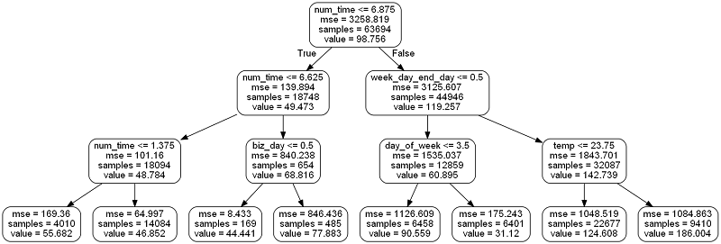
```

### Support Vector Machine

A support vector machine (SVM) regressor is the most complicated and the least
interpretable of the models explored in this report. SVMs can be used for both
classification and regression and operate based on finding a hyperplane to
separate classes. The concept is that any decision boundary becomes linear in a
high enough dimensional space [14]. For example, a linear decision boundary in
three-dimensional space is a plane. The SVM projects the features of the
observations into a higher dimensional space using a kernel, or a transformation
of the data. The model then finds the plane that best separates the data by
maximizing the margin, the minimum distance between the nearest member of each
class and the decision boundary. The support vectors in the name of the
algorithm refer to the points closest to the decision boundary, called the
support, which have the greatest influence on the position of the hyperplane.
SVM regressors work by fitting a non-parametric regression model to the data and
trying to minimize the distance between the model and all training instances.
SVM models are more complex than either a linear regressor or a random forest
regressor and have almost no interpretability. The transformation of the
features into a higher-dimensional space using a kernel removes all physical
representation of the features. SVM models are black boxes but have high
accuracy on small datasets with limited amounts of noise. The support vector
machine also takes much longer to train than either of the other models. That
being said, this approach demonstrated successful results in the literature and
was therefore investigated [15] [16]. An example of a support vector machine for
classification with several different kernels is shown below

```{r, echo = FALSE}
knitr::include_graphics('../svc_kernel.png')
```

The RBF or Radial Basis Kernel, is the most popular kernel in use in the literature
and is the default in most implementations. 

# Exploratory Data Analysis

The driving goals behind the EDA were to determine the trends and patterns within
the electricity consumption data, and to find the most significant relationships. 
The outcome of the EDA was not fixed, but the results would be used to inform 
objectives and inputs to the modeling section. 

## Trends and Patterns

The EDA quickly revealed building energy consumption exhibits daily, weekly, and 
seasonal repeating patterns in addition to overall trends. Moreover, these patterns
differ significantly between buildings in different climate zones and different 
building types (for example, retail buildings that are open 7 days a week 
compared to office building operating only during the week). The patterns were
analyzed at different time scales and buildings were compared both to themselves in 
different seasons, and to other buildings in different climate zones. 

### Long Term Trends

To get a feel for the overall structure of the data, it is best to graph the entire
time series. The following graphs show several different buildings with business
days separated from the non-business days. 

```{r}
# Entire time-series for three buildings
knitr::include_graphics('kansas_full.png')
knitr::include_graphics('las_vegas_full.png')
knitr::include_graphics('phoenix_full.png')

```

There are a number of noticeable trends in these plots. For all the buildings,
energy consumption increases during the the summer which agrees with domain knowledge. The largest source of office building energy consumption tends to be 
the heating, ventilation, and air conditioning (HVAC) system, which tends to 
see more use during the summer months for the southern climates. Kansas City, 
Las Vegas, and Phoenix experience hot summers and hence will see an increase in 
energy consumption due to air conditioning use. The buildings in Las Vegas and 
Phoenix exhibit a decrease in energy consumption during the winter because these
cities typically experience mild winters which do not necessitate 
energy-intensive heating. Meanwhile, the building in Kansas City does not exhibit
the same large decrease during the summer. Energy consumption for this building
has two peaks (it is bi-modal), with one occurring during late summer, and the other
occurring during late winter. 

### Monthly Trends

A great plot for understanding the location and spread of data is the boxplot. 
A boxplot shows the median, the interquartile range, and any outliers in a dataset.
The following graphs show boxplots with the average energy consumption per month
for the same three buildings. These boxplots are computed using only business days.

```{r}
# Graphs of monthly consumption as boxplots
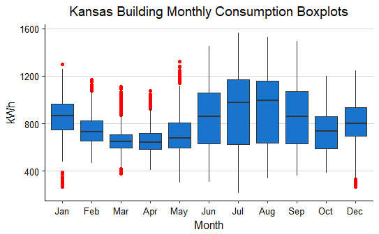
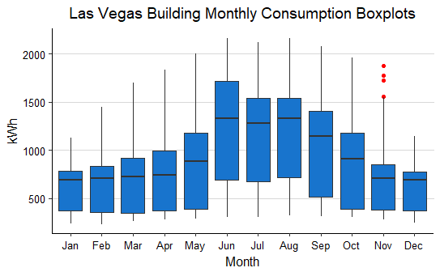
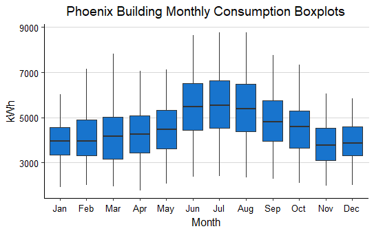

```

The same yearly behavior is observed as before, with an increase during summer
for the Las Vegas and Phoenix buildings, and two yearly peaks in consumption
for the Kansas building. The Kansas building has significantly more outlying 
points during the spring months indicating that daily energy consumption can vary
significantly during these months. This is not unexpected as some springs
may be much colder than others, necessitating higher heating use.

### Weekly Trends

Finally, the last two patterns in the data are those over the course of a week
and throughout the day. The graphs are colored by season to different the 
patterns that occur throughout the year. The energy consumption is in kWh for
each 15 minute interval, averaged over all the points in a specific day 
during a specific season.

```{r}
# Graphs for each week, colored by season, faceted by day of week
knitr::include_graphics('kansas_week.png')
knitr::include_graphics('las_vegas_week.png')
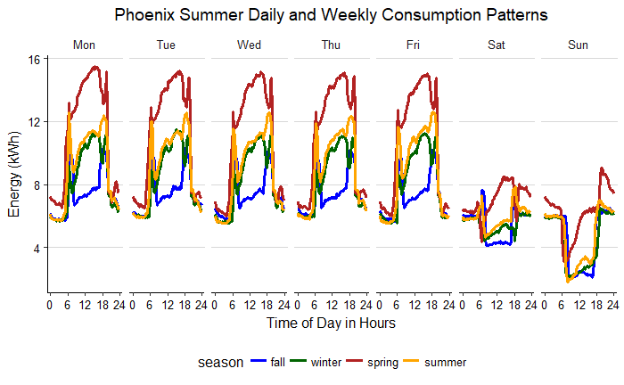
```

These graphs show trends by week, over the course of a day, and in different 
seasons. It is difficult to draw general conclusions because all of the buildings
display different behavior. However, it is clear that energy consumption is higher
during the week as expected for office buildings. The energy use typically rises
in the morning which would correspond to the HVAC starting and workers arriving
at the building. The energy consumption remains high during the work day, and then
drops significantly overnight. The energy consumption never drops to zero
because all buildings still have systems that must be kept running constantly. This 
is referred to as the baseload of a building and is a target for energy use
reduction. Energy use in noticeably higher in the summer for the Phoenix and 
Las Vegas buildings and also slightly higher during the summer for the Kansas 
building. Spring and Fall generally exhibit lower energy consumption than winter and 
summer, except for the Kansas building where energy consumption is 
second greatest during the fall. The weekend patterns are very interesting
as the energy consumption is moderate during the morning and afternoon, in line
with that observed during the day, but then drops precipitously during the 
afternoon. This is intriguing because it suggests certain systems are shut off
during the afternoon on the weekends but then are turned on again during
the morning and afternoon. Overall, there are numerous conclusions to draw
about a single building from these plots, and they will be a useful tool to the
EDIFES team when analyzing the energy profile of a building.

## Weather Correlations

The second major aspect of the exploratory data analysis was discovering the 
significant correlations between weather conditions and energy consumption. 
Based on these relationships, it should be possible to inform a building owner
ahead of time based on the weather forecast how much energy they can expect to use 
and how to potentially mitigate energy use based on the weather. 

The best approach for determining weather correlations is to calculated them 
separately during the winter and summer. Depending on the climate zone
and the type of heating used by the building, the direction and strength of 
weather correlations vary greatly. 

Looking at the numerical correlations is useful, but a quicker way to gauge the 
relative magnitudes between buildings is with heatmaps. These show stronger 
correlations as more vivid colors and can express large amounts of information
in a compact form. These heatmaps show the Pearson Correlation Coefficient
between the respective weather variable and energy consumption during 
each 15-minute interval. 

```{r}
# Summer and Winter correlation heatmaps
knitr::include_graphics('summer_heatmap.png')
knitr::include_graphics('winter_heatmap.png')

```

These visualization contain a significant amount of information. The major 
conclusion for the summer is that temperature tends to be positively
correlated with energy consumption as does ghi, dif, and gti. The exception 
to this statement is the building in Portland, Oregon, which exhibits the exact
opposite correlations as the other buildings. This was considered to be anomalous,
and the building owners were contacted for an explanation, but none was provided.
It is possible that the time stamp on the electricity meter is systematically wrong,
or the measurements could be strange but correct. This building is the only
building location in a relatively cold climate, which could explain the 
difference in behavior. The knowledge that temperature and the three irradiance 
variables are positively correlated with energy consumption (ignoring the Portland building for now)
could inform recommendations to a building owner. These might include:

* Add additional insulation to keep the cool air in during the summer
* Install double-paned windows with adequate sealing
* Cover windows in direct sunlight during the day
* Schedule employees to work earlier in the morning and leave during the afternoon
when the temperature peaks.

This last recommendation may appear drastic, but it could be necessary as 
the efforts to reduce energy consumption become more urgent. However, the other
recommendations are much simpler to implement and can result in significant
reductions in energy use with no disruption to productivity. 

The majority of the winter correlations are smaller in magnitude and not consistent
across the buildings. In particular, the temperature correlation varies 
significantly as it is positive in some buildings and negative for others.
One potential explanation is the typical heating
in use in the climate zone. If a building has gas heat, then as the temperature 
decreases, it would not be expected that the electricity consumption would increase
and hence the temperature - energy correlation will be small or positive
during the winter.
A building with electrical heating will need to use more electricity as the 
temperature decreases, and hence the temperature - energy correlation will be 
negative. That is, as the temperature decreases, the energy use increases. The 
Portland building again stands out, although it is similar to the Kansas City
building which could support the hypothesis that these buildings are different
because are located in colder parts of the country than the other six buildings. 
There is considerable additional analysis that can be performed on these correlation
heatmaps, and they hold potential for informing decisions with real-world benefits.

After performing this analysis on the eight Progressive buildings, a similar analysis
of weather correlations with energy consumption was done on all 750+ building
datasets that EDIFES currently owns. The results are as follows where the numbers
again correspond to the Pearson Correlation Coefficient. The climate zones 
are the Koppen Geiger Climate Zones. The branching trees on the top and left 
side of the heatmap are dendrograms created by a hierarchical clustering. 
The clustering groups together similar climate zones and similar weather conditions
by the magnitude of the correlation coefficient. Using these dendrograms could
provide a method for comparing buildings in different climate zones. 

```{r}
# Correlation heatmaps for all buildings by climate zone
knitr::include_graphics('summer_kgcz.png')
knitr::include_graphics('winter_kgcz.png')


```

In general, temperature, gti and ghi are positively correlated with energy 
consumption during the summer and relative humidity is negatively correlated
with energy use. 
However, during the winter, there are significant differences between the temperature
correlation by climate zone, with some zones exhibiting a negative correlation and 
others a positive correlation.  The 
majority of the winter correlations are small in magnitude as was
observed for the eight Progressive office buildings. The smaller magnitude of these
coefficients might be due to average across many buildings in each climate zone. 
For example, in a climate zone with two buildings, if one building has a positive 
correlation between temperature and energy during the winter and the other has a 
negative correlation, averaging these two out may lead to the conclusion that 
temperature has no correlation with energy use in that climate zone during the 
winter. A better approach may be to examine each individual building as was done
in the EDA and then compare the building to the average for the climate zone. 

# Modeling and Prediction

## Linear Modeling

Modeling started off with a basic univariate linear model. The objective was
to predict the average daily energy consumption from the average daily
temperature. Due to the differences between buildings and seasons, a different
model was created for each building and season. Temperature was selected
as the single variable because it displayed the highest correlation with 
energy consumption. Following is a summary of all the linear models. Reported
in the table is the slope of the temperature with respect to the energy consumption
and the r-squared for each model during the summer and winter.

```{r}
load('all_temp_slopes')
# All slopes of linear model
knitr::kable(all_temp_slopes[1:8, ], caption = 'Summer and Winter Temp Linear Model Stats')
```


While a linear model cannot capture complex relationships, it does have a high 
level of interpretability because the features are not transformed. The slope
of this model represents the daily change in kWh of energy use for a 1 degree Celsius
daily increase in temperature. Therefore, for the building in Sacramento, a 1 
degree warmer day during the summer will results in 308 kWh more electricity use,
and at the national average energy price of \$0.104 / kWh, 
that represents \$30 per day. During the winter, some buildings will observe 
a decreased in electricity usage with a decrease in temperature, while other 
buildings will have an increase in electricity usage with an increase in temperature.
The results also show that this model is not powerful. The summer r-squared is less
than 0.2 for all buildings indicating that the model can explain less than 20% 
of the observed variability in energy consumption based only on the temperature. 
The winter r-squared values are similarly small. This indicates that a more complex
model is needed, or more variables should be included in the linear model.
An example of the univariate linear model plotted on the actual summer data is
below for the first building in Phoenix with a summer slope of 21.16. The points
in red are the high leverage points, or those with the greatest distance
from the main cluster of points. These points have a considerable influence on the 
slope of the model as can be seen in the contrasting lines representing the model
without the high leverage points, and the model with only the high leverage points.

```{r}
# Linear model with high leverage points
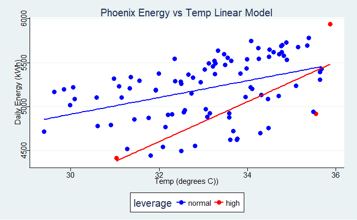
```

Before moving on to more complex models, a linear model was created to predict
daily average energy use using all the weather variables. The energy use is not
dependent on only temperature, and a model with more variables might be able
to account for more of the variability in the average daily energy use. The following
table shows the r-squared values for a linear model created between temperature
and all of the weather conditions.

```{r}
load('weather_r2')
# R-Squared for average daily energy use models with all weather variables
knitr::kable(weather_r2, caption = 'Weather Linear Model R-squared')
```

The measured r-squared values are not significantly better than those 
produced by temperature alone. An Analysis of Variance (ANOVA) test showed that 
the model with all weather variables did not exhibit a statistically significant 
improvement with alpha = 0.05 compared to the model with only temperature. Predicting
daily averages accurately is not possible because there are significant 
patterns that occur throughout the day. Averaging over an entire daily essentially
reduces the amount of data available by a factor of 96, the number of daily
observations of weather and temperature. Therefore, in order to create a more 
accurate model, the model should predict the energy consumption for each and 
every 15-minute interval from the corresponding time and weather conditions. 
To find a daily total, these predictions can then be summed up over the 96
intervals, or a more accurate approach to assessing the predictions is to compare
them to the known energy use for each 15-minute period. By making predictions every
15 minutes, and using all of the time variables in addition to the weather variables,
the accuracy of the model and the percentage of the variation explained is 
expected to be significantly greater. 

## Machine Learning Prediction

The daily averaging method with a linear model proved inadequate, and thus there
is a need for more complex models operating at a higher granularity to capture all
of the relationships within the energy information. Three models were selected
for comparison based on results reported in the literature and in order to cover
a range of complexity. A linear model, random forest, and support vector machine 
were all evaluated for regression capabilities. The models were compared against
one another using a random 0.70/0.30 training/testing split of the data. In 
hindsight, comparing the models using the random split of data was not the optimal
choice because they were being evaluated for predictive abilities. However, the 
random split of the data should be adequate for comparing the algorithms because
it still allows for relative evaluations. A model that cannot perform well at 
estimating the electricity consumption on a random split of the data also will not
be accurate at predicting months worth of electricity data into the future. The 
objective of the model comparison phase was to determine the most promising model 
that would then be optimized for the task.


### Data Preparation 

In order to compare models, they must be trained and tested on the same dataset. 
Preparation of the data was completed in R, and the results were then saved
as feather files for loading into Python. The algorithms themselves were 
implemented using the Skicit-learn library in Python because of the speed and 
increased training control. The results were then saved as feather files and 
analyzed using R because of the graphing capabilities. 
Data preparation consisted of the following steps:

__One-hot Encoding__

One hot encoding is a tricky concept at first that is best illustrated with an example.
The goal is to convert categorical variables into numeric variables without creating
an arbitrary ordering. 

The process takes this:

| Day of Week |
|-------------|
| Monday      |
| Tuesday     |
| Wednesday   | 


and converts it into this:

| Monday | Tuesday | Wednesday |
|--------|---------|-----------|
| 1      | 0       | 0         |
| 0      | 1       | 0         |
| 0      | 0       | 1         |

Each value for each categorical variable is represented as either a 0 or 1.One-hot encoding is 
required because machine learning models do not know how to handle categorical data, and simply
mapping the values to numbers imposes a random valuing of the feature values based on order, 
which may not be appropriate. 

__Cyclical variable transformation__ is crucial because some trends, such as months in
a year will not be properly represented by 1-12 numbers. Month 12 is closer to month
1 than is month 5, but this is falsely depicted by using 1-12. Transforming the variables
into cosine and sine components creates the desired relationship between the 
variables. This is done by using the equation for a sinusoidal 
$$y(t) = sin(2 * \pi * f * t)$$   In the case of months, the frequency is 1/12 
because the pattern repeats every twelve months (for daily time in hours, the frequency is 1/24). 
The conversion for months is 
therefore $$y(m) = sin(2 * \pi * m / 12)$$ and $$y(m) = cos(2 * \pi * m/12)$$. 

The result is that month 12 is now represented as occurring closest to month 1 and month 11. 

__Normalization__ either means subtracting the 
mean and dividing by the standard deviation or 
subtracting the minimum value and dividing by the maximum minus
the minimum. In the first approach, each feature column will
have 0 mean and unit (1) variance. The second approach scales each feature value to between 0 and 1. This step is necessary to remove any
disproportionate representations because of the varying units used in variables.
In other words, a variable with units of millimeters might have a larger weight attached
to it than a unit of meters simply because of different units. Normalization 
overcomes the problem of differing unit scales.

Finally, the dataset must be split into __training and testing sets__. During training, the 
model is allowed to see the answers in order to learn the relationships (if any)
between the explanatory and response variables. When testing, the model is asked to 
make predictions for a set of features it has not seen before. The targets for these
features are known and therefore the performance metrics can be computed based 
on the discrepancy between the known target values and the predictions.

### Metrics 

Not only must the models be trained and tested on the same data, they must be 
evaluated using the same performance metrics. The following set of metrics was
used for comparison:

1. __rmse__: root mean square error; the square root of the sum of the squared deviations 
divided by the number of observations. This is a useful metric because it has the same units
(kWh) as the true value so it can serve as a measure of how many kWh the average
estimate is from the known true target. 

2. __r-squared__: the percentage of the variation in the dependent variable explained 
by the independent variables in the model.

3. __MAPE__: mean average percentage error: the absolute value of the deviation for each 
prediction divided by the true value and multiplied by 100 to convert to a percentage. This metric 
indicates the percentage error 
in the prediction and can be better than the rmse because it takes into account the relative 
magnitude of the target variable.

## Model Comparison

The results of the model comparison are shown in the following graphs.

* lr = linear regression
* svm = support vector machine regression
* rf = random forest regression

```{r}
# Comparison of models on rmse, r-squared, mape
knitr::include_graphics('rmse_comparison.png')
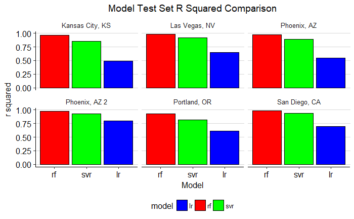
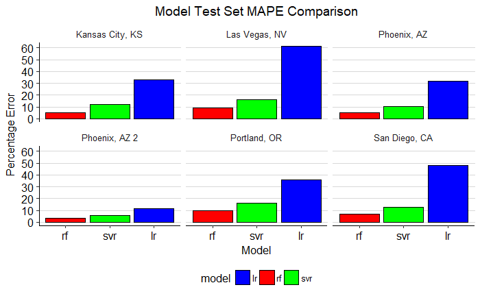
```

The random forest regression model is the clear winner on all metrics.
The linear regression is not able to capture the relationship between
the inputs, the time and weather conditions, and the outputs, the energy consumption.
The support vector machine does considerably better, but it does not match the 
performance of the random forest. Moreover, the runtime of the random forest was
much lower than that for the support vector machine, and the svm does not have
interpretability because the features are transformed into a higher dimension
using a kernel (radial basis kernel in this implementation). The random forest
is relatively simple to understand, has good interpretability because it returns
the relative importance of features, is quick to train and make predictions, and
has the best performance of all the models. Therefore, the random forest model 
was chosen for refinement and testing with predictions of six months of
energy use. 

## Random Forest Validation and Implementation

Once the random forest had been selected, the next step was to optimize the 
hyperparameters for the particular problem. In contrast to model _parameters_ which 
are learning by the model during training, the _hyperparameters_ must be set by the 
programmer ahead of training. One way to think of these is as model settings that 
can be turned back and forth until the model performs up to standards. 
In Skicit-learn, models are built with a sensible
set of default hyperparameters, but there is not guarantee these are optimal and only
a rigorous evaluation routine can determine the best set. 

Hyperparameter tuning requires creating many models with different options and 
then evaluating each using cross-validation to determine which set of configuration
options performs optimally. This can be done automatically in both R and Python and 
the method used for this project was grid search with cross-validation using
Skicit-learn in Python. The following set of hyperparameters achieved the highest 
metrics on a random training/testing split (again, perhaps not the best choice for
this problem).

* 200 decision trees in the forest
* No maximum depth for each tree (trees will be grown until all predictions are made)
* A minimum of 1 sample per leaf node
* A maximum fraction of 50% of the features evaluated for each tree
* A minimum number of 2 samples to split a node
* A minimum impurity decrease of 0.0 to split a node

These hyperparameters resulted in an increase in performance of the algorithm
without any noticeable increase in runtime. The following graph shows the 
root-mean squared error comparison of the baseline to optimized model.

```{r}
# Baseline with Optimized RMSE comparison
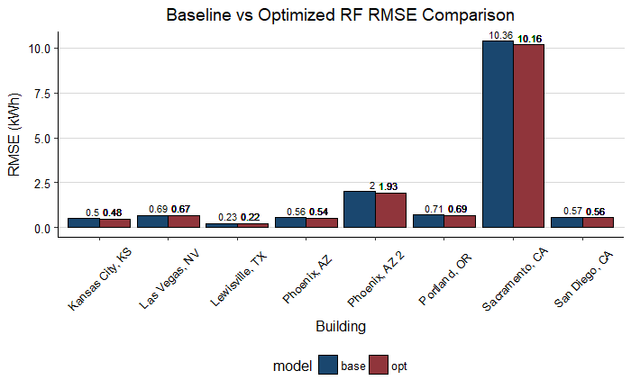
```

The optimized model performs the baseline model in rmse for all buildings. 

The next step was to challenge the random forest by predicting six months of energy
consumption. Six months was selected to correspond to the ARPE-E milestone
to develop a predictive model capable of an adjusted r-squared of 0.85 
when predicting six months worth of energy use. To implement this test,
the dataset was split into training and testing with the final six months
used for testing and the first part of the data for training. During testing, the 
model would be asked to predict the six months from the recorded
weather conditions and time. The data was again prepared in R, the algorithm
implemented in Python, and the results analyzed in R. 

The prediction metrics are presented below in graphical form.

```{r}
# Prediction metrics for random forest
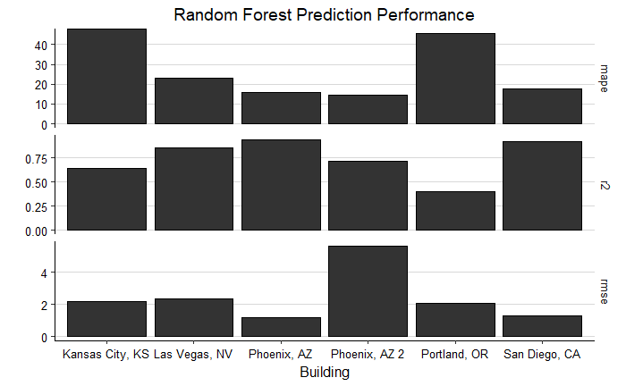

```

Four of the eight buildings meet the r-squared requirement. 
The average performance metrics were a mape of %21.24, an r-squared of 0.77, and
an rmse of 3.83 kWh. Although these metrics are not outstanding, they represent
a decent start towards meeting the project modeling requirement. Predicting six 
months of energy use is difficult, especially with some datasets not quite one
year in length. The random forest model is a promising method for predicting energy
consumption, but there is also a need to try additional methods. Another method 
currently used by the team is the diffusion indices method. One method that deserves
more exploration is a general additive model, in which the time-series is modeled
as sum of patterns on different time scales (days, weeks, months, years), as
well as an overall trend (increasing or decreasing with time). The prophet package
[32] in R provides a simple implementation although this is based on daily 
observations and will require adjustment for more frequent observations.
Overall, the prediction testing showed the random forest is capable of achieving
required performance when predicting six months of energy consumption. Further 
optimization of the hyperparameters and feature engineering will improve the rf
and it can be combined with ensemble methods to develop a robust prediction model.

# Discussion

The Progressive office building EDA provided the ideal opportunity to explore the problem
domain. Many of the findings, while not entirely novel [7] [8], were surprising
to the author. All of these could have been directly told to the author, but it
is a more memorable exercise to have to write the code and make the
discoveries firsthand rather than hearing them passively. Moreover, it is
reassuring when the conclusions reached by an independent team member agree with
those established by the rest of the team. While disagreements drive progress,
similar results confirm the methods in use and allow for the establishment of
base truths from which to work. The major finding was the number of different
patterns that can be ascertained in the energy data. Each building exhibits
different trends depending on the time of day, day of the week, 
the season of the year, and even between years if a retrofit to improve efficiency 
has been performed.
Moreover, once the office buildings had been thoroughly explored, a set of
coffee shops was examined and found to have entirely different patterns!
Clearly, the process of modeling and eventually forecasting energy consumption
will require sophisticated methods that can separate each of the trends [27]
[28]. Additional significant findings from the EDA were weather and energy
correlations that show temperature and global horizontal irradiance (GHI) are
the most highly correlated variables with energy use during the summer. These
results suggest several methods for reducing energy consumption including
increasing insulation, installing shades over windows in direct sunlight,
properly sealing windows and doors, and positioning buildings to use the sun as
a natural source of heating in the winter without absorbing excess heat in the
summer [29]. The EDA also showed the interpretations that can be drawn from a
linear model as well as the limitations linear models have because they are not
flexible enough to capture intricate trends. One significant aspect of the EDA
that was unsuccessful was the attempt to normalize buildings across climate
zones, building types, and building sizes. There were not enough buildings to
make statistically significant comparisons, but it might be possible
with the entire set of buildings available in HBase.

The modeling section of the report focused on two parts: an explanatory part
in which the reason behind energy consumption was investigated, and a predictive
part, in which energy consumption was predicted from a set of features. The final
random forest model can be used for both explanation, in terms of feature importances,
and prediction. 

Example predictions from the Random Forest are presented in the following figures:

```{r}
# Full Predictions for six months
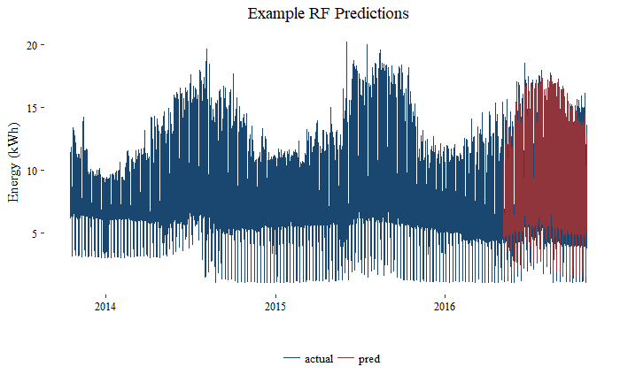
# Predictions for a week
knitr::include_graphics('predictions_week.png')
```
The first image shows the entire dataset and the predicted portion 
which aligns closely to the actual values. The second image shows a typical
week of predictions and how the random forest is able to accurately
capture all of the different patterns within the data. For this building,
the mean average percentage error was 15.72%, which is acceptable but will
need to be improved.

## Interpreting Model

To get a sense of why the random forest makes a certain prediction, it can 
be helpful to look at the feature importances. These are not useful so much in
absolute terms as in relative terms to rank features. The actual meaning
behind the importances is the reduction in uncertainty due to splitting a node
on the given feature. 

The following graphs show first the feature importances for each individual
building, and then averaged over all the buildings. In total, after feature engineering,
there are 24 different features used by the random forest.

```{r}
# All importances for each building
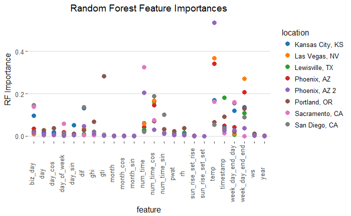
# Importances averaged over all buildings
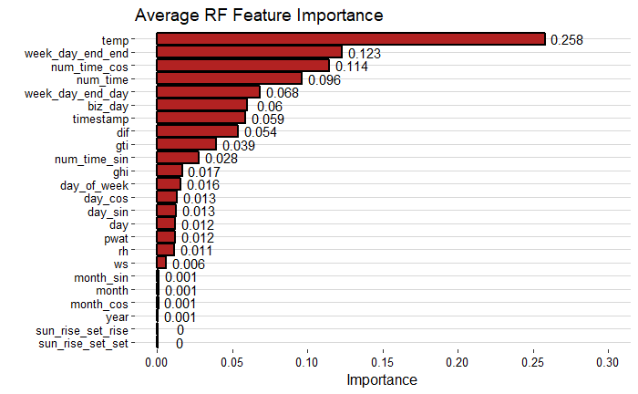
```

Temperature is the single most important factor for determining the energy
consumption at any 15-minute interval. This is in agreement with the correlation
coefficients and with the linear modeling. Moreover, dif, gti, and ghi are the 
next highest importance weather variables, in agreement with the correlation
coefficients. The day of the week and the time of the day have high importance,
which makes sense given the domain because the weekends have considerably lower
consumption than during the week, and the consumption also varies greatly over the
course of a typical day. The cosine transformation of the time of day has a higher
importance than the raw time itself, which validates the cyclical feature 
transformation performed during data preparation. There are several variables
with very low importance, and these could likely be removed from the model without
resulting in a performance decrease. The random forest performs implicit feature
selection, and it will learn these are not useful, but removing them could help 
other methods that would only be "confused" by these unimportant features. 
Most of the features with low importance have low variance, meaning they fall
within a narrow range, or take on the same value for most observations. 
It is possible to remove features with low variance during data preparation
using preprocessing in the caret package. 

Although the random forest does not return weights associated with the features 
which means that the effect of a unit change in a feature cannot be assessed as in
the linear models, the random forest can still be used to observe the effects
of altering a variable. Experiments with altering variables can be performed using
the random forest in order to assess effects of various changes in weather conditions.

## Global Warming Experiment

Current predictions indicate the global surface temperature will increase
between 1 C and 4 C by 2100 as the result of human-caused climate change [25]
[26]. In order to assess these effects on future energy use consumption, a
reasonable increase of 2 C can be modeled using the random forest. This is done
by training the model on the entire historical data available, and then creating
a testing set by keeping all of the explanatory variables the same except for
the temperature, which will be increased in every interval by 2 C reflecting a
mean increase in line with current forecast for future warming. In this
situation, there are no correct values to compare the predictions to, and this
is purely an experiment to observe the effects. The economic effects in terms of
annual energy use costs are demonstrated in Figure 29. These results were
obtained by finding the difference between the unaltered energy consumption and
the prediction energy consumption with the temperature increase and then
multiplying by the average cost of electricity in the United States. One aspect
of global warming that often goes unmentioned is it will unevenly effect
different areas of the globe, with some locations enjoying longer growing
seasons and others experiencing frequent severe weather events. The unequal
distribution of the effects of climate change are reflected in the figure which
demonstrates that according to the random forest model, some areas will see a
reduction in energy usage (and hence cost) while other areas will see a
significant increase in energy use. According to this analysis, an office
building of 50,000 ft2 could see an increase of nearly $30,000 in annual energy
costs due to increased temperatures. Many arguments have been made for taking
steps to reduce carbon emissions and transition to sustainable energy sources,
but perhaps none is more persuasive than that of simple economics.

The economic results of this experiment are presented below:

```{r}
# Economics of2 degree Celsius increase in temperature
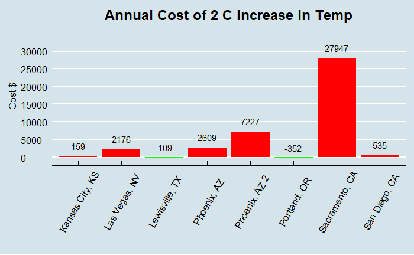
```

Additional experiments are possible, modifying any of the weather or time variables.
Eventually, in order to quantify the effects of a building efficiency improvement,
a method will be developed to alter a building characteristic and gauge the effect.
This is an active area of research and work for the EDIFES team because putting
a precise figure on the savings from a recommendation is critical to the value
of a virtual energy audit. The random forest experiment provides a framework
for how to alter one (or several if wanted) variables and observe the effects
on energy consumption by using the historical data.

# Conclusion

The main question driving the EDA was 

__Which weather and time conditions are most correlated with energy use,__
__and is it possible to build a model to predict energy use from the__
__explanatory variables?__.

The query was addressed by a combination of data exploration, data visualization,
and modeling. 
In answer to the first half of the question, temperature, global horizontal 
irradiance, and diffuse horizontal irradiance are most highly positively 
correlated with energy consumption during the summer. In the winter, temperature
is also highly correlated with energy consumption although the direction 
of this relationship varies across climate zones. In terms of time conditions, 
whether or not the day is weekend is the most important variable followed
by the cosine transformation of the time of day in hours, and then the raw 
time of day in hours. 

It is possible to predict energy use from the weather and time variables
to a high degree of accuracy using machine learning methods. A random forest
regression model was developed to predict six months worth of electricity
consumption and achieved near 80% accuracy averaged across all eight buildings.
A complex, highly non-linear model was needed in order to capture all of the 
patterns and relationships within the data. Further work remains to be done
with the random forest model to improve performance, but it is a promising 
start on the prediction problem. Additionally, the random forest can be used to 
perform experiments involving altering one or more variables and seeing the response
in the context of historical data. Further models should be developed for the 
EDIFES project because relying on a single model is not smart choice, especially
with the ease of implementing many models using the R statistical language or
Python and the numerous open-source libraries devoted to machine learning.

Overall, the Progressive Building Energy EDA was an optimal introduction to the 
problem domain of the EDIFES project. The author was able to gain an understanding
of the structure of the data and the tools that will be used for virtual energy audits. 

# Acknowledgements

The author would like to thank the following members of the EDIFES team for their 
willingness to explain all aspects of the project and for their tolerance of a significant 
number of questions: Professor Alexis Abramson, Professor Roger French, Rojiar Haddadian, 
Arash Khalilnejad, Jack Mousseau, Shreyas Kamath, and Ahmad Karimi. 
This project would not have been possible without their continuous support.

# References

Following is a nearly complete list of works used over the course of this semester. 
It is impossible to document all the websites, stack overflow questions, 
books, and individuals consulted for this project, but acknowledge the help I 
received from each and every person contributing to this project.

1.	A. Abramson, R. French, J. Mousseau, A. Khalilnejad, M. Hossain, R. Haddadian, E. Pickering, W. Koehrsen, S. Kamath and K. Nash, BuildingRClean R Package. Cleveland, OH: Case Western Reserve University, 2017. Available: https://bitbucket.org/cwrusdle/buildingrclean/overview
2.	"About the Commercial Buildings Integration Program | Department of Energy", Energy.gov, 2016. [Online]. Available: https://energy.gov/eere/buildings/about-commercial-buildings-integration-program. 
3.	University of Hawaii's Environmental Research and Design Laboratory, 2013, Energy Audit Procedures, US Department of Energy Office of Electricity Delivery and Energy Reliability. Available: https://www.hnei.hawaii.edu/sites/dev.hnei.hawaii.edu/files/Energy%20Audit%20Procedures.pdf
4.	EMS Environmental Incorporated, "How Much Does a Commercial Energy Audit Cost", 2017 [Online]. Available: http://emsenv.com/2016/04/28/commercial-energy-audit-cost/. 
5.	"ARPA-E | Virtual Building Energy Audits", Arpa-e.energy.gov, 2015. [Online]. Available: https://arpa-e.energy.gov/?q=slick-sheet-project/virtual-building-energy-audits. 
6.	"GIS data and maps", Solargis.com, 2017. [Online]. Available: http://solargis.com/products/maps-and-gis-data/. 
7.	E. Pickering, "EDIFES 0.4 Scalable Data Analytics for Commercial Building Virtual Energy Audits", Masters of Science in Mechanical Engineering, Case Western Reserve University, 2017.
8.	M. Hossain, "Development of Building Markers and an Unsupervised Non-Intrusive Disaggregation Model for Commercial Building Energy Usage", Ph.D., Case Western Reserve University, Department of Mechanical and Aerospace Engineering, 2017.
9.	Kim, H., Marwah, M., Arlitt, M., Lyon, G., and Han, J., 2011, "Unsupervised Disaggregation of Low Frequency Power Measurements", Proceedings of the 2011 SIAM International Conference on Data Mining, pp.747-758.Available http://epubs.siam.org/doi/abs/10.1137/1.9781611972818.64
10.	A. Zoha, A. Gluhak, M. A. Imran, and S. Rajasegarar, "Non-Intrusive Load Monitoring Approaches for Disaggregated Energy Sensing: A Survey," Sensors, vol. 12, no. 12, pp. 16838-16866, Dec. 2012.
11.	D. Borthakur, "HDFS Architecture Guide", 2008 [Online]. Available: https://hadoop.apache.org/docs/r1.2.1/hdfs_design.html.
12.	Solar Degradation and Lifetime Extension (SDLE) Laboratory, cradletools Package. Cleveland, OH: Case Western Reserve University, 2017. Available: https://bitbucket.org/cwrusdle/cradletools/src
13.	G. K. Uyanik and N. G?ler, "A Study on Multiple Linear Regression Analysis," Procedia - Social and Behavioral Sciences, vol. 106, no. Supplement C, pp. 234-240, Dec. 2013.
14.	B. Scholkopf and A. J. Smola, Learning with Kernels: Support Vector Machines, Regularization, Optimization, and Beyond. Cambridge, MA, USA: MIT Press, 2001.
15.	Dong, B., Cao, C., and Lee, S., 2005, "Applying support vector machines to predict building energy consumption in tropical region", Energy and Buildings, 37(5), pp. 545-553.Available: http://www.sciencedirect.com/science/article/pii/S0378778804002981
16.	A. S. Ahmad et al., "A review on applications of ANN and SVM for building electrical energy consumption forecasting," Renewable and Sustainable Energy Reviews, vol. 33, no. Supplement C, pp. 102-109, May 2014.
17.	L. Breiman, "Random Forests," Machine Learning, vol. 45, no. 1, pp. 5-32, Oct. 2001.
18.	"World Maps of Koppen Geiger Climate Clssification", Institute for Veterinary Pulic Health Vienna. 2017. [Online]. Availble: http://koeppen-geiger.vu-wien.ac.at/
19.	Nordstrom, G. H. (2013). "Using the Energy Signature Method to Estimate the Effective U Value of Buildings." Sustainability in Energy and Buildings Smart Innovation, Systems and Technologies, 35-44.
20.	"Pearson Product-Moment Correlation", Laerd Statistics 2017. [Online] Available: https://statistics.laerd.com/statistical-guides/pearson-correlation-coefficient-statistical-guide.php
21.	"Electric Power Monthly: Table 5.6., A Average Price of Electricity to Ultimate Customers by End-Use Sector", United States Energy Information Administration, October 24, 2017. [Online]. Available: https://www.eia.gov/electricity/monthly/epm_table_grapher.php?t=epmt_5_6_a
22.	"Chicago Energy Benchmarking Homepage", City of Chicago, 2017. [Online]. Available: https://www.cityofchicago.org/city/en/progs/env/building-energy-benchmarking---transparency.html
23.	R. Sakia, "The Box-Cox Transformation Technique: A Review", The Statistician, vol. 41, no. 2, p. 169, 1992. Available: http://www.jstor.org/stable/2348250?seq=1#page_scan_tab_contents
24.	"scikit-learn: machine learning in Python", Scikit-learn.org, 2017. [Online]. Available: http:/scikit-learn.org/stable/.
25.	J. L. Lean and D. H. Rind, "How will Earth's surface temperature change in future decades?," Geophys. Res. Lett., vol. 36, no. 15, p. L15708, Aug. 2009.
26.	S. R. Loarie, P. B. Duffy, H. Hamilton, G. P. Asner, C. B. Field, and D. D. Ackerly, "The velocity of climate change," Nature, vol. 462, no. 7276, p. 1052, Dec. 2009.
27.	H. Zhao and F. Magouls, "A review on the prediction of building energy consumption," Renewable and Sustainable Energy Reviews, vol. 16, no. 6, pp. 3586-3592, Aug. 2012.
28.	Amasyali, K., and El-Gohary, N., 2017, "A review of data-driven building energy consumption prediction studies", Renewable and Sustainable Energy Reviews, 81, pp. 1192-1205. Available: http://www.sciencedirect.com/science/article/pii/S1364032117306093
29.	"Retrofitting Existing Buildings to Improve Sustainability and Energy Performance | WBDG Whole Building Design Guide." [Online]. Available:https:/www.wbdg.org/resources/retrofitting-existing-buildings-improve-sustainability-and-energy-performance. 
30.	K. Cetin, M Siemann, C Sloop, "Disaggregation and Future Prediction of Monthly Residential Building Energy Use Data Using Localized Weather Data Network," ACEEE Summer Study on Energy Efficiency in Buildings, 2016. Available: https://aceee.org/files/proceedings/2016/data/papers/12_410.pdf
31.	T. Hastie and R. Tibshirani, "Generalized Additive Models," Statist. Sci., vol. 1, no. 3, pp. 314-318, Aug. 1986.
32.	Quick Start Guide to Prophet, CRAN, [Online]. Available: https://cran.r-project.org/web/packages/prophet/vignettes/quick_start.html.

