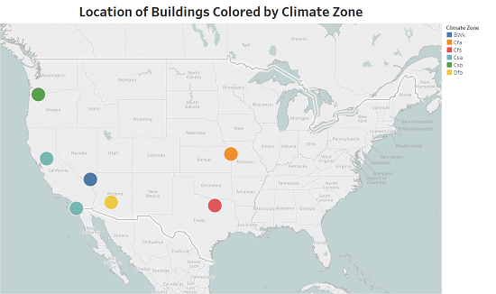
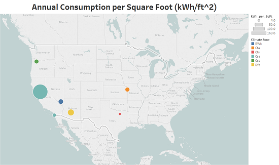

<!--
# Script Name: eda_report_one.Rmd
# Purpose: First report for DSCI 451 Semester Project
# Authors: William Koehrsen
# License: Creative Commons Attribution-ShareAlike 4.0 International License.
##########
# Latest Changelog Entries:
# v0.00.01 - 9/23/17 - eda_report_one.Rmd - William Koehrsen began this rmd
# v0.00.02 - 9/23/17 - eda_report_one.Rmd - William Koehrsen finished initial draft
# v0.00.03 - 9/24/17 - eda_report_one.Rmd - William Koehrsen made initial edit
# v0.00.04 - 9/25/17 - eda_report_one.Rmd - William Koehrsen completed final version for presentation
##########


# Rmd code goes below the comment marker!
-->
```{r setup, include=FALSE}
knitr::opts_chunk$set(echo = TRUE)
# Set correct working directory depending on desktop in use
# 
# For personal laptop use
 knitr::opts_knit$set(root.dir = 'C:/Users/Will Koehrsen/Documents/DSCI 451/17f-dsci351-451-wjk68/1-assignments/SemProj-451/building_energy_eda')

 # For VUV VDI (citrix) use
#knitr::opts_knit$set(root.dir =
 #'H:/Git/17f-dsci351-451-wjk68/1-assignments/SemProj-451/building_energy_eda')
knitr::opts_chunk$set(dev = "pdf")
```

# Project Overview 

## Problem
An energy audit is an inspection and analysis of the electricity consumption patterns
of a building by documenting incoming and outgoing energy flows.
When done correctly, energy audits can significantly increase the overall efficiency of a 
building, thereby reducing electricity costs and greenhouse gas emissions. 
However, traditional physical building energy audits are resource intensive in 
terms of both time and cost. In-person audits require a team of auditors to travel
to a building and perform a series of tests and inspections to determine 
the efficiency of a building and identify areas for improvement. In 
addition to the resource costs of a physical audit, assessments can vary
significantly between auditing teams, raising into doubt any economic 
benefit of an in-person audit. Real concrete gains in building energy use are possible, 
as the US Department of Energy estimates that building efficiency could increase by 30% by 2030[^1] 
implementing existing technologies. However, it is clear that physical
energy audits are not the optimal tool for identifying efficiency improvement
opportunities. 

## Approach
EDIFES: Energy Diagnostic Investigator for Efficiency Savings is an 
ARPA-E funded project[^2]  that aims to develop a software tool for performing 
virtual energy audits. The overall objective of the project, under the 
direction of Professor Alexis Abramson and Professor Roger French, is to 
eliminate the need for physical audits by determining areas for efficiency
improvements using only overall building electricity consumption data and 
building metadata. Part of this process is developing a set of building markers from 
the electricity data, such as building occupancy schedule and HVAC on/off cycle
times, that can be used to characterize a building.[^3] 
In the first phase of the 
project, EDIFES has partnered with several companies to gain access to data,
predict building markers, and receive feedback on the accuracy of the 
predictions.[^4] 

[^1]:"About the Commercial Buildings Integration Program | Department of Energy", Energy.gov, 2016. [Online]. Available: https://energy.gov/eere/buildings/about-commercial-buildings-integration-program. [Accessed: 23- Sep- 2017].

[^2]:"ARPA-E | Virtual Building Energy Audits", Arpa-e.energy.gov, 2015. [Online]. Available: https://arpa-e.energy.gov/?q=slick-sheet-project/virtual-building-energy-audits. [Accessed: 23- Sep- 2017].

[^3]: E. Pickering, "EDIFES 0.4 Scalable Data Analytics for Commercial Building Virtual Energy Audits", Masters of Science in Mechanical Engineering, Case Western Reserve University, 2017.

[^4]: M. Hossain, "Development of Building Markers and an Unsupervised Non-Intrusive Disaggregation Model for Commericial Building Energy Usage", Ph.D., Case Western Reserve University, Department of Mechanical and Aerospace Engineering, 2017.

## Applicability of Dataset 

My DSCI 451 semester project will concentrate on building energy data from 10 
Progressive Insurance offices. This data has already been cleaned by members 
of the EDIFES team[^5] and has been analyzed using the first 10 building markers. 
However, no full EDA has been performed on the data making it an ideal dataset on 
which to put into practice the tools of exploratory data science.

[^5]: Rojiar Haddadian, Arash Khalilnejad, Mohammad Hossain,
Jack Mousseau, Shreyas Kamath, Ethan Pickering

# Introduction to Dataset

I will be exploring a dataset of time-series electricity consumption data
from 10 Progressive office buildings. In addition, the building information contains metadata allowing the weather data associated with each
building to be obtained from solarGIS. The data has already 
been cleaned by members of the EDIFES team and the corresponding weather data 
is attached to the time-series for each building. Each building is contained in a separate csv file.  In the initial cleaning 
process performed by the EDIFES team, 2 of the office buildings did not pass 
the data quality standards established by the project (as documented by Houssain) because of issues with anomalies and missing values. 
For now, I plan on including these two datasets in my analysis in order to 
practice dealing with incomplete and messy data. As these buildings have
already been partially modeled by the team, I will focus on exploring
questions that might have been beyond the scope of the initial EDIFES investigation. 

## Building Metadata

The building metadata contains city, square footage, and annual consumption which is primarily 
useful for obtaining the corresponding weather data from [solarGIS](http://solargis.com/)

```{r results = 'asis'}
# Load in needed libraries without displaying messages
suppressMessages(library(tidyverse))
suppressMessages(library(knitr))

# Load in the metadata with no messages
metadata <- suppressMessages(read_csv("metadata/progressive_metadata.csv"))

# Make a nicely formatted table of metadata
kable(metadata[c(1,2,4,6,8)], caption = "Progressive Building Metadata")
```

A brief explanation of the metadata variables follows: 

* Ref: reference number
* Location: City, State
* Square Footage: Size of building in ft^2
* Climate Zone: [Koppen-Geiger](http://koeppen-geiger.vu-wien.ac.at/) climate zone classification
* Annual Consumption: Total consumption per year in kWh

__Buildings with Reference number 92 and 95 were not analyzed by EDIFES__
__because of issues with data quality.__

## Energy and Weather Data

The energy data for 8 of the buildings has already been cleaned and each building is 
in a separate csv file with associated weather information. Each row of the 
csv data files contains one time interval of fifteen minutes.
The columns contain the energy consumption and weather data associated with that building
and timestamp. The csv file for each building contains the following columns. 

|     Variable     |    Type   | Units | Meaning                                   |
|:----------------:|:---------:|:-----:|-------------------------------------------|
| timestamp        | date      |       | date and time                             |
| elec_cons        | numeric   | kWh   | electricity consumption                   |
| elec_cons_imp    | integer   |       | electricity consumption imputed           |
| power_dem        | numeric   | kW    | power difference                          |
| biz_day          | integer   |       | business day                              |
| day_of_week      | character |       | day of the week                           |
| week_day_end     | character |       | weekday or weekend                        |
| sun_rise_set     | character |       | sun rise or sun set                       |
| num_time         | numeric   | hours | time in hours from start of day           |
| cleaned_energy   | number    | kWh   | energy consumption with anomalies removed |
| anom_flag        | integer   |       | anomaly flag                              |
| ghi              | integer   | W/m^2 | global horizontal irradiance              |
| dif              | integer   | W/m^2 | diffuse horizontal irradiance             |
| gti              | integer   | W/m^2 | global tilted irradiance                  |
| temp             | numeric   | C     | temperature                               |
| rh               | numeric   | %     | relative humidity                         |
| pwat             | numeric   | cm    | precipitable water                        |
| ws               | numeric   | kph   | wind speed                                |
| forecast         | numeric   | kWh   | cleaned energy forecast                   |
| anom_missed_flag | integer   |       | anomaly or missing data flag              |


__Example data for one building__
```{r messages = FALSE}

# Read in data for one building and display
suppressMessages(f.SRP <- read_csv("data/f-SRP_weather.csv"))
head(f.SRP[c(1:6)], 5)
head(f.SRP[c(7:13)], 5)
head(f.SRP[c(14:20)], 5)
```

Not all of the variables were examined in the initial modeling of the data by the EDIFES team.
The following variables were
of primary interest to the EDIFES team on the first pass through the data.

* timestamp: gives the date and time for the energy measurement in fifteen minute intervals
* elec_cons: the raw electricity consumption data (kWh)
* elec_cons_imp: 1 or 0 marker if the data was linearly imputed
* power_dem: difference in power (kW) between measurements
* biz_day: business day or not (accounts for holidays)
* day_of_week: relatively self-explanatory
* week_day_end: weekday or weekend
* num_time: number of hours since the start of day
* temp: most correlated weather variable with energy consumption
* rh: relative humidity, the second highest positively correlated weather variable with energy
consumption
* forecast: final cleaned energy consumption with anomalies removed and missing 
data imputed using a custom function
* anom_missed_flag: marker that tells if forecast energy had to be corrected from the raw number. 
There would be two reasons for the raw data to be corrected:the data was
missing, or the data was anomalous (an outlier). 

Although not all of the variables were used in the modeling by the EDIFES team, I will keep all of the weather data
to try and find relationships that might have gone overlooked.

## Data Cleaning and Assembly of Dataframe

The data (except for the 2 poor-quality data buildings) 
has been completely cleaned. Nonetheless, I would like to take the raw energy data and apply 
my own cleaning strategy to see 
if I arrive at the same values for the final cleaned energy. Team members used the tsoutliers
package to identify and correct anomalies. Missing data was either linearly imputed 
(if fewer than 4 missing points in a row) or imputed using a custom function developed 
for the project. Assembling the dataframes will be as simple as reading in the data
from the correct csv file. I expect to have one dataframe for each building rather 
than collecting them into one massive data structure. The EDIFES team is more concerned
with analyzing buildings individually rather than performing comparisons
and the best strategy is to perform the EDA one building at a time. 

# Exploration Questions

With all this beautiful tidy data at my hands, what questions should I ask? 

My primary interest is correlations between weather and energy consumption. The
EDIFES team did identify relationships, but did not pursue these or translate them 
into any building markers (yet). As building energy consumption can be strongly 
dependent on the weather, this reseach holds potential for significant energy savings.
In particular, I want to identify what weather conditions result in higher energy usage. 
This information could then be used to inform
building energy managers that their building could be optimized to their climate or could be used to develop a 
more efficient heating/cooling schedule in anticipation of forecasted weather. 


Furthermore, if it were possible to develop a model that accurately predicted energy 
consumption for the next day based on the weather forecast, it might be possible to 
incorporate this into the building energy schedule in order to prepare for the weather conditions. 
Although this would be going beyond EDA and into modeling, I would like to see 
if a machine learning model could accurately predict the next day's energy consumption 
based on current/forecasted weather conditions. With the addition of [keras into R](https://keras.rstudio.com/),
it is now possible to relatively quickly develop a deep or recurrent neural network. 
The weather neural network would take in the previous day's weather and electricity consumption as labels and try to predict
the next day's electricity consumption as the target. A [recurrent neural network with LSTM cells](https://deeplearning4j.org/lstm.html) would
be an ideal model for this task because it has the capability to "remember" previous
inputs, which is vital in time series (or any sequence) analysis. 

I am also interested in comparitive analysis. Although I will look at the buildings individually,
it might be useful to compare buildings with similar characteristics located 
in different climate zones. Moreover, I want to determine how a "good" 
building performs with regards to energy efficiency. I think these questions could be
answered by comparing the buildings and potentially using average building energy use statistics
from other data sources. (Possible data source: [City of Chicago detailed energy](https://data.cityofchicago.org/Environment-Sustainable-Development/Energy-Usage-2010/8yq3-m6wp/data] use from 2010). 

Finally (at least for now), I would like to apply the next series of 10 building markers
currently being developed to these buildings. Studying the feedback provided by Progressive
with regards to the first 10 buildings markers was a good learning experience because
it showed what the team was able to correctly predict, and what parts of the models need to be adjusted.
A similar prediction <-> feedback cycle will take place with the second set of 10 markers, and 
it will show what we can and cannot understand about a building
from a single stream of data. This would involve using code currently under development
by EDIFES members as well as the edifes R package available through the HPC. I hope to develope a pipeline that 
will automatically run the 10 building marker for a building. For the first 10 markers,
the EDIFES team developed a script that took in a cleaned building dataset and generated a complete report. 
The script will need to be applicable to any cleaned data and not only the dataset I have for this project. 

Based on these three paths of exploration, I formulated the following set of 6 questions:

1. Which weather variables are most correlated with energy consumption and what is the 
physical explanation behind this?
2. Can the current day's weather data be used to predict tomorrow's energy consumption?
3. Controlling for building size, which climate zone is the most energy intensive?
4. Are these buildings "good" in terms of energy efficiency? What does "good" mean in this context 
(i.e. how can it be quantified)?
5. Can the next 10 markers accurately characterize these buildings?
6. Based on the answers to the previous 5 questions, are there concrete recommendations 
for building managers to reduce energy use?

__I expect these questions to change and adapt over the course of this exploration.__

EDA is an iterative process, and starting to answer one question can lead to 5 more
as one gets into the data. Moreover, all data has fundamental limitations and may not
be appropriate to answer the initial questions. This is not an undesirable situation
because the heart of EDA is to learn what your data can teach you before
employing more sophisticated statistical methods to test hypotheses. 

In the words of [John Tukey](https://en.wikipedia.org/wiki/John_Tukey) (a mathematician who developed the FFT and boxplot): 

> Data analysis, like experimentation, must be considered as an open-ended, highly interactive,
iterative process, whose actual steps are selected segments of a stubbily branching, 
tree-like pattern of possible actions.

# Exploratory Visualizations

Yeah, that's great and all, but show us some plots! 

First up, I wanted to show the location and the associated climate zone. This demonstrates
the diversity in climate zones. 
```{r, echo = FALSE}

```

As can be seen, 6 different climate zones are represented meaning there is considerable 
variability for comparison purposes. The small numbers refer to the number of buildings at
the location (3 in Portland and 2 in Phoenix). 

We can also visualize the annual consumption per square foot. This metric can be used
to control for the size of the buildings and might be one way to compare buildings 
across climate zones. 
```{r, echo = FALSE}

```

As a side note, these plots were made using[^6] [Tableau](https://www.tableau.com/) 

[^6]: Tableau is a flexible chart-making software (and as students, we can get the professional edition for free). 
Part of data science is using the appropriate tools for the
situation, and if you have clean, tidy data and 
want to make a decent looking map in five minutes, then Tableau is the best tool 
for the task! (If you have a csv file and are thinking about making a plot in Excel,
stop, do yourself a favor, and open Tableau so you can make a professional looking chart.)

Now we can return to the world of R for a few sample plots of the energy consumption 
and weather data. These plots look at one of the buildings in Phoenix.
The first plot shows the raw energy consumption and the second shows the final 
cleaned version of the energy consumption.

```{r, dpi = 300, fig.width = 6, fig.height = 3}
# dpi is adjusted to not overwhelm the pdf
# Plot the raw electricity consumption over time
ggplot(f.SRP) + geom_jitter(aes(timestamp, elec_cons), color = "blue",  alpha = 0.2) + 
  ylab("Elec. Cons. (kWh)") + xlab('') + 
  ggtitle("Raw Electricity Consumption")
```
```{r, dpi = 300,  fig.width = 6, fig.height = 3}
# dpi is adjusted to not overwhelm the pdf
# Plot the complete cleaned energy data over time
ggplot(f.SRP) + geom_jitter(aes(timestamp, forecast), color = "red", alpha = 0.2) +
  ylab("Elec. Cons. (kWh)") + xlab('') + 
  ggtitle("Cleaned Electricity Consumption")
```

These graphs are a unrefined and cluttered, but they primarily demonstrate that 
the cleaned data does not contain anomalies or missing points as in the raw data.

Perhaps a better visualization would be mean daily energy consumption over time
to identify long-term seasonal trends.

```{r, suppressMessages = TRUE}
# Create date only column in df
f.SRP$date <- as.Date(format(f.SRP$timestamp, "%Y-%m-%d"))

# Have to use aggregate because dealing with characters
# group_by does not work with character columns
daily.df <- aggregate(f.SRP$forecast, by = list(f.SRP$date), FUN = mean)

# Plot the average daily electricity consumption
ggplot(daily.df, aes(Group.1, x)) + geom_point() +
  geom_line() + geom_smooth() + xlab('') + 
  ylab("Elec Cons. (kWh)") + ggtitle("Avg. Daily Electricity Consumption") 
```

As expected for a city in the southwest, energy consumption rises during the summer months and falls 
during the winter months. It will be interesting to see how much of a difference a "cool" summer or a "warm" winter has on energy consumption.

The next two plots look at possible correlations between energy use and weather conditions.
As a hypothesis, I would expect electricity consumption to increase with an increase in 
temperature and decrease with a decrease in relative humidity.

The first plot shows the relationship between
average daily electricity consumption and average daily temperature.

```{r}
# Create a dataframe of daily averages
# This requires using aggregate because group_by does not work for characters
daily.df <- aggregate(f.SRP[,c("forecast", "temp", "rh", "ws")], by = list(f.SRP$date), 
                      FUN = mean)

# Plot the daily average electricity consumption and daily average temperature
ggplot(daily.df, aes(x = Group.1)) + 
  geom_point(aes(y = forecast)) + 
  geom_line(aes(y = forecast)) + 
  geom_smooth(aes(y = forecast, color = "Avg. Elec Cons.")) + 
  geom_smooth(aes(y = temp, color = "Avg Temp")) + 
    xlab('') + ylab("Avg. Elec. Cons.") + 
  labs(color = "Legend") + 
  scale_y_continuous(sec.axis = sec_axis(~.*1, name = "Avg. Temp (C)")) + 
  ggtitle("Avg. Daily Electricity Consumption and Temperature")
```

The next plot shows the relationship between average daily energy consumption
and average daily relative humidity. 

```{r, messages = FALSE}
# Plot the average daily electricity consumption
# and the average daily relative humidity
ggplot(daily.df, aes(x = Group.1)) + 
  geom_point(aes(y = forecast)) + 
  geom_line(aes(y = forecast)) + 
  geom_smooth(aes(y = forecast, color = "Avg. Elec Cons.")) + 
  geom_smooth(aes(y = rh, color = "Relative Humidity")) + 
    xlab('') + ylab("Avg. Elec. Cons.") + 
  labs(color = "Legend") +   
  scale_y_continuous(sec.axis = sec_axis(~.*1, name = "Avg. Relative Humidity (%)")) + 
  ggtitle("Avg. Daily Electricity Consumption and Relative Humidity")
```


Finally, to quantify possible relationships between the weather and electricity
consumption, we can plot the correlation matrix. 

```{r}
# Create a correlation matrix with daily average final cleaned energy 
# (forecast), temperature, relative humidity, and windspeed
suppressMessages(library(PerformanceAnalytics))
subset <- filter(daily.df, Group.1 < as.Date("2016-05-01"))
suppressWarnings(chart.Correlation(subset[, c("forecast",
                                              "temp", "rh", "ws")], 
                                   histogram = TRUE, pch = 19))
```

From the correlation matrix and the [Pearson correlation coefficient](https://en.wikipedia.org/wiki/Pearson_correlation_coefficient), it is clear
that average daily energy consumption and average daily temperature are strongly positively linearly 
related. Furthermore, average daily electricity consumption and average daily
relative humidity are strongly negatively related. 

# Conclusions

The first report for the DSCI 451 Semester project identified the problem and how 
the data I have fits into the solution to that problem. I have examined the 
data currently at my disposal and have explored additional sources of data should
more data be needed. My exploration of the data will be guided by a set
of six initial questions with more to come as a start a thorough examination of the data. Finally, I have
made some preliminary charts of the data and have identified possible relationships
for further investigation. See you in Report 2!
