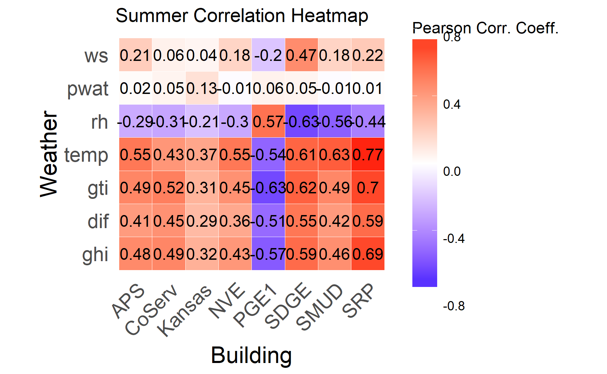
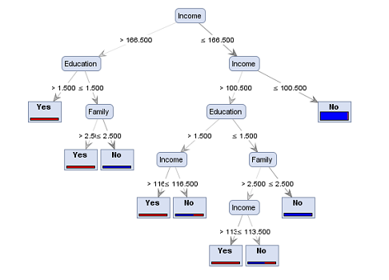

<!--
  # Script Name: eda_report_three.Rmd
  # Purpose: Third report for DSCI 451 Semester Project
  # Authors: William Koehrsen
  # License: Creative Commons Attribution-ShareAlike 4.0 International License.
  ##########
# Latest Changelog Entries:
# v0.00.01 - 11/20/17 - eda_report_three.Rmd - William Koehrsen began this rmd
# v0.00.02 - 11/22/17 - eda_report_three.Rmd - William Koehrsen completed
#  types of modeling
# v0.00.03 - 11/25/17 - eda_report_three.Rmd - William Koehrsen completed model
# selection
# v0.00.04 - 11/28/17 - eda_report_three.Rmd - William Koehrsen completed 
# model validation and intrepretation
# v0.00.05 - 11/30/17 - eda_report_three.Rmd - William Koehrsen completed 
# model challenge and conclusions
# v0.00.06 - 12/02/17 - eda_report_three.Rmd - William Koehrsen completed first draft
# v0.00.07 - 12/04/17 - eda_report_three.Rmd - William Koehrsen completed first edit
# v0.00.08 - 12/05/17 - eda_report_three.Rmd - William Koehrsen made final adjustments to report
##########

# Rmd code goes below the comment marker!
-->

```{r setup, include=FALSE}
knitr::opts_chunk$set(echo = TRUE)
knitr::opts_chunk$set(root_dir = 'C:/Users/Will Koehrsen/Documents/DSCI 451/17f-dsci351-451-wjk68/1-assignments/SemProj-451/building_energy_eda/scripts')
knitr::opts_chunk$set(cache = TRUE)
knitr::opts_chunk$set(warning = FALSE)

# Load in libraries required for anaysis
library(lubridate)
library(ggthemes)
library(stats)
library(tidyverse); theme_set(theme_classic(12)) + theme(axis.text = element_text(color = 'black'), plot.title = element_text(hjust = 0.5))
library(data.table)
library(car)
library(dummies)
library(randomForest)
library(caret)
library(feather)
library(Metrics)
```

```{r, echo = FALSE}
# Helper function to read in a building energy dataframe properly
read_data <- function(filename) {
  df <- as.data.frame(suppressMessages(read_csv(paste0('../data/', filename))))
  df$timestamp <- as.POSIXct(df$timestamp)
  df$day_of_week <- as.factor(df$day_of_week)
  df$week_day_end <- as.factor(df$week_day_end)
  df$sun_rise_set <- as.factor(df$sun_rise_set)
  return(df)
}

# Example
df <- read_data('../data/f-SRP_weather.csv')

# List of files names
filenames <- dir('../data/')

# Axis labels theme for plots
th <- theme(axis.text = element_text(face = 'bold', color = 'black', size = 12))
```
# Introduction 


__The overall guiding question for this project is what explanatory variables are__
__most highly correlated with energy consumption, and is it possible to build a__
__model to predict energy consumption from the explanatory variables?__

The first report introduced the background for the Progressive Building Energy 
Exploratory Data Analysis (EDA) and the purpose of the EDIFES project. Several questions were posed in the 
first report to guide the EDA outlined in Report Two.  Report To detailed my initial forays into the data in which I identified trends 
between weather and energy consumption and the relationship between the square
footage of a building and the annual energy consumption. I also looked at pairwise
plots to find the strongest relationships between variables, performed a power transformation using
the Box-Cox transformation, and evaluated three different models for accuracy
in predicting the energy consumption from the weather and time variables. 

Report Three will focus on an in-depth modeling investigation with an emphasis on
interpretability and accuracy. Several types of modeling are documented with 
varying degrees of complexity from linear regression models to a support vector machine with 
amounts of interpretability. This report expands on the exploratory work done in
report two and aims to provide models and conclusions that can be used by the EDIFES
team for performing virtual building energy audits. Modeling allows us not only to 
explain the past based on the observations, but to predict future behavior so that we may adjust our actions accordingly. 

# Types of Modeling

The challenge of predicting energy consumption from weather and time data is supervised because 
we know the actual answers, which in this case are the values of energy at each fifteen minute interval.
There are an almost unlimited number of modeling approaches for regression tasks that can be implemented in R and Python. 
These range in complexity from linear models with simple equations and 
understandable variable weights, to deep neural networks which are essentially black boxes 
that accept data as an input, perform a sequence
of mathematical operations, and produce an (often correct) answer with no justification. For this 
project, I will evaluate three different modeling approaches, covering the spectrum of complexity:
Linear Regression, a Random Forest Regressor, and a a Support Vector Machine Regressor. 


## Supervised Learning

I am approaching this modeling problem as a supervised regression task. We are given a 
dependent response variable, energy use, and asked to use the explanatory (theoretically independent) variables
to explain and predict the response. If I had thousands of buildings, clustering could 
be an interesting approach to find similarities between buildings in climate zones,
or maybe to find groups of buildings that behave similarly, but with only 
eight buildings, the possibilities for clustering or unsupervised learning
processes are limited. Another option for unsupervised learning is feature 
reduction/selection with [principal component analysis (PCA)](https://onlinecourses.science.psu.edu/stat505/node/51), 
but when this is performed, the variables lose their physical representation and the 
entire process then is unintrepretable to humans. Primarily for the reason of 
intrepretability, I will limit this report to supervised learning, and the task
of predicting energy usage from the weather and time variables. 


## Single and Multivariate Linear Regression

The simplest model and the ideal place to start  is linear regression which aims to explain the variance
in the response variable by a weighted linear addition of the explanatory variables. Linear Regression
can use a single explanatory (independent) variable, or it can use many. Taking a power 
transformation of the explanatory variables in order to explain the dependent variable
is still a linear model because the response model is still a linear addition of coefficients multiplied
by the respective independent variable. The general equation for a linear model is
$$y = w_0 + w_1 * x_1 + w_2 * x_2 + ... + w_n * x_n$$
where $w_0$ is the intercept, $x_n$ represents the explanatory variables, $w_n$ is the weight 
assigned to each explanatory variable,
and $y$ is the response variable. In the case of the Building Energy Dataset,
y is the energy consumption, x is the weather or time features, and w is the weight
assigned to each feature. The weight in a linear model represents the slope of the relationship, or 
how much a change in the x variable affects the 
y variable. A great aspect of linear modeling is
that the impact of change in one independent variable can be directly observed and predicted.

As a reminder, here is a summer and winter correlation heatmap showing the 
correlation coefficients between the weather variables and the energy consumption
for each building. These relationships can be used to build a linear model 
by using only the strongest correlations. 

```{r, echo = FALSE}

```

```{r, echo = FALSE}
knitr::include_graphics('../images/Winter_corr_heatmap.png')

```

This shows the most highly correlated variables with energy consumption which
might be a good place to start for creating linear models. At this point, it
makes sense to segment by season because the coefficients vary greatly 
between the winter and the summer. The objective with linear modeling is to create a parsimonious model,
which can be thought of as the simplest model with the highest level of performance. Generally in regression,
this means having as few 
explanatory variables as possible while minimizing the sum of squared errors. 

## Random Forest

To understand the powerful random forest, you first need to grasp the concept of a decision tree.
The best way to describe a single decision tree is as a flowchart of questions about the variable values
of an observation
that leads in a classification/prediction. Each question (known as a node) has a yes/no answer based on the value of a particular variable.
The two answer form branches leading away from the node. Eventually, 
the tree terminates in the final classification/prediction node called a leaf. 
A single decision tree can be arbitrarily large and deep depending on the number of features
and the number of classes. They are adept at both classification and regression and 
can learn a non-linear decision boundary (they actually learn many small linear 
decision boundaries which collectively are non-linear). However, a single decision tree
is very prone to overfitting, especially as the depth increases. The decision tree is flexible 
leading to a tendency to simply memorize the training data. To solve this problem, 
ensembles of decision trees are combined into a powerful classifier known 
as a random forest. Each tree in the forest is trained on a randomly chosen subset of the 
training data (either with replacement, called bootstrapping, or without) and 
 on a subset of the features. This increases variability between trees making
the overall forest more robust and less prone to overfitting. In order to make predictions,
the random forest passes the features (values of variables) of the observation to all trees, and takes an average 
of the votes of each tree (known as bagging). The random forest can also weight the votes 
of each tree with respect to the confidence the tree has in its prediction. Overall, 
the random forest is fast, relatively simple, has a moderate level of interpretability,
and performs extremely well on both classification and regression tasks. The random
forest should be one of the first models tried on any machine learning problem and is generally my second approach after a linear model.
There are a number of hyperparameters that must be specified for the forest ahead of time
with the most important the number of trees in the forest, the number of features 
considered by each tree, the depth of the tree, and the minimum number of observations
permitted at each leaf of the tree. These can be selected by training many different models
with varying hyperparameters and selecting the combination that performs 
best on cross-validation or a testing set. A random forest performs implicit feature 
selection and can return the relative importances of the features so it can 
be used as a method to reduce dimensions for additional algorithms.

A typical model of a single decision tree is presented below:

```{r, echo = FALSE}


```

This particular decision tree is used to make predictions about whether or not
an individual will default on a loan based on numerous personal features. Much as a single analyst might make a bad judgement often but 
an entire roomful will typically make the right decision, a forest of decision trees 
is much better equipped to make correct predictions 
than even the most capable individual decision tree.


## SVM

A support vector machine (SVM) regressor is the most complicated and the least 
interpretable of the models explored in this report. SVM can be used for
both classification and regression and operate on the basis of finding
a hyperplane to separate classes. The idea is that any decision boundary becomes linear
in a high-dimensional space. For example, 
a linear decision boundary in three-dimensional space is a plane. 
The SVM projects the features of the 
observations into a higher dimensional space using a kernel, which is
simply a transformation of the data. The model then finds the plane that best 
separates the data by maximizing the margin, the minimum distance
between the nearest member of each class and the decision boundary. The support vectors in the name
of the algorithm refer to the points closest to the decision boundary which are
refereed to as the support and have the greatest influence on the position of the 
hyperplane. SVM regressors work by fitting a non-parametric regression model to the 
data and trying to minimize the distance between the model and all training instances. 
SVM models are more complex tan either a linear regressor or a random forest regressor
and hence have almost no interpretability. The transformation of the features into 
a higher-dimensional space using a kernel removes all physical representation 
of the features. SVM models are truly black boxes, but have high accuracy on 
small datasets with limited amounts of noise. The support vector machine also 
takes much longer to train than either of the other models. I primarily am using this 
algorithm to evaluate an additional approach to cover the spectrum of models and because it showed 
promising results in the literature. 

Examples of the classification ability of SVM using different kernels is shown below:

```{r, echo = FALSE}
knitr::include_graphics('../svc_kernel.png')
```

The RBF or Radial Basis Kernel, is the most popular kernel in use
and is the default in many implementations. I have little experience with SVMs, and hence will
rely mainly on the default specifications of the hyperparamters when evaluating the model. 

# Statistical Prediction/Modeling

The EDIFEES project is primarily concerned with reducing the energy consumption
of buildings and theretofore, a sensible place to begin modeling is trying to predict the daily
electricity use of a building. The only information available for this prediction is the past 
electricity consumption and weather variables. The problem is a supervised regression learning
task because we have known targets, the energy consumption, that we wish to predict
form the independent variables, the time and weather information. Once we
are able to predict how much electricity a building will use on a given day, the next step
will be to find the main drivers of that electricity usage and see if they can 
be mitigated or prepared for. I will start with daily prediction because any longer
period of time will be too coarse to predict with accuracy. Moreover, aggregating
across periods of time essentially reduces the information value because the inherent 
variability is smoothed out. This smoothing could make it more difficult to predict the 
variance in the response variables from the variance in the independent variables. 
My approach will treat each building separately because I was not able to determine
a satisfactory method for normalizing energy consumption between buildings of
different sizes in varying climate zones. This should not be a problem, because 
EDIFES will theoretically always have access to the past data of a building (at least one year), and 
will therefore be able to train a model for each building. After the model has 
been trained on past data, it can be used to forecast future energy usage, including
the effects of any recommendations our team makes to the building owner. 

## Linear Modeling

The best place to start is always with a linear model. These are not complex 
so they cannot capture intricate relationships in the data, but they will give a
good first approximation. The first linear model I want to try will use a single 
variable, temperature. 

### Univariate: Energy Consumption versus Temperature

I will segment the data by season and then create a linear model trying to explain daily energy use with temperature as the only explanatory variable.

```{r}
# Metadata with building location
metadata <- read_csv('../metadata/progressive_metadata.csv')
metadata <- dplyr::mutate(metadata, location = paste0(City, ", ", State))
metadata[which(metadata$Name == 'SRP'), ]$location <- 'Phoenix, AZ 2'

# A simple linear regression model explaining daily energy use by temperature
linear_temp_model <- function(df, return_model = FALSE) {
  # Filter out the summer months and find daily averages
  df_summer <- filter(df, lubridate::month(timestamp) %in% c(6, 7, 8)) %>%
    select(timestamp, forecast, temp) %>% mutate(day = lubridate::yday(timestamp)) %>% 
    group_by(day) %>% 
    summarize_all(funs(mean))
  
  # Create the model
  summer_model <- lm(96 * forecast ~ temp, data = df_summer)
  
  # Filter out the winter months and find daily averages
  df_winter <- filter(df, lubridate::month(timestamp) %in% c(12, 1, 2)) %>%
    select(timestamp, forecast, temp) %>% mutate(day = lubridate::yday(timestamp)) %>% 
    group_by(day) %>% 
    summarize_all(funs(mean))
  
  # Create the model
  winter_model <- lm(96 * forecast ~ temp, data = df_winter)
  if (return_model) {
    return(summer_model)
  }
  
  # Return the temp coefficient and the r-squared performance on the training data
  return(c(summer_model$coefficients[[2]], summary(summer_model)$r.squared,
           winter_model$coefficients[[2]], summary(winter_model)$r.squared))
}

# Creata a dataframe to hold all the results
all_temp_slopes <- as.data.frame(matrix(ncol = 5))
names(all_temp_slopes) <- c('bldg', 'summer_slope', 'summer_r2', 
                            'winter_slope','winter_r2')

# Iterate through the buildings and create a summer and winter model for each
for (file in filenames) {
  df <- read_data(file)
  name <- unlist(strsplit(file, '-|_'))[2]
  location <- metadata[which(metadata$Name == name), ]$location
  results <- linear_temp_model(df)
  all_temp_slopes <- add_row(all_temp_slopes, bldg = location, 
                             summer_slope = round(results[1], 2), 
                             summer_r2 = round(results[2], 2), 
                             winter_slope = round(results[3],2),
                             winter_r2 = round(results[4], 2))
}

# Remove the na row from the dataframe
all_temp_slopes <- all_temp_slopes[-1,]


knitr::kable(all_temp_slopes[1:8, ], caption = 'Summer and Winter Temp Linear Model Stats')

```

These results have interpretability because I am using a linear model. The slope
is the change in y for every unit change in x, so the slope represents the change
in daily energy use (kWh) for a 1 degree Celsius change in temperature. For example,
for the SRP building during the summer, with a slope of 100, for a 1 degree increase
in temperature, this building will use 100 more kWh. At the [national average price of $0.104 /kWh](https://www.eia.gov/electricity/state/),
that represents $10.40 in increased cooling costs per day for each degree increase
in temperature. 

To get a better understanding of this model, we can examine the model results from
one building, the SRP building in Phoenix, Arizona in the American southwest. 

```{r, echo = FALSE}
# Look at the model for a single building
srp_df <- read_data("f-SRP_weather.csv")
summer_model <- linear_temp_model(srp_df, return_model = TRUE)

# Display the relevant characteristics
summary(summer_model)
```
The summary tells us the significance of the variables and the standard error.
In this case, the slope is significant with a p value of less than 0.001 and a
standard error of 21.52 kWh. The intercept in this case represents the daily
energy use for a day with an average temperature of 0 degrees Celsius, not a likely
occurrence in Phoenix during the summer! 

Another way to visualize the results is to examine the residuals and the 
q-q plot. The base plotting function in R has methods for handling linear models.

```{r, fig.height = 4, fig.width = 6}
# Plot the results from the model
plot(summer_model)

# Cook's Distance
plot(summer_model, which = 4)
```

The residuals are relatively evenly distributed around 0
for this dataset and do not exhibit a clear systematic bias in either direction. 
The qqplot also shows that the data is nearly linear although the relationship is not perfect. 
The Cook's Distance plot shows the points with the highest leverage, or the greatest effect on the model slope. 

A better way to visualize the effect of these high-leverage points is to plot the energy
versus temperature and show a model without
the high leverage points and with only the high leverage points. 

```{r, echo = FALSE}
# Create a new dataframe with daily averages during the summer
srp_df_summer <- filter(srp_df, lubridate::month(timestamp) %in% c(6, 7, 8)) %>%
    select(timestamp, forecast, temp) %>% mutate(day = lubridate::yday(timestamp)) %>% 
    group_by(day) %>% 
    summarize(daily_temp = mean(temp, na.rm = TRUE), 
                                daily_energy = 96 * mean(forecast, na.rm = TRUE))

# Highlight the high leverage points
srp_df_summer$leverage <- 0
srp_df_summer[c(13, 20, 29), 'leverage'] <- 1

# Plot the high leverage points
ggplot(srp_df_summer, aes(daily_temp, daily_energy, color = as.character(leverage))) +
  geom_jitter(shape = 19, size = 3) + geom_smooth(method = "lm", se = FALSE) + 
  scale_color_manual(values = c("blue", "red"), labels = c('normal', 'high')) + 
  xlab('Temp (degrees C))') + ylab('Daily Energy (kWh)') + labs(color = 'leverage') +
  ggtitle('Phoenix Energy vs Temp Linear Model') + theme_stata(12) 
```

This plot shows the effects of the high leverage points on the overall 
relationship. The high leverage points will tend to decrease the slope 
between energy and temperature. 

I can print the r_squared values to find how useful temperature is as a predictor
of daily electricity use in the winter and summer. The [r_squared value (or coefficient of determination) can be interpreted](https://www.khanacademy.org/math/ap-statistics/bivariate-data-ap/assessing-fit-least-squares-regression/v/r-squared-or-coefficient-of-determination)
as the percentage of variation of the dependent variable explained by the 
independent variable(s) in the model of interest. I already calculated the 
r_squared values for all of the buildings during the summer and winter. 

Here are the results.

```{r, echo = FALSE}
# look at the r-squared values for all models
all_temp_slopes[c('bldg', 'summer_r2', 'winter_r2')]
```

It turns out that temperature alone is not a very good explanation for the daily variance in electricity observed
in an office building. I will create another linear model that takes into account multiple weather variables
and compare the results.

### Multivariate: Energy and Multiple Weather Variables

This model will use all the available weather variables to try and 
explain the variation in temperature. Again, I will be using the daily 
averages as opposed to every 15-minute interval. 

```{r}
# Fits a linear model to the data using all the weather variables
# Function returns the r2 value for summer and winter or 
# the entire summer model if specified
linear_weather_model <- function(df, return_model = FALSE) {
  # Select the summer months and the weather columns
  # Find daily averages
  df_summer <- filter(df, lubridate::month(timestamp) %in% c(6, 7, 8)) %>%
    select(timestamp, forecast, ghi, dif, gti, temp, rh, pwat, ws) %>% 
    mutate(day = lubridate::yday(timestamp)) %>% 
    group_by(day) %>% 
    summarize_all(funs(mean))
  
  # Create the linear model
  summer_model <- lm(96 * forecast ~ ghi + dif + gti + temp + rh + pwat + ws, 
                     data = df_summer)
  
  # Select the winter months and the weather columns
  # Find daily averages
  df_winter <- filter(df, lubridate::month(timestamp) %in% c(12, 1, 2)) %>%
    select(timestamp, forecast, ghi, dif, gti, temp, rh, pwat, ws) %>%
    mutate(day = lubridate::yday(timestamp)) %>% 
    group_by(day) %>% 
    summarize_all(funs(mean))
  
  # Create the linear model
  winter_model <- lm(96 * forecast ~ ghi + dif + gti + temp + rh + pwat + ws, 
                     data = df_winter)
  
  # Return the summer model if specified
  if (return_model) {
    return(summer_model)
  }
  
  # Otherwise return the two r-squared values
  return(c(summary(summer_model)$r.squared, summary(winter_model)$r.squared))
}

# Dtaframe to hold reuslts
weather_r2 <- as.data.frame(matrix(ncol = 3))
names(weather_r2) <- c('bldg', 'summer_r2', 'winter_r2')

# Iterate through all buildings and record results
for (file in filenames) {
  df <- read_data(file)
  name <- unlist(strsplit(file, '-|_'))[2]
  results <- linear_weather_model(df)
  weather_r2 <- add_row(weather_r2, bldg = name,
                             summer_r2 = round(results[1], 2),
                             winter_r2 = round(results[2], 2))
}

# Remove the first row
weather_r2 <- weather_r2[-1, ]

knitr::kable(weather_r2, caption = 'Weather Linear Model R-squared')

```

Including all the weather variables does not improve the model greatly.
In order to assess the effect of adding the additional variables, I can run 
an [Analysis of Variance Test (ANOVA)](http://www.statisticshowto.com/anova/)
to compare the two models. This will tell us if including more variables actually
improves the model.

```{r, echo = FALSE}
# Create the two linear models for the SRP building
srp_temp_model <- linear_temp_model(srp_df, return_model = TRUE)
srp_weather_model <- linear_weather_model(srp_df, return_model = TRUE)

# Perform an analysis of variance test to determine if the model has improved
anova(srp_temp_model, srp_weather_model)
```

The results show that the second model, with all the weather variables, is slightly
better than the model with only temperature. The residual sum of squares, a measure
of the total error of the predictions, is lower for the model with all weather
variables. However, looking at the p value of 0.2169, this difference is not significant.
The interpretation of this p-value is that the observed difference has a 21.69% chance of 
occurring at random. Therefore, we can conclude that including all of the weather
variables does not significantly improve the model for predicting average daily
energy consumption compared to the baseline with only temperature at a significance level of 0.05. 

Finally, we can examine the model with all the weather variables to 
determine which have a significant ability to predict energy consumption.

```{r, echo = FALSE}
# Examine multivariate model
summary(srp_weather_model)
```

The significant variables in this case are ghi, gti, and temperature. GHI and GTI are both measures
of irradiance, or the amount of energy from the sun hitting the Earth per unit area. This is potentially
useful information as it shows what weather conditions are related to greater 
energy consumption and could be useful for predicting the weather consumption 
of a building on a given day if the weather forecast is known ahead of time. 
It is interesting that the gti  coefficient is negative while those for
ghi and temperature are positive as expected. Moreover, temperature is the most
significant variable for this building during the summer. 


Predicting the average daily energy consumption requires averaging 96 observations. This method 
essentially reduces the amount of data available by a factor of 96 (the number
of observations per day) because it averages out the variables over each day. 
In order to get more accurate predictions, I can look at each individual fifteen minute
interval of the day and include variables such as the time of day. The resulting predictions
will be energy consumption for each fifteen minute interval as opposed to the 
daily average. The forecast over each interval can then be summed over the course of a day 
to derive the daily energy consumption if needed.

# Model Selection

In order to develop an optimal model to predict the energy from the weather and time
variables for each 15-minute interval, it is best to try out several different approaches.
As explained above, the three models I selected were Linear Regression, Support
Vector Machine Regression, and a Random Forest Regressor. The Linear Regression 
was selected because it is simple and interpretable, the Support Vector Machine 
because it has been in common use for this task in the literature, and the Random
Forest because it is a versatile and highly accurate algorithm for non-linear 
problems. Previous experience with this dataset suggests the relationship between 
energy use and weather and time is non-linear and will not be explained by a simple
model. 

The only way to choose the best model is to try them out on the data! The basic 
procedure is to split the data into training and testing sets, fit the models on 
the training data, make predictions on the test data, and evaluate the models 
uses appropriate metrics. The metrics selected for evaluation are explained below:

1. __rmse__: root mean square error; the square root of the sum of the squared deviations 
divided by the number of observations. This is a useful metric because it has the same units
(kWh) as the true value so it can serve as a measure of how many kWh the average
estimate is from the known true target. 

2. __r-squared__: the percentage of the variation in the dependent variable explained 
by the independent variables in the model.

3. __MAPE__: mean average percentage error: the absolute value of the deviation for each 
prediction divided by the true value and multiplied by 100 to convert to a percentage. This metric 
indicates the percentage error 
in the prediction and can be better than the rmse because it takes into account the relative 
magnitude of the target variable.


## Data Preparation

Before comparing models for energy prediction based, I
need to prepare the data for machine learning. This will require several steps:

  * __[One-hot encoding](https://hackernoon.com/what-is-one-hot-encoding-why-and-when-do-you-have-to-use-it-e3c6186d008f) of categorical variables__ 
  * __Transformation of [cyclical variables](https://ianlondon.github.io/blog/encoding-cyclical-features-24hour-time/)__
  * __[Normalization](http://www.analytictech.com/ba762/handouts/normalization.htm) of variables to zero mean and unit variance __
  * __Separation into training and testing [features and labels](https://stackoverflow.com/questions/40898019/what-is-the-difference-between-feature-and-label)__

One hot encoding is a tricky concept at first that is best illustrated with an example.
The goal is to convert categorical variables into numeric variables without creating
an arbitrary ordering. 

__One-hot Encoding__

The process takes this:

| Day of Week |
|-------------|
| Monday      |
| Tuesday     |
| Wednesday   | 


and converts it into this:

| Monday | Tuesday | Wednesday |
|--------|---------|-----------|
| 1      | 0       | 0         |
| 0      | 1       | 0         |
| 0      | 0       | 1         |

Each value for each categorical variable is represented as either a 0 or 1.One-hot encoding is 
required because machine learning models do not know how to handle categorical data, and simply
mapping the values to numbers imposes a random valuing of the feature values based on order, 
which may not be appropriate. 

__Cyclical variable transformation__ is crucial because some trends, such as months in
a year will not be properly represented by 1-12 numbers. Month 12 is closer to month
1 than is month 5, but this is falsely depicted by using 1-12. Transforming the variables
into cosine and sine components creates the desired relationship between the 
variables. This is done by using the equation for a sinusoidal 
$$y(t) = sin(2 * \pi * f * t)$$   In the case of months, the frequency is 1/12 
because the pattern repeats every twelve months (for daily time in hours, the frequency is 1/24). 
The conversion for months is 
therefore $$y(m) = sin(2 * \pi * m / 12)$$ and $$y(m) = cos(2 * \pi * m/12)$$. 

The result is that month 12 is now represented as occurring closest to month 1 and month 11. 

__Normalization__ either means subtracting the 
mean and dividing by the standard deviation or 
subtracting the minimum value and dividing by the maximum minus
the minimum. In the first approach, each feature column will
have 0 mean and unit (1) variance. The second approach scales each feature value to between 0 and 1. This step is necessary to remove any
disproportionate representations because of the varying units used in variables.
In other words, a variable with units of millimeters might have a larger weight attached
to it than a unit of meters simply because of different units. Normalization prevents 
this problem of differing unit scales.

Finally, the dataset must be split into __training and testing sets__. During training, the 
model is allowed to see the answers in order to learn the relationships (if any)
between the explanatory and response variables. When testing, the model is asked to 
make predictions for a set of features it has not seen before. The targets for these
features are known and therefore the performance metrics can be computed based on the 
discrepancy between the known target values and the predictions. This is standard 
practice for evaluating a supervised learning algorithm and I will be using
a 0.7/0.3 training/testing split. The training and testing data will be randomly separated. Each model 
will be evaluated against the same
training and testing data for a fair comparison. 

The following function takes in a dataframe and prepares it completely for
modeling. The output will be a dataframe with the variables (features) and a dataframe
with the targets (labels). 

```{r}
# Take in a dataframe in standard format and create training and testing sets
get_features_labels <- function(df) {
  
  # Enforce column specifications
  # Create columns for day of the year, month, and year
  df2 <- df %>% mutate(day = yday(timestamp), month = month(timestamp), 
                      year = year(timestamp)) %>%  
    
    # Transform cyclical features (month, day, num_time)
    mutate(day_sin = sin(2 * day * pi / 365), 
           day_cos = cos(2 * day * pi / 365),
           month_sin = sin(2 * month * pi / 12), 
           month_cos = cos(2 * month * pi / 12),
           num_time_sin = sin(2 * num_time * pi / 24),
           num_time_cos = cos(2 * num_time * pi / 24))
  
  # Convert day of week to a numeric value
  df2$day_of_week <- as.numeric(unclass(df2$day_of_week))
  
  # One hot encoding of categorical variables
  df2 <- dummy.data.frame(df2, names = c('week_day_end', 'sun_rise_set'), sep = '_') 
  
  # Extract the known values, and timestamps for graphing
  labels <- df2[c('timestamp', 'cleaned_energy', 'forecast')]
  
  cols_to_remove <- c('elec_cons', 'elec_cons_imp', 'pow_dem', 'cleaned_energy',
                      'anom_flag', 'forecast', 'anom_missed_flag', 
                      'sun_rise_set_NA')
  
  # Change the timestamp to a numeric
  df2$timestamp <- as.numeric(df2$timestamp)
  
  # Remove the columns from the features
  df2 <- df2[, -which(names(df2) %in% cols_to_remove)]
  
  # Scale all the features to have 0 mean and 1 sd
  df2 <- as.data.frame(scale(df2))
  
  # Set a seed for reproducible results
  set.seed(40)
  # Split data into training and testing sets with 70% training
  train_indices <- (createDataPartition(labels$forecast, p = 0.7))$Resample1
  
  # Return the complete features and labels as testing and training sets
  train_features <- df2[train_indices, ]
  test_features <- df2[-train_indices, ]
  
  train_labels <- labels[train_indices, ]
  test_labels <- labels[-train_indices, ]
  
  return(list('X_train' = train_features, 'X_test' = test_features, 
              'y_train' = train_labels, 'y_test' = test_labels))
}

# Example application
features_labels <- get_features_labels(df)
X_train <- features_labels$X_train
X_test <- features_labels$X_test
y_train <- features_labels$y_train
y_test <- features_labels$y_test

# Results in a presentable format
knitr::kable(X_train[1:5, 1:6], caption = 'Training Features Cols 1:6')

knitr::kable(y_train[1:5, ], caption = "Training Labels")
```

### Switching to Python

A critical aspect of data science is knowing the right tools to use for 
an application. In the case of machine learning implementations, Python handily 
beats R for ease of use and especially speed. After spending several hours training
a random forest in R, I decided to make the switch to Python. [Scikit-learn](http://scikit-learn.org) 
is an incredible machine learning library built in Python and contains all three models for this report. While it is not yet possible to directly pass R dataframes to Python,
it can be done using only two additional steps with the [feather](https://github.com/wesm/feather) library. Feather uses binary files to save dataframes and reading and writing times
are greatly reduced compared to csv files. The entire structure including column names is 
preserved using feather files. 

### Feather and Scikit-Learn

The primary reason to switch to Python is the capabilities and speed of Scikit-learn 
and the switch is made possible by the feather library. To take an R dataframe and 
use it in Python, the only steps are to write the dataframe to a feather file, and then read
in the dataframe into a pandas dataframe in Python. Once the models have been built,
I can export the results to another feather file and read the results back into R
as a dataframe for analysis. It's not perfect inter-operability, but it's still amazing to 
be able to use the advantages of each language; the intuitive nature of machine 
learning implementations in Python, and the charting and data manipulation ability of R. 

The following code creates the training and testing data as R dataframes 
and saves them to feather files. These feather
files can then be read directly into Python as pandas dataframes.

```{r, eval = FALSE}
# Save training and testing dataframes to feather files for use in Python
for (file in filenames) {
  
  # Create the training/testing features/labels
  df <- read_data(file)
  name <- unlist(strsplit(file, '-|_'))[2]
  features_labels <- get_features_labels(df)
  X_train <- features_labels$X_train
  X_test <- features_labels$X_test
  y_train <- features_labels$y_train
  y_test <- features_labels$y_test
  
  # Save the data
  feather::write_feather(X_train, sprintf('../feather/%s_X_train.feather', name))
  feather::write_feather(X_test, sprintf('../feather/%s_X_test.feather', name))
  feather::write_feather(y_train, sprintf('../feather/%s_y_train.feather', name))
  feather::write_feather(y_test, sprintf('../feather/%s_y_test.feather', name))
}

```

#### Python Code

For documentation, here is the Python code used for model evaluation. I like to do
my development work in Jupyter Notebooks before moving to Sublime Text for
forming one coherent script. 

```python
# Import libraries
import pandas as pd
import numpy as np
import os
import re
import random
import datetime
import time
from sklearn.preprocessing import MinMaxScaler
from sklearn.model_selection import train_test_split
from sklearn.linear_model import LinearRegression
from sklearn.metrics import mean_squared_error
from sklearn.metrics import r2_score
from sklearn.ensemble import RandomForestRegressor
from sklearn.model_selection import RandomizedSearchCV
from sklearn.svm import SVR
from dateutil import parser
from tpot import TPOTRegressor
import tensorflow as tf
import feather

# Directory with feather files
root_dir = 'feather/train_test/'
building_names = ['APS', 'CoServ', 'Kansas', 'NVE', 'PGE1', 'SDGE', 'SMUD', 'SRP']

# Create the three models with minimal hyperparameter selection
rf = RandomForestRegressor(n_estimators = 200, max_depth = 40, criterion = 'mse', 
n_jobs = -1, verbose = 1)
lr = LinearRegression()
svr = SVR(kernel = 'rbf', verbose = True)

# Need to store RF feature importances
feature_importances = pd.DataFrame(columns = building_names)

# Iterate through all the buildings
for building in building_names:
    
    # Create a dataframe to hold the predictions
    predictions = pd.DataFrame(columns = ['rf', 'lr', 'svr'])
    
    # Read in the training/testing sets
    X_train = np.array(feather.read_dataframe(root_dir + 
    '%s_X_train.feather' % building))
    X_test = np.array(feather.read_dataframe(root_dir + 
    '%s_X_test.feather' % building))
    y_train = np.array(feather.read_dataframe(root_dir + 
    '%s_y_train.feather' % building)['forecast'])
    y_train = np.array(feather.read_dataframe(root_dir + 
    '%s_y_train.feather' % building)['forecast'])
    
    # Fit (train) the models and make predictions on the test data
    rf.fit(X_train, y_train)
    rf_predictions = rf.predict(X_test)
    
    # Save features importances of the random forest
    building_feature_importances = rf.feature_importances_
    feature_importances[building] = building_feature_importances
    
    lr.fit(X_train, y_train)
    lr_predictions = lr.predict(X_test)
    
    svr.fit(X_train, y_train)
    svr_predictions = svr.predict(X_test)
    
    # Save the predictions to a dataframe
    predictions['rf'] = rf_predictions
    predictions['lr'] = lr_predictions
    predictions['svr'] = svr_predictions
    
    # Write the predictions 
    feather.write_dataframe(predictions, 'feather/predictions/' + 
    '%s_predictions.feather' % building)

# Write the feature importances to a feather file for analysis
feather.write_dataframe(feature_importances, 
'feather/feature_importances/feature_importances.feather')

```
The Python code reads the files for each building, trains all three models sing the same training data, and then 
makes predictions on the test data. The results are stored in pandas dataframes which can then
be saved to feather files for plotting metrics in R. A visual model comparison is often more intuitive than merely looking at tables of metrics!


```{r, echo = FALSE}
# Read results back in from Python
feather_dir <- '../feather/predictions/'
metrics <- as.data.frame(matrix(ncol = 4))
names(metrics) <- c('building', 'metric', 'model', 'value')

# Iterate through all the predictions for all the buildings
for (file in filenames) {
  name <- unlist(strsplit(file, '-|_'))[2]
  
  # Dataframe to hold results for each building one at a time
  results <- as.data.frame(matrix(nrow = 9, ncol = 4))
  names(results) <- c('building', 'metric', 'model', 'value')
  
  # Compare the true values and the predictions
  true_values <- read_feather(sprintf('../feather/train_test/%s_y_test.feather', 
                               name))$forecast
  predictions <- read_feather(paste0(feather_dir, name, '_predictions.feather'))
  predictions$true <- true_values
  
  # Performance metrics
  rf_rmse <- Metrics::rmse(predictions$true, predictions$rf)
  lr_rmse <- Metrics::rmse(predictions$true, predictions$lr)
  svr_rmse <- Metrics::rmse(predictions$true, predictions$svr)
  
  rf_r2 <- cor(predictions$true, predictions$rf) ^ 2
  lr_r2 <- cor(predictions$true, predictions$lr) ^ 2
  svr_r2 <- cor(predictions$true, predictions$svr) ^ 2
  
  rf_mape <- Metrics::mape(predictions$true, predictions$rf)
  lr_mape <- Metrics::mape(predictions$true, predictions$lr)
  svr_mape <- Metrics::mape(predictions$true, predictions$svr)
  
  rmse <- c(rf_rmse, lr_rmse, svr_rmse)
  r2 <- c(rf_r2, lr_r2, svr_r2)
  mape <- c(rf_mape, lr_mape, svr_mape)
  all_metrics <- c(rmse, r2, mape)
  
  # Add results to building dataframe
  results$building <- name
  results$metric <- c(rep('rmse', 3), rep('r2', 3), rep('mape', 3))
  results$model <- rep(c('rf', 'lr', 'svr'), 3)
  results$value <- all_metrics
  
  # Store all results in a single dataframe
  metrics <- rbind(metrics, results)
}

# Remove the first row 
metrics <- metrics[-1, ]
```

## Visualization of Performance Metrics

The performance of each model can viewed as a table, but it is quicker
and more intuitive to examine charts of the metrics to make comparisons. 
Results presented in these charts were obtained on the test data with the 
algorithms hyperparameters as shown in the Python code. Each model was trained and tested on the
same data to allow for fair comparisons.

The first plot is the root mean squared error. This metric has the benefit of being in the 
same units as the target variable and is thus a direct measure if the average
deviation of the predictions from the true values.

The following abbreviations are used in the plots

*lr = linear regression
*rf = random forest regression
*svr = support vector machine regressor

```{r, echo = FALSE}
metrics <- merge(metrics, metadata[, c('Name', 'location')], by.x = 'building',
                 by.y = 'Name', all.x = TRUE)

# RMSE Comparison Plot
ggplot(filter(metrics, metric == 'rmse' & building != "CoServ" & building != "SMUD"), aes(factor(model, levels = c('rf', 'svr', 'lr')))) + 
  geom_bar(aes(y = value, fill = model), 
           color = "black", width = 0.9, position = 'dodge', stat = 'identity') + 
  facet_wrap(~location) + xlab('Model') + 
  ylab("rmse (kWh)") + theme_hc(12) + 
  theme(axis.text = element_text(size = 12, color = 'black'),
        plot.title = element_text(hjust = 0.5)) + 
  scale_y_continuous(breaks = seq(0, 6, 1)) + 
  ggtitle("Model Test Set RMSE Comparison") + 
  scale_fill_manual(values = c("blue", "red", "green"))

```

That's one point for the random forest! On each building (I am showing 6 of the 8), 
the random forest significantly outperforms the other two models. The linear model has
double the inaccuracy of the random forest for nearly every building. 

The next measure is the r squared value. This can be interpreted as the percentage of the 
variation in the target variable explained by the independent variables in the model. 
For this situation, it is the variability in the energy consumption for 15-minute interval
explained by the corresponding weather and time information.

```{r, echo = FALSE}
# R Squared Comparison plot
ggplot(filter(metrics, metric == 'r2' & building != "CoServ" & building != "SMUD"), aes(factor(model, levels = c('rf', 'svr', 'lr')))) + 
  geom_bar(aes(y = value, fill = model), 
           color = "black", width = 0.9, position = 'dodge', stat = 'identity') + 
  facet_wrap(~location) + xlab('Model') + 
  ylab("r squared") + theme_hc(12) + 
  theme(axis.text = element_text(size = 12, color = 'black'),
        plot.title = element_text(hjust = 0.5)) +
  ggtitle("Model Test Set R Squared Comparison") + 
  scale_fill_manual(values = c("blue", "red", "green"))
```

The second metric is clearly another win for the random forest. On the _test_ set, 
the random forest achieves over 0.9 R-Squared. All of the models can explain a majority 
of the variance in the energy consumption except for the linear model on the Kansas
building. The rest of the variation in the response variable is due either to latent
(hidden) variables, or inherent randomness.

The last metric is the mean average percentage error. The rmse values are a little 
meaningless without an idea of the average value for the energy consumption. 
The mean squared percentage error takes into account the scale of the targets and expresses
the error as a percentage of the actual known value.

```{r, echo = FALSE}
# MAPE Comparison plot
ggplot(filter(metrics, metric == 'mape' & building != "CoServ" & building != "SMUD"), aes(factor(model, levels = c('rf', 'svr', 'lr')))) + 
  geom_bar(aes(y = 100 * value, fill = model), 
           color = "black", width = 0.9, position = 'dodge', stat = 'identity') + 
  facet_wrap(~location) + xlab('Model') + 
  ylab("Percentage Error") + theme_hc(12) + 
  theme(axis.text = element_text(size = 12, color = 'black'),
        plot.title = element_text(hjust = 0.5)) + 
  ggtitle("Model Test Set MAPE Comparison") + 
  scale_y_continuous(breaks = seq(0,60, 10)) + 
  scale_fill_manual(values = c("blue", "red", "green"))

```

Again, the random forest significantly outperforms the other two models 
achieving less than 10% error on all of the buildings. The linear model is
much less accurate with the support vector machine in the middle in terms of performance. It is 
interesting that all of the models performed much better on the SRP and APS buildings, which 
are both located in Phoenix. Perhaps the buildings in warmer climates have clearer relationships 
between weather and energy usage.

Overall, the random forest demonstrated significantly better performance on 
all three metrics.
__Therefore, I will select the Random Forest regression model for further development.__

### Runtime

I choose Python because of the reduced run time versus the R implementation of the 
algorithms. With that in mind, I collected data on the run time of the 
random forest in Python because I was interested in the results.

```{r, echo = FALSE}

# Create dataframe of training and prediction times for random forest
runtimes <- as.data.frame(matrix(nrow = 16, ncol = 3))
names(runtimes) <- c('building', 'task', 'time')
runtimes$building <- c('APS', 'APS', 'CoServ', 'CoServ', 'Kansas', 'Kansas', 
                       'NVE', 'NVE', 'PGE1', 'PGE1', 'SDGE', 'SDGE', 'SMUD', 
                       'SMUD', 'SRP', 'SRP')
runtimes$task <- rep(c('train', 'predict'), 8)
runtimes$time <- c(186, 1.7, 156, 2.1, 41.1, 0.4, 108, 1.0, 37.3, 0.3, 47.6, 0.4, 
                   162, 1.5, 102, 0.9)

# Plot the training and prediction times for all builings
ggplot(runtimes, aes(x = building, y = time, 
                     fill = factor(task, levels = c('train', 'predict')))) + 
  geom_bar(stat = 'identity', position = 'dodge') + 
  scale_fill_manual(values = c('blue', 'red')) + xlab('') + ylab('Time (sec)') + 
  ggtitle('Random Forest Runtimes') + labs(fill = 'task') + 
    theme_classic(14) + theme(axis.text = element_text(color = 'black')) + 
  scale_y_continuous(breaks = seq(0, 180, 20))
```

The run times are very reasonable even when training
on 100,000 examples. The prediction times are 
especially impressive as it took less than 5 seconds to make predictions fr each building. 
All metrics were derived using multiple cores on my personal laptop
and would likely be much quicker if run in parallel with the computing resources available
to EDIFES. The runtime of training the models should not be an impediment to production use. 

# Cross Validation, Predictive R2

Performance metrics for the random forest were already computed in the model 
selection part of this report. However, it is worth taking another look 
at the metrics and examining the predictions themselves. 

## Performance on Random Train/Test Split

Model selection was done with randomly selected training and testing sets. These
metrics are adequate for comparing models, but might need to be adjusted for
assessing the predictive value of a model. 

```{r, echo = FALSE}
# Find the average metrics for only the random forest
rf_metrics <- dplyr::filter(metrics, model =='rf') 
rf_metrics_summary <- rf_metrics %>% 
  group_by(metric) %>% summarize(avg = mean(value))

# Display in a table
knitr::kable(rf_metrics_summary, caption = 'RF Metrics on Random Test Split')
```

The final values are very impressive. On the 30% testing random split, the random forest 
regression model achieves an average percentage error of 6.65% and is able to explain 96.8% of the 
variance in the energy consumption.

With the predictions and the known labels, we can plot both over time.
These points have been chosen at random, so they do not necessarily demonstrate
any patterns. 

```{r, results = 'hide'}
# Retrieve the training and testing labels
aps_trainlabels <- read_feather('../feather/train_test/APS_y_train.feather')
aps_testlabels <- read_feather('../feather/train_test/APS_y_test.feather')

# Add all the labels into a single dataframe
aps_labels <- rbind(aps_trainlabels, aps_testlabels) %>% arrange(timestamp)
aps_predictions <- read_feather('../feather/predictions/APS_predictions.feather')

# Add the timestamp back to the predictions
aps_predictions$timestamp <- aps_testlabels$timestamp

# Get the predictions and true values in the same dataframe
aps_comparison <- merge(aps_labels, aps_predictions, by = c('timestamp'), all.x = TRUE)

# Plot the true values and the predictions
p <- ggplot(aps_comparison, aes(as.Date(timestamp), forecast)) + geom_point(alpha = 0.1)  + 
  geom_point(aes(y = rf), color = 'red', size = 1.1, alpha = 0.1) + xlab('') + ylab('Energy (kWh)') +
  ggtitle('RF APS Random Split Predictions') + theme_classic(14)

```

```{r, echo = FALSE}
knitr::include_graphics('APS_random_pred.png')
```

Maybe a better plot is to plot the residuals over time to see if they
exhibit any noticeable trends. This could allow me to see if the model is 
consistently under or over predicting for example.

```{r, echo = FALSE}
aps_residuals <- aps_comparison %>% 
select(timestamp, forecast, rf) %>% 
  filter(!(is.na(rf))) %>% mutate(residual = forecast - rf)


ggplot(aps_residuals, aes(timestamp, residual)) + 
  geom_point(col = 'blue', alpha = 0.5) + geom_smooth(se = FALSE, col = 'red') + 
  ylab('Residual') + ggtitle('RF APS Residuals')
```

The residuals do not seem to indicate any particular skew. They are evenly distributed
around 0 showing that the model over and under predicts at about the same frequency.

## Hyperparameter Optimization

Now that the random forest has clearly been labeled the best algorithm for this
task, I need to work on optimizing the model. The random forest has a number
of hyperparameters (think of settings) that can be adjusted to develop the best model for
a given set of training data. Hyperparameters differ from parameters in that
the latter are learned by the model during training while hyperparameters
must be explicitly defined by the model creator before training. Scikit-learn implements
a set of sensible default hyperparameters, but there is no guarantee these will be the 
best settings for a particular problem. 

Hyperparameters are best optimized by creating a number of different models and 
evaluating each one on the same testing set, or using cross-validation to select
the optimal model. Scikit-learn has a number of handy tools for hyperparamter
optimization including a grid search which exhaustively tries every model 
in a specified grid and evaluates each one using cross-validation. The function 
returns the performance of all models and the best performing model can be selected for 
application. The following Python code performs this grid search over a pre-defined 
grid of hyperparameters. 

#### Python Code

```python
# Perform grid search to find best parameters
# Feature selection, depth, number of trees, and minimum size of leaves
param_grid = {
    'max_features': [None, 0.5], 
    'max_depth': [None, 40],
    'n_estimators':[200, 400],
    'min_samples_leaf': [1, 4]
}

# Testing on a dataset with a high mape to improve performance
nve_X_train = feather.read_dataframe('feather/train_test/NVE_X_train.feather')
nve_X_train = np.array(nve_X_train)

nve_X_test = feather.read_dataframe('feather/train_test/NVE_X_test.feather')
nve_X_test = np.array(nve_X_test)

nve_y_train = feather.read_dataframe('feather/train_test/NVE_y_train.feather')
nve_y_train = np.array(nve_y_train['forecast'])

nve_y_test = feather.read_dataframe('feather/train_test/NVE_y_test.feather')
nve_y_test = np.array(nve_y_test['forecast'])

rf_test = RandomForestRegressor(bootstrap = True, verbose = 2, n_jobs = -1)

rf_grid = GridSearchCV(rf_test, param_grid, scoring = 'neg_mean_squared_error', n_jobs = -1, 
verbose = 2)

rf_grid.fit(nve_X_train, nve_y_train)

rf_grid.best_params_
```

The best parameters are as follows: 

* 200 decision trees in the forest
* No maximum depth for each tree (trees will be grown until all predictions are made)
* A minimum of 1 sample per leaf node
* A maximum fraction of 50% of the features evaluated for each tree
* A minimum number of 2 samples to split a node
* A minimum impurity decrease of 0.0 to split a node

Once the optimal hyperparameters have been selected, I can evaluate them against the 
same training and testing set as the baseline set of hyperparameters to assess the 
difference in performance.
The optimized hyperparameters were selected based on a single building (NVE building) 
and therefore I need to make sure that these settings will work well for all buildings.
The following procedure to assess performance is basically the same as for the base models:
read in the predictions and true values, calculate the performance metrics, and 
graph the results for a 
a comparison.If the optimized model performs better on average with the same training 
and testing set, then I can conclude that these hyperparameters are a better fit for the problem. 


### Optimized to Baseline Comparison

```{r, echo = FALSE}
# Read results back in from Python
feather_dir <- '../feather/predictions/'
opt_metrics <- as.data.frame(matrix(ncol = 3))
names(opt_metrics) <- c('building', 'metric','value')

# Iterate through all the predictions for all the buildings
for (file in filenames) {
  name <- unlist(strsplit(file, '-|_'))[2]
  
  # Dataframe to hold results for each building one at a time
  results <- as.data.frame(matrix(nrow = 3, ncol = 3))
  names(results) <- c('building', 'metric', 'value')
  
  # Compare the true values and the predictions
  true_values <- read_feather(sprintf('../feather/train_test/%s_y_test.feather', 
                               name))$forecast
  predictions <- read_feather(paste0(feather_dir, name, '_optimized_predictions.feather'))
  
  predictions$true <- true_values
  
  # Performance metrics
  rf_rmse <- Metrics::rmse(predictions$true, predictions$rf)
  
  rf_r2 <- cor(predictions$true, predictions$rf) ^ 2
  
  rf_mape <- Metrics::mape(predictions$true, predictions$rf)
  
  all_metrics <- c(rf_rmse, rf_r2, rf_mape)
  
  # Add results to building dataframe
  results$building <- name
  results$metric <- c('rmse', 'r2', 'mape')
  results$value <- all_metrics
  
  # Store all results in a single dataframe
  opt_metrics <- rbind(opt_metrics, results)
}

# Remove the first row 
opt_metrics <- opt_metrics[-1, ]
opt_metrics <- merge(opt_metrics, metrics[, c('building', 'location')], 
                     by = 'building', all.x = TRUE)
```


In order to determine if the hyperparameter selection actually improved performance,
I need to compare these results to those previously obtained with the baseline random
forest. That can be done quantitatively with tables and visually with plots.

```{r, echo = FALSE}
# Create a dataframe of the optimized rf results
rf_metrics <- rf_metrics
rf_metrics$model <- 'base'
opt_metrics$model <- 'opt'
rf_metrics <- rbind(rf_metrics, opt_metrics)

# Plot the rmse of optimized versus base model
ggplot(dplyr::filter(rf_metrics, metric == 'rmse'), aes(location, value, 
                                                       fill = model)) + 
         geom_bar(stat = 'identity', position = 'dodge', color = 'black') + 
         scale_fill_stata() + 
         xlab('Building') + ylab('RMSE (kWh)') + 
ggtitle('Baseline vs Optimized RF RMSE Comparison') + theme_hc(12) + 
  geom_text(data = dplyr::filter(rf_metrics, metric == 'rmse' & model == 'opt'),
            aes(label = round(value, 2)), vjust = -0.4, hjust = -.2, size = 3) + 
  geom_text(data = dplyr::filter(rf_metrics, metric == 'rmse' & model == 'base'),
            aes(label = round(value, 2)), vjust = -0.4, hjust = 1, size = 3) + 
  theme(plot.title = element_text(hjust = 0.5), 
        axis.text.y = element_text(color = 'black'), 
        axis.text.x = element_text(color = 'black', angle = 45, vjust = 0.5))
```

The optimized random forest outperforms the base model on root-mean-squared-error
for all of the buildings using a random test set. This indicates that the hyperparameter tuning has
improved the model's predictive capability. We can also plot the mean percentage error 
for comparison.

```{r}
# Plot the MAPE for the base and optimized model
ggplot(dplyr::filter(rf_metrics, metric == 'mape'), aes(building, value * 100, 
                                                       fill = model)) + 
         geom_bar(stat = 'identity', position = 'dodge', color = 'black') + 
         scale_fill_manual(values = c('darkgreen', 'blue')) + 
         xlab('Building') + ylab('MAPE (%)') + 
ggtitle('Baseline vs Optimized RF MAPE Comparison') + theme_dark(12) + 
  theme(panel.grid = element_blank(), axis.text = element_text(face = 'bold', color = 'black')) + 
  geom_text(data = dplyr::filter(rf_metrics, metric == 'mape' & model == 'opt'),
            aes(label = round(value, 4) * 100), size = 3, vjust = -0.4, hjust = -.2) + 
  geom_text(data = dplyr::filter(rf_metrics, metric == 'mape' & model == 'base'),
            aes(label = round(value, 4) * 100), size = 3, vjust = -0.4, hjust = 1)
```
Based on the root mean squared error and the mean average percentage error, 
I can conclude that the optimized model does outperform the baseline model using a 
random training/testing split.
Moreover, the optimized model does not take noticeably longer to run than the 
baseline model. Therefore, there is no reason to use the baseline model, and I will adopt
the optimized model for all future implementations of the random forest regressor. 

# Interpret Results

We can learn useful information from both the linear modeling and the random forest 
regression. These models can tell us what variables are most important in 
determining electricity usage and how increasing one variable
may affect the energy consumption of a building. 

## Linear Model Interpretation 

First, we can look at the results of the univariate linear regression 
to see the effects of temperature on daily energy usage. Using the SMUD building,
the coefficient between daily average energy consumption and daily average temperature 
was 308. For this building, an increase of 1 degree Celsius in temperature during the summer
results in 308.40 kWh more energy consumption. This represents about $40 of electricity
and is an intriguing result demonstrating the effect of higher temperatures. 

Moreover, from the multivariate modeling using all the weather variables and 
daily average energy, we were able to determine the three significant variables
as temperature, ghi, and gti. All other weather
variables were not useful for predicting the average daily energy consumption.
Overall, the linear models developed to predict daily average energy consumption from weather
variables were not very explanative, with an average r-squared around 0.20. 
This indicates that only about 20% of the variability in daily
energy consumption can be explained by variability in weather consumption.

## Random Forest Interpretation

The random forest is able to return feature importances that show the relative importance
of each feature. These are not absolute measures (they represent the reduction in 
error attributed to the variable) but the numbers are useful for comparison. 

First, we can look at the feature importances for all buildings at the same time. 

```{r}

# Feature Importances
features_import <- read_feather('../feather/feature_importances/feature_importances.feather')

features <- names(read_feather('../feather/train_test/APS_X_test.feather'))

features_import$feature <- features

features_import <- reshape2::melt(features_import, id.vars = c('feature'))
names(features_import) <- c('feature', 'building', 'importance')

features_import <- merge(features_import, metadata[, c('Name', 'location')], 
                         by.x = 'building', by.y = 'Name', all.x = TRUE)

# Plot the feature importances for all buildings
ggplot(features_import, aes(feature, importance, col = location)) + 
  geom_point(size = 3) + xlab('feature') + ylab('RF Importance') + 
  ggtitle('Random Forest Feature Importances') +  
  theme(axis.text.x = element_text(angle = 90, vjust = 0)) + 
  theme_hc(12) + scale_color_tableau() + 
  theme(plot.title = element_text(hjust = 0.5),
        legend.position = 'right')


```

Much as the linear model demonstrated, the most helpful weather variables are temperature and 
ghi. In terms of all the variables, the time of day in hours (num time) as well as the 
cyclical transformation of this feature proved to be significant in predicting energy 
consumption. The weekday indicator 
also was significant, which is not unexpected because office buildings show a significant
difference in energy consumption on the weekends as compared to during the week. 
Finally, we can also see that many features might not be useful and could be 
excluded from future models such as month, and sun rise or sun set.

I can then take the average of the feature importances across all buildings for a 
better comparison.

```{r}
# Show the average importance of features across all buildings
average_import <- features_import %>% group_by(feature) %>%
  summarize(average = mean(importance)) %>%
  arrange(desc(average))

# Plot as a horizontal barchart
ggplot(average_import, aes(reorder(feature, average), average)) + 
  geom_bar(stat = 'identity', fill = 'firebrick', withd = 0.9, 
           color = 'black', lwd = 1) + 
  coord_flip() + xlab('') + ylab('Importance') + 
  ggtitle('Average RF Feature Importance') + theme_hc(12) + 
  scale_y_continuous(lim = c(0, 0.3), breaks = seq(0, 0.3, 0.05)) + 
  theme(axis.text = element_text(color = 'black')) +
  geom_text(aes(y = average + 0.015, label = round(average, 3)))
```

This chart is pretty definitive! The temperature is clearly the most significant
variable, followed by whether or not the day is a weekday or weekend, the time of day in hours,
and whether or not the day is a business day (which accounts for holidays as well as 
weekends). Overall, the most significant weather variables are temperature, dif,
gti, and ghi. There are a number of unimportant variables, such as windspeed, month 
(including all cyclical transformations), year, and sun rise or set. This last one
is not surprising because the vast majority of times are not sunrise or sunset,
and these have no noticeable connection with energy usage. These are low variance variables 
that do not have much explanatory power. They should most likely be removed
from any model to avoid adding irrelevant features. 

Removing unnecessary features can improve the performance of a model as well as 
decreasing the run time. The optimized random forest only considered 50% of the features 
for each tree and achieved slightly better results than the base random forest.
Whether or not this is due to the features retained could be determined through testing,
but it is clear that not all features need to be retained in order to predict energy use. Moreover,
the best model could have faster run times if some of the features were entirely removed.

### Visualizing A Single Decision Tree

Another incredible aspect of the Scikit-learn implementation of the random forest
is that it is possible to examine every single tree in the forest. This makes it  possible
to determine exactly why a particular tree made the classification/prediction that it did. 
The complete trees in the actual random forest can be hundreds of layers deep, so I will
create a simplified tree with a depth of three to illustrate how a decision tree 
is able to make an energy prediction. Theoretically, we could reconstruct the actual values
of the features (before they have been transformed) to interpret the exact
set of circumstances (weather/time) that lead to a predicted amount of energy consumption.
This process would be arduous but could give us extreme detailed insight into the factors
that cause a building to use more energy. A later part of this project could involve 
examining the trees in order to extract usable data from the prediction reasoning.

```{r, echo = FALSE}
knitr::include_graphics('../treevis_verysmall.png')
```

Because the features have been scaled, the tree loses some interpretability, but it would 
be possible to reverse the preprocessing steps to extract the true values of the features. 
The tree has also been simplified so it  can be displayed as the actual trees require 
many additional layers to make a prediction based on the provided features. 

## Simulating Global Warming

The final part of interpreting results I would like to try is to see what happens
with the change of a single variable. In this case, I will increase the average temperature
by 2 degrees Celsius to simulate the amount of global warming expected to occur
by the end of the century. We can then see what effect this will have on the energy 
consumption of the buildings. This is a simple transformation and I am eager to see the 
results. Perhaps it will turn out that increasing the temperature increases building energy 
use in some locations (particularly the southwest) but decreases it in other areas 
that have to use less electricity during the winter for heating. 

```{r, results = 'hide'}
# Take in a dataframe in standard format and create training and testing sets
get_features_labels_notest <- function(df) {
  
  # Enforce column specifications
  # Create columns for day of the year, month, and year
  df2 <- df %>% mutate(day = yday(timestamp), month = month(timestamp), 
                      year = year(timestamp)) %>%  
    
    # Transform cyclical features (month, day, num_time)
    mutate(day_sin = sin(2 * day * pi / 365), 
           day_cos = cos(2 * day * pi / 365),
           month_sin = sin(2 * month * pi / 12), 
           month_cos = cos(2 * month * pi / 12),
           num_time_sin = sin(2 * num_time * pi / 24),
           num_time_cos = cos(2 * num_time * pi / 24))
  
  # Convert day of week to a numeric value
  df2$day_of_week <- as.numeric(unclass(df2$day_of_week))
  
  # One hot encoding of categorical variables
  df2 <- dummy.data.frame(df2, names = c('week_day_end', 'sun_rise_set'), sep = '_') 
  
  # Extract the known values, and timestamps for graphing
  labels <- df2[c('timestamp', 'cleaned_energy', 'forecast')]
  
  cols_to_remove <- c('elec_cons', 'elec_cons_imp', 'pow_dem', 'cleaned_energy',
                      'anom_flag', 'forecast', 'anom_missed_flag', 
                      'sun_rise_set_NA')
  
  # Change the timestamp to a numeric
  df2$timestamp <- as.numeric(df2$timestamp)
  
  # Remove the columns from the features
  df2 <- df2[, -which(names(df2) %in% cols_to_remove)]
  
  # Scaling will be done in Python
  return(list('features' = df2,
              'labels' = labels))
}

increase_temp <- function(df) {
  
  # Increase the temp by 2 degrees Celsius to simluate global warming
  df2 <- df %>% mutate(temp = temp + 2)
  
  # Pass through function to get features and labels
  train <- get_features_labels_notest(df)
  test  <- get_features_labels_notest(df2)
  
  return(list('train' = train$features, 
              'test'  = test$features, 
              'labels' = train$labels))
}


# Example application
srf_df <- read_data('f-SRP_weather.csv')
increased_df <- increase_temp(srp_df)
```

```{r eval = FALSE}
# Create training and testing feather files for Python
for (file in filenames) {
  
  # Create the training/testing features/labels
  df <- read_data(file)
  name <- unlist(strsplit(file, '-|_'))[2]
  increased_results <- increase_temp(df)
  
  train <- increased_results$train
  labels <- increased_results$labels
  test  <- increased_results$test
  
  # Train is original dataframe modified for machine learning, labels are forecasted 
  # Test is same dataframe but increased temperature by 2 degree
  feather::write_feather(train, sprintf('../feather/increased/%s_train.feather', name))
  feather::write_feather(labels, sprintf('../feather/increased/%s_labels.feather', name))
  feather::write_feather(test, sprintf('../feather/increased/%s_test.feather', name))
}
```

After creating the dataframes, we send them to Python for prediction using the 
random forest with the optimized parameters. The random forest is trained on
the normal data, and then makes predictions on the increased temperature
data. We can then read these prediction back in to assess the effects of 
this modest global warming estimate. 

```{r, echo = FALSE}
# Create a vector to hold results
diff_df <- as.data.frame(matrix(ncol = 4))
names(diff_df) <- c('building', 'before', 'after', 'diff_pct')

yearpoints <- 96 * 365

# Iterate through the file and find the differences
for (file in filenames) {
  name <- unlist(strsplit(file, '-|_'))[2]
  
  # Find the total consumption before, total consumption after, and change
  predictions <- read_feather(sprintf('../feather/predictions/%s_increased_predictions.feather', name))
  true <- read_feather(sprintf('../feather/increased/%s_labels.feather', name))
  
  if (length(predictions) >= yearpoints) {
    last_index <- length(predictions) - yearpoints
    annual_before <- sum(true$forecast[last_index:nrow(true)])
    annual_after <- sum(predictions[last_index:length(predictions)])
    
  } else {
    annual_before <- sum(true$forecast)
    annual_after <- sum(predictions)
  }
  
  difference_pt <- (annual_after - annual_before) / annual_before * 100
  
  # Add the row to a dataframe for record keeping
  diff_df <- add_row(diff_df, building = name, before = annual_before,
                     after = annual_after, diff_pct = difference_pt)

}

# Only complete rows retained
diff_df <- diff_df[complete.cases(diff_df), ]

# Record increase for coloring
diff_df$increase <- ifelse(diff_df$diff_pct > 0, 'red', 'green')
diff_df <- merge(diff_df, metadata[, c('Name', 'location')], 
                 by.x = 'building', by.y = 'Name', all.x = TRUE)

# Plot the results
ggplot(diff_df, aes(x = location, y = diff_pct, fill = increase)) + 
  geom_bar(stat = 'identity', color = 'black') + 
  xlab('') + ylab('% Difference') + 
  ggtitle('Effect of 2 C Increase in Temp') + 
  scale_y_continuous(lim = c(-2, 5), breaks = seq(-2, 5, 1)) + 
  theme_economist(12) + 
  scale_fill_identity() + theme(legend.position = 'none')
```
While some buildings will see less energy use, 6 out of the 8 will see increased
electricity consumption due to a 2 degree C increase in temperature. 
Let's quantify those results in terms of actual dollars. The average price per 
kWh of electricity in the United States is $0.104 (which will only go up 
in the future unless renewables completely take over the grid). 

```{r}
# Calculate and graph costs (or savings) of temp increase
kwh_cost <- 0.104
diff_df <- diff_df %>% mutate(cost = (after - before) * kwh_cost)

# PLot the costs (using economist theme of course)
ggplot(diff_df, aes(location, cost, fill = increase)) + 
  geom_bar(stat = 'identity') + 
  scale_fill_identity() + xlab('') + ylab('Cost $') + 
  ggtitle('Annual Cost of 2 C Increase in Temp') + theme_economist(12) +
  scale_y_continuous(breaks = seq(0, 30000, 5000), limits = c(-500, 35000)) + 
  geom_text(label = round(diff_df$cost), vjust = -1) + 
  theme(axis.text.x = element_text(angle = 60, vjust = 0.5),
        plot.title = element_text(hjust = 0.5))
```

I hope the owner of the SMUD building believes in global warming because 
she/he will be in for quite a surprise if something is not done. Overall, we can 
say that among this sample of eight Progressive building, the total cost in 
energy use from the 2 degree Celsius increase in temperature is __$40191.25__
every year. There may be some people who dismiss science, but economics is an area in which
we are all in agreement; less cost is better.

The last graph in this section is of the daily average energy consumption before and 
after the 2 C increase for the SMUD building in Sacramento, CA. For nearly every day 
of the year, the average energy consumption is greater with the higher temperature. 

```{r, echo = FALSE}
# Read in the actual energy values and the predictions 
# from the increased temperature model
smud_df <- read_data('f-SMUD_weather.csv')
smud_predictions <- read_feather('../feather/predictions/SMUD_increased_predictions.feather')
smud_df$in_pred <- smud_predictions$predictions
smud_df$day <- lubridate::yday(smud_df$timestamp)

# Create a long dataframe with daily averages for plotting
smud_increase <- smud_df %>% select(day, forecast, in_pred) %>% group_by(day) %>%
  summarize_all(funs(mean)) %>% gather(key = 'type', value = 'energy', -day)

# Plot the average daily consumption with and without the temperature change
ggplot(smud_increase, aes(x = day, y = energy, col = type)) + 
  geom_line(lwd = 1.1) + xlab('') + ylab('Energy Consumption') + 
  theme_solarized(12) + ggtitle('Daily Average Energy Comparison with 2 C Increase') + 
  scale_color_manual(values = c('darkgreen', 'orange'), 
                                              labels = c('Before', 'After')) + 
  theme(title = element_text(color = 'black'), axis.text = element_text(color = 'black'),
        axis.title = element_text(color = 'black'), legend.text = element_text(color = 'black'),
        legend.title = element_blank())
```

These results demonstrate the value of the random forest model. We can replay the 
days in the dataset and alter as many variables as desired to assess the effects of
changes. The next step for this approach would be to find a way to model building retrofits
to determine energy savings of particular recommendations. 

# Challenge Results

To challenge the random forest regression model, I wanted to see if it could perform accurate 
prediction. One of the primary objectives of EDIFES is to develop a model that can
forecast future energy use both before and after building modifications. In order to 
verify the accuracy of a forecast model, we must be able to construct a model 
which achieves an adjusted r-squared of greater than 0.85 when predicting six months
of energy use. This model will train on all available data, and then make predictions
on the final six months of the data which can then be compared to the known values. 


## Prediction of Six Months 

In order to test the model, I will try to predict the last six months of energy 
consumption from the weather and time variables for that time period. 
The random forest requires the same number of features during testing as during training, and
so will always need the full provided set of features. When we need to make forecasts
without known weather data, we will have to use average weather from the past few years
or the typical meteorological year, which is based on decades of weather and 
hence is not very accurate because of the recent changes to weather from
global warming. The six month prediction is meant to validate the accuracy
of the model when the weather is known.

The predictions on the testing data can
then be compared to the actual answers (the true energy consumption) in order to 
determine the prediction ability of the random forest. Because EDIFES will always be able
to retrieve historical weather data for a location, this approach could be implemented to 
forecast into the future if it proves successful. We would need to train a model using the 
existing weather and electricity consumption, match the weather data from the previous year
(or an average of multiple previous years)
to the future dates we want to forecast, and then have the model make predictions for those
dates. Eventually, we would have to develop a method for simulating improving insulation,
altering an HVAC schedule, or any number of steps taken to decrease energy use.

The first step is to create training/testing sets with the final 6 months used for
testing. The code below removes creates training and testing features and labels for
the final six months of each dataset.

```{r}
# Take in a dataframe in standard format and create training and testing sets 
# of final six months
prepare_six_months <- function(df) {
  
  # Enforce dataframe
  df <- as.data.frame(df)
  
  # Enforce column specifications
  # Create columns for day of the year, month, and year
  df2 <- df %>% mutate(day = yday(timestamp), month = month(timestamp), 
                       year = year(timestamp)) %>%  
    
    # Transform cyclical features (month, day, num_time)
    mutate(day_sin = sin(2 * day * pi / 365), 
           day_cos = cos(2 * day * pi / 365),
           month_sin = sin(2 * month * pi / 12), 
           month_cos = cos(2 * month * pi / 12),
           num_time_sin = sin(2 * num_time * pi / 24),
           num_time_cos = cos(2 * num_time * pi / 24))
  

  # Enforce factors
  df2$day_of_week <-  as.factor(df2$day_of_week)
  df2$week_day_end <- as.factor(df2$week_day_end)
  df2$sun_rise_set <- as.factor(df2$sun_rise_set)
  
  # One hot encoding of categorical variables
  df2 <- dummy.data.frame(df2, names = c('day_of_week', 
                                         'week_day_end', 'sun_rise_set'), sep = '_') 
  
  # Extract the known values, and timestamps for graphing
  labels <- df2[c('timestamp', 'cleaned_energy', 'forecast')]
  
  cols_to_remove <- c('elec_cons', 'elec_cons_imp', 'pow_dem', 'cleaned_energy',
                      'anom_flag', 'forecast', 'anom_missed_flag')
  
  # Change the timestamp to a numeric
  df2$timestamp <- as.numeric(df2$timestamp)
  
  # Remove the columns from the features
  df2 <- df2[, -which(names(df2) %in% cols_to_remove)]
  
  # Index of dates for final six months
  six_months_index <- nrow(df2) - (60 / as.numeric(df$timestamp[5] - 
                                                     df$timestamp[4])) * 24 * 180
  
  # Return the complete features and labels as testing and training sets
  train_features <- df2[1:six_months_index - 1, ]
  test_features <- df2[six_months_index:nrow(df2), ]
  
  # Scale features
  # Train the prepreocessor on training data and then transform
  # both training and testing data
  pre_processor <- caret::preProcess(train_features, 
                                     method = c('center', 'scale', 'nzv'))
  
  train_features <- predict(pre_processor, train_features)
  test_features <- predict(pre_processor, test_features)
  
  # Extract labels
  train_labels <- labels[1:six_months_index - 1, ]
  test_labels <- labels[six_months_index:nrow(df2), ]
  
  return(list('X_train' = train_features, 'X_test' = test_features, 
              'y_train' = train_labels, 'y_test' = test_labels))
}

# Example Application
df <- read_data('f-SMUD_weather.csv')
name <- 'SMUD'

features_labels <- prepare_six_months(df)
X_train <- features_labels$X_train
X_test <- features_labels$X_test
y_train <- features_labels$y_train
y_test <- features_labels$y_test

```

Now, I will use the function to create the training and testing features and labels. 
Again, these will be saved as feather files so they can be read into Python 
and the random forest trained on the data. 

```{r eval = FALSE, include = FALSE}
# Save training and testing dataframes to feathers for use in Python
for (file in filenames) {
  # Create the training/testing features/labels
  df <- read_data(file)
  name <- unlist(strsplit(file, '-|_'))[2]
  features_labels <- prepare_six_months(df)
  X_train <- features_labels$X_train
  X_test <- features_labels$X_test
  y_train <- features_labels$y_train
  y_test <- features_labels$y_test
  
  # Check to make sure all sets look correct
  print(nrow(y_test))
  print(nrow(X_test))
  print(sum(is.na(X_test)))
  print(sum(is.na(X_train)))
  print(sum(is.na(y_train)))
  print(sum(is.na(y_test)))

  # Save the data
  feather::write_feather(X_train, sprintf('../feather/challenge_predictions/%s_X_train.feather', name))
  feather::write_feather(X_test, sprintf('../feather/challenge_predictions/%s_X_test.feather', name))
  feather::write_feather(y_train, sprintf('../feather/challenge_predictions/%s_y_train.feather', name))
  feather::write_feather(y_test, sprintf('../feather/challenge_predictions/%s_y_test.feather', name))
}
```

The Python code to read in the data, train the model, and make predictions using the 
model is much the same as before (in fact it is exactly the same except for the names
of the input files!). The predictions are recorded in pandas dataframes and written to 
feather files for transport back to R and evaluation. 

### Assessing Prediction Performance

By comparing the predictions for the final six months with the known values of energy use,
I can evaluate the performance of the model. I will again use the 3 metrics outlined
prior (rmse, r2, and mape) to determine if this model can make accurate predictions.

```{r, echo = FALSE}
# Read results back in from Python
feather_dir <- '../feather/challenge_results/'
months_metrics <- as.data.frame(matrix(ncol = 3))
names(months_metrics) <- c('building', 'metric', 'value')

# Iterate through all the predictions for all the buildings
for (file in filenames) {
  name <- unlist(strsplit(file, '-|_'))[2]
  
  # Dataframe to hold results for each building one at a time
  results <- as.data.frame(matrix(nrow = 3, ncol = 3))
  names(results) <- c('building', 'metric', 'value')
  
  # Compare the true values and the predictions
  true_values <- read_feather(sprintf('../feather/challenge_predictions/%s_y_test.feather', 
                               name))$cleaned_energy
  
  # Read in the predictions and add the true values to the dataframe
  predictions <- read_feather(paste0(feather_dir, name, '_preds.feather'))
  predictions$true <- true_values
  

  rf_rmse <- Metrics::rmse(predictions$true, predictions$predictions)
  rf_r2 <- cor(predictions$true, predictions$predictions) ^ 2
  rf_mape <- Metrics::mape(predictions$true, predictions$predictions)
  
  all_metrics <- c(rf_rmse, rf_r2, rf_mape)
  
  # Add results to building dataframe
  results$building <- name
  results$metric <- c('rmse', 'r2', 'mape')
  results$value <- all_metrics
  
  # Store all results in a single dataframe
  months_metrics <- rbind(months_metrics, results)
}

# Dataframe of results for the final 4 months
months_metrics <- months_metrics[complete.cases(months_metrics), ]
months_metrics <- merge(months_metrics, metadata[, c('Name', 'location')],
                        by.x = 'building', by.y = 'Name', all.x = TRUE)
```

The moment of truth is visualizing these metrics. 

```{r, echo = FALSE}
# Convert MAPE to a percentage
months_metrics[which(months_metrics$metric == 'mape'), 'value'] <- 
  months_metrics[which(months_metrics$metric == 'mape'), 'value'] * 100

knitr::kable(months_metrics, caption = 'RF Prediction Metrics')

# Metric Plots for the final Six Months
ggplot(filter(months_metrics, building != "CoServ" & building != "SMUD"), 
       aes(x = location, y = value)) + 
  geom_bar(stat = 'identity', fill = 'gray20', color = 'black') +
  ylab("") + xlab('Building') + 
  facet_grid(metric ~ ., scales = 'free_y') + 
  ggtitle("Random Forest Prediction Performance") + theme_hc(12) + 
  theme(axis.text = element_text(color = 'black'), 
        plot.title = element_text(hjust = 0.5))

months_metrics[which(months_metrics$value == Inf), ]$value <- NA
prediction_summary <- group_by(months_metrics, metric) %>%
  summarize(value = mean(value, na.rm = TRUE))
```

These results are extremely promising! The objective is to achieve an r squared
greater than 0.85 when we have access to at least two years of historical data.
From the metrics, we can see that half of the buildings meet the performance criteria, 
while some of the other buildings have lower metrics. We can compare the length of the 
dataset to the accuracy to get an indication of how much the amount of training
data affects the performance of the model.

```{r, echo = FALSE}

# Find length of all datasets in years
lenyrs <- c()
names <- c()
train_lens <- c()

# Iterate through all the files
for (file in filenames) {
  # Create the training/testing features/labels
  df <- read_data(file)
  name <- unlist(strsplit(file, '-|_'))[2]
  
  leny <- nrow(df) / (60 / (as.numeric(df$timestamp[5] - df$timestamp[4])) * 24 * 365)
  train_len <- nrow(df) - (60 / (as.numeric(df$timestamp[5] - df$timestamp[4])) * 24 * 180)
  
  lenyrs <- c(lenyrs, leny)
  names <- c(names, name)
  train_lens <- c(train_lens, train_len)
}

# Dataframe with lengths and r2 values
df_lens <- data.frame('building' = names, 'years' = lenyrs, 'points' = train_lens)
df_lens <- merge(df_lens, dplyr::filter(months_metrics, metric == 'r2'), by = 'building')

# Plot r2 versus years of data with linear fit, indicate uncertainty
ggplot(df_lens, aes(x = years, y = value)) + geom_point(size = 2, color = 'firebrick') + 
  xlab('Years of data') + ylab('R2') + ggtitle('R2 vs Years of Data') + 
  theme_classic(12) + th + scale_y_continuous(breaks = seq(0.4, 1.0, 0.1)) + 
  geom_smooth(se = TRUE, method = 'lm') + geom_text(aes(y = value + 0.05, label = building))

# Plot r2 versus number of datapoints with linear fit, indicate uncertainty
ggplot(df_lens, aes(x = points, y = value)) + geom_point(size = 2, color = 'firebrick') + 
  xlab('Number of Training Datapoints') + ylab('R2') + ggtitle('R2 vs Training Points') + 
  theme_classic(12) + th + scale_y_continuous(breaks = seq(0.4, 1.0, 0.1)) + 
  geom_smooth(se = TRUE, method = 'lm') + geom_text(aes(y = value + 0.05, label = building))
```

From the plots, we can clearly see there is a positive relationship between the 
number of training data points and the accuracy of the model. This relationship 
is entirely to be expected, because as the number of valid training data points increases, 
the accuracy of any regressor (or classifier) will improve. A good article on this 
topic was written by [Alon Halevy, Peter Norvig, and Fernando Pereira](https://static.googleusercontent.com/media/research.google.com/en//pubs/archive/35179.pdf), 
seminal leaders in the field of machine learning. 

The random forest regression model is currently being tested against all datasets
available to EDIFES to get a better indicator of its ability. The performance 
will be presented in the final report. 

# Conclusion

In this report, I evaluated a number of different modeling techniques 
(linear, svm, and random forest), implemented the most successful one for prediction, 
simulated global warming, and assessed the prediction ability of the best model.
Modeling is a crucial part of the data analysis pipeline because it allows one to 
determine the strength of relationships between response and explanatory variables. 
This can then be translated into real-world applications by concentrating on those 
variables that have the largest effect on the response. Experiments can be run wherein 
these features are slightly altered in order to test the model or try to achieve a
desired response. For the building energy problem, an ideal model would allow 
the EDIFS team to alter factors such as the effective thermal resistance of a building 
(a function of the amount of insulation and quality of seals) or the HVAC schedule 
and observe the effects on building energy use. 

Three models were evaluated in this report for their ability to predict electricity
consumption from all weather and time variables: both uni- and multivariate 
linear regression; a support vector machine using a radial basis kernel; and a random forest 
composed of 200 decision trees. On a random training/testing split, the random 
forest significantly outperformed the other two models in terms of RMSE, mape, and
R-Squared. Therefore, the random forest was selected for further exploration. This 
exploration included a simulated modeling of a 2 degree Celsius 
increase in temperature, and an attempt to predict energy consumption for six months
using known weather data. The explorations revealed both the 
strengths of the random forest model as well as its limitations. Moving forward in the 
EDIFES project, I expect a random forest model could play a vital role in 
helping us to understand and improve building energy consumption.

Following are the 10 primary conclusions from this report:

1. Temperature is the most highly correlated variable with daily energy consumption. 
However, a univariate linear model attempting to explain daily energy use from only temperature 
has an R-Squared value below 0.20 for all buildings during the summer. 
  * A 1 degree Celsius increase in temperature can increase electricity consumption
  by up to 300 kWh over the course of a day in an office building. 
  
2. Including all of the weather variables in a linear model with energy as the 
response yielded slightly better predictions although the model was not
significantly better than the simple model with only temperature.

3. The three significant weather variables for predicting daily energy consumption in a 
linear model are temperature, global horizontal irradiance (GHI), and global tilt irradiance (GTI). 

4. When trying to predict energy consumption for each 15-minute interval
from all of the time and weather variables, the random forest significantly outperformed
a support vector machine regression and a linear regression. 
  * On a random training/testing split, the Random Forest Regression achieved
  an average R-Squared of 0.968 and a mean average percentage error of 6.65%
  
5. The best Random Forest model uses the following hyperparameters: 200 trees in the forest,
no maximum depth of the decision trees, a minimum of 1 sample per leaf, a minimum of 
2 samples to split a node, and a maximum of half of the features used for each tree.

6. The most important variables for predicting energy consumption as ranked by the 
Random Forest are: temperature, weekday or weekend, time of day in hours,
business day or non business day, timestamp, and diffuse horizontal irradiance.
Several variables, including month and sun rise or 
sunset, were not significant for predicting energy consumption. 

7. A 2 degree Celsius increase in average temperature results in an average 
increase in energy consumption by 1.568% for the eight buildings studied. Prediction
was carried out using the random forest with temperatures 2 degree higher
than in the training data. 
  * An increase of this size can result in more than $20000 increased electricity
  costs over the course of one year for a single building.
  * Two buildings showed a decrease in electricity consumption with an increase in temperature
  
8. A random forest regression model could be used to make estimates of the effect of 
altering one or several variables and finding the change in energy response. However,
this would have to be limited to days on which we have reliable 
weather information. 
  * It is possible to replay past days and alter one or more variables
    in order to determine the effect on energy consumption
  
9. The Random Forest model might be capable of meeting the EDIFES project requirement
of 0.85 r-squared when predicting six months of energy consumption. A study on all
the Project EDIFES buildings is ongoing that will determine the applicability of the method. 
  * Prediction was done on all eight buildings, with four passing the requirement
  * There is a definite positive relationship between the number of training 
  datapoints and the prediction accuracy of the regression model. 


10. Overall, the problem of predicting energy consumption from weather and time
variables in 15-minute increments is a highly non-linear task. There are significant
differences in energy consumption depending not only on the weather conditions, but the time
of day, the day of the week, the season, and the building characteristics. Any supervised model
that can accurately predict the energy usage of a building must be
non-linear and highly flexible. 

I will see you in the final report! 