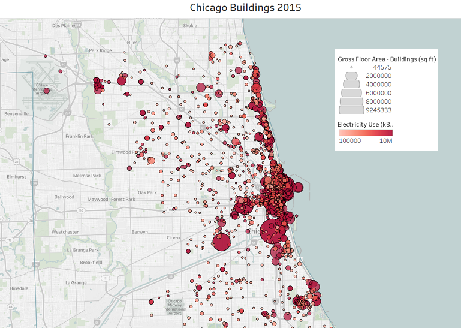
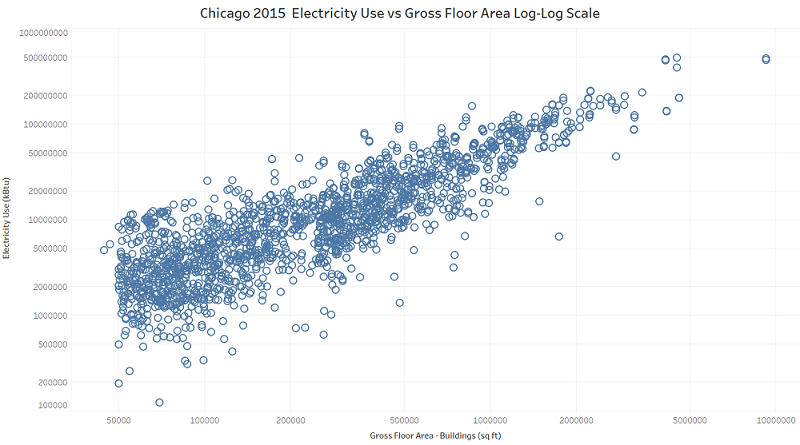
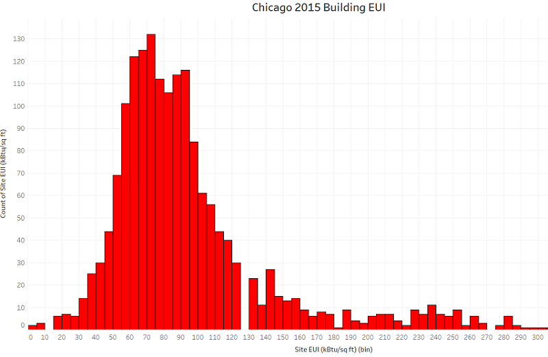
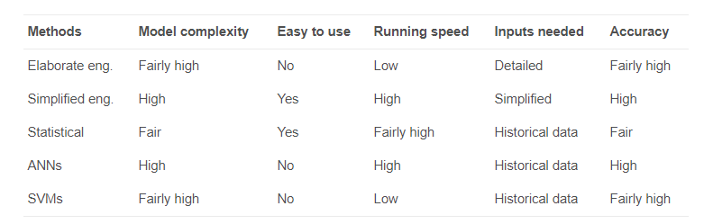
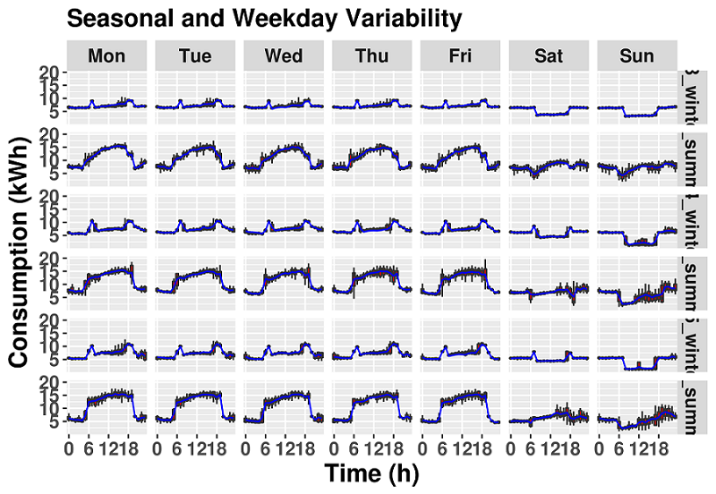
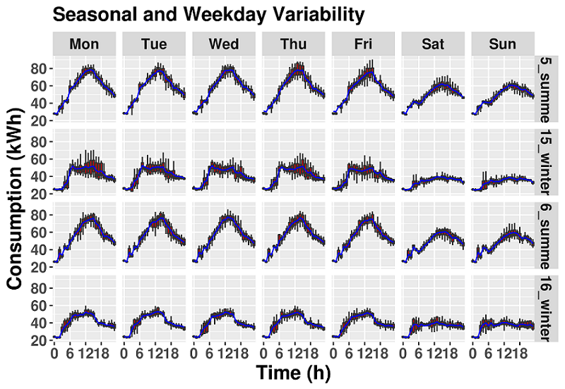
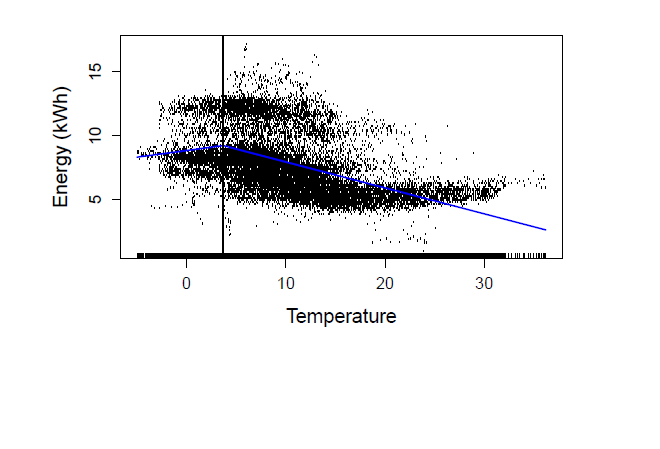

  <!--
  # Script Name: eda_report_two.Rmd
  # Purpose: Second report for DSCI 451 Semester Project
  # Authors: William Koehrsen
  # License: Creative Commons Attribution-ShareAlike 4.0 International License.
  ##########
# Latest Changelog Entries:
# v0.00.01 - 10/01/17 - eda_report_two.Rmd - William Koehrsen began this rmd
# v0.00.02 - 10/07/17 - eda_report_two.Rmd - William Koehrsen completed preliminary
#  version of this report
# v0.00.03 - 10/07/17 - eda_report_two.Rmd - William Koehrsen edited the first half 
# of this report
# v0.00.04 - 10/12/17 - eda_report_two.Rmd - William Koehrsen continued editing report
# v0.00.05 - 10/13/17 - eda_report_two.Rmd - William Koehrsen completed editing
# v0.00.06 - 10/20/17 - eda_report_two.Rmd - William Koehrsen has completed the report
# v0.00.07 - 10/25/17 - eda_report_two.Rmd - William Koehrsen made some upgrades to aesthetics
# v0.00.08 - 10/26/17 - eda_report_two.Rmd - William Koehrsen made final adjustments to report
##########

# Rmd code goes below the comment marker!
-->

```{r setup, include = FALSE}

knitr::opts_chunk$set(echo = FALSE)

options(formatR.indent = 4, width = 80)
knitr::opts_chunk$set(tidy = TRUE)
# Set correct working directory depending on desktop in use
# 
# For personal laptop use
knitr::opts_knit$set(root.dir = 'C:/Users/Will Koehrsen/Documents/DSCI 451/17f-dsci351-451-wjk68/1-assignments/SemProj-451/building_energy_eda')
# For VUV VDI (citrix) use
# knitr::opts_knit$set(root.dir =
# 'H:/Git/17f-dsci351-451-wjk68/1-assignments/SemProj-451/building_energy_eda')
```

# Introduction

The first report of the Progressive Building Energy EDA described the project, 
established objectives/guiding questions, examined the data available, and showed a 
few preliminary graphs. This follow-on report documents the exploratory data analysis 
of the Progressive Building Energy data which includes establishing a databook,
finding trends/relationships between variables, graphing these relationships, performing
power transformations of the variables, compare results to established knowledge, 
and examining possible models/statistical learning techniques to be examined 
in subsequent work. 


```{r, include = FALSE, message = FALSE}
# Load in relevant libraries and set theme for ggplot
suppressMessages(library(tidyverse))
suppressMessages(library(lubridate))
library(ggthemes)
suppressMessages(library(ggplot2)); 
theme_set(theme_classic(12) + theme(plot.title = element_text(hjust = 0.5),
                                    axis.text = element_text(color = 'black')))

suppressMessages(library(data.table))

```

# Databook 

__In this report, the following meteorological definitions for__ 
__winter and summer are used:__

__Winter = December, January, February__

__Summer = June, July, August__

## Metadata

Both metadata and specific electricity consumption data about each building is available as
documented in [report one](https://drive.google.com/open?id=0B_41odSiCNW8NWdzaWdnQzA5WEE). 
The metadata is contained in a single csv file with one row for each building, and the 
columns are the variables that describe the building. The columns are as follows:

|      Variable     |    Type   | Units | Explanation                                        |
|:-----------------:|:---------:|:-----:|----------------------------------------------------|
| Ref               | integer   |       | Reference number for building                      |
| Name              | character |       | Assigned Name of building                          |
| City              | character | kWh   | City location of building                          |
| State             | character |       | State location of building                         |
| Square Footage    | integer   | sq ft | Square footage of building                         |
| Years of data     | integer   | years | Number of years of complete data for building      |
| Climate Zone      | character |       | Koppen-Geiger climate zone                         |
| Customer          | character |       | Company owning building (Progressive)              |
| Annual Consumption | integer   | kWh   | Average annual electricity consumption of building |
| Country           | character |       | Country location of building (United States)       |

Table: Metadata Databook

```{r, results = 'asis' }
metadata <- fread('metadata/progressive_metadata.csv')
metadata_sub <- metadata[,c(2, 3, 4, 5, 7, 9)]
knitr::kable(metadata_sub, caption = 'Progressive Building Metadata')
```

The annual consumption is determined from the previous 365 days of electricity consumption. The 
annual consumption and square footage of the building is used for calculating the 
energy use intensity, which is a standard measure used for comparing different sized
buildings of the same type. The climate zone could be useful when trying to create
a normalized indicator of an energy efficiency score.

```{r }
# Create list of file names for iteration
# Paste is used to join the directory on the front of files
file.names <- dir('data')
file.names <- paste0('data/', file.names)

```

## Building Energy and Weather Data
The energy data for 8 of the buildings has already been cleaned by the EDIFES team[^1]
and each building is in a separate csv file with associated weather information. Each row of the 
csv data files contains one time interval of fifteen minutes.
The columns contain the energy consumption and weather data associated with that building
and timestamp. The csv file for each building contains the following columns: 

|     Variable     |    Type   | Units | Meaning                                   |
|:----------------:|:---------:|:-----:|-------------------------------------------|
| timestamp        | date      |       | date and time                             |
| elec_cons        | numeric   | kWh   | electricity consumption                   |
| elec_cons_imp    | integer   |       | electricity consumption imputed           |
| power_dem        | numeric   | kW    | power difference                          |
| biz_day          | integer   |       | business day                              |
| day_of_week      | character |       | day of the week                           |
| week_day_end     | character |       | weekday or weekend                        |
| sun_rise_set     | character |       | sun rise or sun set                       |
| num_time         | numeric   | hours | time in hours from start of day           |
| cleaned_energy   | number    | kWh   | energy consumption with anomalies removed |
| anom_flag        | integer   |       | anomaly flag                              |
| ghi              | integer   | W/m^2 | global horizontal irradiance              |
| dif              | integer   | W/m^2 | diffuse horizontal irradiance             |
| gti              | integer   | W/m^2 | global tilted irradiance                  |
| temp             | numeric   | C     | temperature                               |
| rh               | numeric   | %     | relative humidity                         |
| pwat             | numeric   | cm    | precipitable water                        |
| ws               | numeric   | kph   | wind speed                                |
| forecast         | numeric   | kWh   | cleaned energy forecast                   |
| anom_missed_flag | integer   |       | anomaly or missing data flag              |

Table: EDIFES Databook

[^1]: Professor Alexis Abramson, Professor Roger French, Rojiar Haddadian, Arash Khalilnejad, 
Mohammad Hossain, Jack Mousseau, Shreyas Kamath, Ethan Pickering

Not all of the variables were examined in the initial modeling of the data by the EDIFES team.
The following variables were of primary interest to the EDIFES team on the first pass through the data.

* timestamp: gives the date and time for the energy measurement in fifteen minute intervals
* elec_cons: the raw electricity consumption data (kWh)
* elec_cons_imp: 1 or 0 marker if the data was linearly imputed
* power_dem: difference in power (kW) between measurements
* biz_day: business day or not (accounts for holidays)
* day_of_week: relatively self-explanatory
* week_day_end: weekday or weekend
* num_time: number of hours since the start of day
* ghi: [global horizontal irradiance](http://solargis.com/support/methodology/solar-radiation-modeling/), 
generally positively correlated with energy consumption during the summer
* temp: most correlated weather variable with energy consumption
* rh: relative humidity
* forecast: final cleaned energy consumption with anomalies removed and missing 
data imputed using a custom function
* anom_missed_flag: marker that tells if forecast energy had to be corrected from the raw number. 
There would be two reasons for the raw data to be corrected:the data was
missing, or the data was anomalous (an outlier). 

Although not all of the variables were used in the modeling by the EDIFES team, 
I will keep all of the weather data to try and find relationships that might have 
gone overlooked.

```{r, include = FALSE}
for (file in file.names) {
  df <- as.data.frame(fread(file))
  # 96 observations a day by 365 days in a year
  expected_points = 96*365
  # Number of years of data
  fractional_years = nrow(df) / expected_points
  if (fractional_years > 1) {
    annual_consumption = sum(tail(df, expected_points)$forecast)
  } else {
    annual_consumption = (sum(tail(df, expected_points)$forecast)) / fractional_years
  }
  print(annual_consumption)
}

```

# Data Visualization and Exploratory Data Analysis

To explore the data, I first need to understand its structure. Therefore, the first plot
to make is simply the energy consumption over the entire dataset. However, as I discovered
in the first report, simply plotting all of the points as a scatter plot resulted in
a messy and nearly incomprehensible picture. There is too much noise from point to point
because of the frequency of the data. A better representation
of the larger trends in the data is to plot the whole energy consumption time series
by daily average. 

### Long Term Trends
The energy data exhibits both long and short term trends. To get a sense of the 
long term seasonal trends, it is useful to graph the average energy use for the entire 
timeframe of the data.

```{r, suppressWarnings = TRUE, suppressMessages = TRUE , fig.height = 4}
# Function to plot daily average energy consumption

# Function takes in a dataframe and optional building name
# and plots average daily energy consumption
plot_daily_average <- function(A, building_location = '') {
  # Create column with only day
  A$date <- as.Date(format(A$timestamp, "%Y-%m-%d"))
  
  # Group by the day and compute averages, have to use aggregate
  # with characters
  daily.df <- aggregate(A[, c("forecast", "biz_day")],
                        by = list(A$date), FUN = mean)
  daily.df <- plyr::rename(daily.df, replace = c("Group.1" = "date"))
  
  # Create the plot, multiply the forecast by 96 to get consumption for day
  print(ggplot(daily.df, aes(x = date, 
                             y = forecast * 96, color = factor(biz_day))) + 
           geom_point() + labs(color = '') + geom_line() + xlab('') + 
    scale_color_manual(values = c("firebrick", "darkgreen"), 
                       labels = c('Business Day', 'Non-Business Day')) +
      theme_hc(12) + ylab("kWh") + 
      scale_x_date(date_labels = ("%m-%Y"), date_breaks = '4 months') + 
    ggtitle(sprintf('%s Average Daily Energy Consumption', building_location)))
    
}

# Iterate through files and create plots
for (file in c("data/f-APS_weather.csv", "data/f-NVE_weather.csv",
               "data/f-Kansas_weather.csv")) {
  name <- unlist(strsplit(file, '-|_'))[2]
  location <- metadata[which(metadata$Name == name), ]$City
  df <- suppressMessages(as.data.frame(read_csv(file)))
  suppressMessages(plot_daily_average(df, location))
}
```

These plots are relatively good at showing long term trends. As can be seen,
there is a seasonal cycle depending on the climate zone. The PGE1 building is located in
Portland and exhibits higher energy usage during the winter when heating systems need 
to be run. The SRP building in Phoenix clearing shows more energy usage during the summer,
when air conditioners are in use. This shows that buildings typically exhibit cyclic yearly
trends and buildings in different climate zones can have significantly different behavior. 

### Yearly Trends

Another good plot is the boxplot which is based on summary statistics. I can plot the 
monthly boxplots across a year to give a better indication
of the variability in the daily data and seasonal trends. I will do this for the PGE1
building and the SRP building to illustrate the differences between climate zones.
These plots are showing only the business days. 

```{r, suppressWarnings = TRUE , fig.height = 3.5}
# Data from PGE1 building
pge1 <- as.data.frame(suppressMessages(read_csv('data/f-PGE1_weather.csv')))
# Data from SRP building
srp <- as.data.frame(suppressMessages(read_csv('data/f-SRP_weather.csv')))
nve <- as.data.frame(suppressMessages(read_csv('data/f-NVE_weather.csv')))
kansas <- as.data.frame(suppressMessages(read_csv('data/f-Kansas_weather.csv')))

# Create month column
srp$month <- lubridate::month(srp$timestamp, label = TRUE, abbr = TRUE)
pge1$month <- lubridate::month(pge1$timestamp, label = TRUE, abbr = TRUE)
nve$month <- lubridate::month(nve$timestamp, label = TRUE, abbr = TRUE)
kansas$month <- lubridate::month(kansas$timestamp, label = TRUE, abbr = TRUE)
# Create plot year where each month is represented as a boxplot
# Multiply forecast by 96 * days in month to get monthly average
# PGE1 building
# ggplot(filter(pge1, biz_day == 1), 
#        aes(x = month, y = 96*30*forecast, group = month)) + 
#   geom_boxplot(outlier.color = 'red', fill = 'dodgerblue3') + theme_hc(12) + 
#   xlab('Month') + ylab('kWh') + scale_fill_stata() + 
#   ggtitle('Portland Building Monthly Consumption Boxplots') 

# SRP building,
ggplot(filter(srp, biz_day == 1), 
       aes(x = month, y = 96*forecast, group = month)) + 
  geom_boxplot(outlier.color = 'red', fill = 'dodgerblue3') + theme_hc(12) + 
  xlab('Month') + ylab('kWh') + scale_fill_stata() + 
  ggtitle('Phoenix Building Monthly Consumption Boxplots') 

ggplot(filter(nve, biz_day == 1), 
       aes(x = month, y = 96*forecast, group = month)) + 
  geom_boxplot(outlier.color = 'red', fill = 'dodgerblue3') + theme_hc(12) + 
  xlab('Month') + ylab('kWh') + scale_fill_stata() + 
  ggtitle('Las Vegas Building Monthly Consumption Boxplots') 

ggplot(filter(kansas, biz_day == 1), 
       aes(x = month, y = 96*forecast, group = month)) + 
  geom_boxplot(outlier.color = 'red', fill = 'dodgerblue3') + theme_hc(12) + 
  xlab('Month') + ylab('kWh') + scale_fill_stata() + 
  ggtitle('Kansas Building Monthly Consumption Boxplots') 

```

### Weekly Trends

There will also be trends over the course of a week because of employee working 
schedule. Generally, for office buildings in the United States, energy consumption drops
during the weekend because there are fewer workers present. If the energy does not
drop as expected, that could be an indication of an atypical work schedule or inefficient
HVAC scheduling. There graphs take the boxplots and group by day of the week.

```{r}
# Plot energy consumption for each day of the week, colored by season
plot_week <- function(df, location) {
  
  # Create necessary columns
  df$day <- lubridate::ymd(as.Date(df$timestamp, tz = 'EST'))
  df$month <- lubridate::month(as.Date(df$timestamp, tz = 'EST'))
  df$year <- lubridate::year(as.Date(df$timestamp, tz = 'EST'))
  
  # December of the preceding year is assocaited with winter of the next year
  df[which(df$month == 12),]$timestamp <-
  df[which(df$month == 12),]$timestamp + years(1)
  
  df[which(df$month == 12),]$year <-
  df[which(df$month == 12),]$year + 1
  
  
  # Season mapping
  df$season <- ifelse(df$month %in% c(12, 1, 2),
  'winter',
  ifelse(
  df$month %in% c(3, 4, 5),
  'spring',
  ifelse(df$month %in% c(6, 7, 8), 'summer',
  'fall')
  ))
  
  # Coloring for scale_color_manual
  df$season_color <- ifelse(df$season == 'winter',
  'blue',
  ifelse(
  df$season == 'spring',
  'darkgreen',
  ifelse(df$season == 'fall', 'orange',
  'firebrick')
  ))
  
  # Day of week as factor for correct ordering
  df$day_of_week <- factor(df$day_of_week,
  levels = c('Mon', 'Tue', 'Wed', 'Thu', 'Fri',
  'Sat', 'Sun'))
  
  df <- arrange(df, season)
  
  # Plot weekly colored by season and facted by day of week
  p1 <- ggplot(df, aes(x = num_time, y = forecast)) + 
    stat_summary(fun.y = mean, geom = 'line', aes(col = season_color), lwd = 1.1) +
    theme_hc(12) + xlab('Time of Day in Hours') + ylab('Energy (kWh)') + 
    ggtitle(sprintf('%s Summer Daily and Weekly Consumption Patterns', location)) +
    scale_x_continuous(breaks = seq(0, 24, 6)) + 
    scale_color_identity(labels = unique(df$season),
                       guide = 'legend') + labs(color = 'season') + 
      facet_wrap(~ day_of_week, ncol = 7)
  
  print(p1)
  
}

for (file in file.names[c(1, 3, 4)]) {
  name <- unlist(strsplit(file, '-|_'))[2]
  location <- metadata[which(metadata$Name == name), ]$City
  df <- suppressMessages(as.data.frame(read_csv(file)))
  suppressMessages(plot_week(df, location))
}

# srp$day <- factor(srp$day_of_week, c('Mon', 'Tue', 'Wed', 'Thu', 'Fri', 'Sat', 'Sun'))
# 
# suppressWarnings(ggplot(filter(srp, month(timestamp) %in% c(6, 7, 8)), 
#                         aes(x = day, y = 96*forecast, 
#                                       group = day)) + 
#   geom_boxplot() + ylab('kWh') + xlab('Day of Week') + 
#   ggtitle('SRP Summer Daily Energy Use Boxplots'))
# 
# suppressWarnings(ggplot(filter(srp, month(timestamp) %in% c(12, 1, 2)), 
#                         aes(day, y = 96*forecast, 
#                                       group = day)) + 
#   geom_boxplot() + ylab('kWh') + xlab('Day of Week') + 
#   ggtitle('SRP Winter Daily Energy Use Boxplots') )


```
This building indicates a clear Monday-Friday working schedule and a 
typical weekend break. The weekend drop is not large relative to the overall
energy usage which suggests that the building has a high baseload that is constant
across the week or sectors of the building where employees work on the weekends.
These are the sorts of questions that can be validated by a building energy manager
and inform subsequent analyses.

### Daily Trends

To demonstrate trends across a day, I can make another plot where 
each hour of the day is represented by a boxplot. These plots show only the 
business days. 

```{r, suppressWarnings = TRUE , fig.height = 3}
# Plot of hourly boxplots, multiply forecast by 4 to get hourly consumption
# 
# PGE1 summer plot
# suppressWarnings(ggplot(filter(pge1, biz_day == 1 & month(timestamp) %in% c(6, 7, 8)), aes(x = round(num_time), y = 4*forecast, 
#                                       group = round(num_time))) + 
#   geom_boxplot() + ylab('kWh') + xlab('Time of Day in Hours') + 
#   ggtitle('PGE1 Summer Daily Energy Use Boxplots') + 
#   scale_x_continuous(limits = c(0, 24), breaks = seq(0, 24, 4)))

# SRP summer plot
suppressWarnings(print((ggplot(filter(srp, biz_day == 1 & month(timestamp) %in% c(6, 7, 8)), aes(x = round(num_time), y = 4*forecast, 
                                      group = round(num_time))) + 
  geom_boxplot() + ylab('kWh') + xlab('Time of Day in Hours') + 
  ggtitle('SRP Summer Daily Energy Use Boxplots') + 
  scale_x_continuous(limits = c(0, 24), breaks = seq(0, 24, 4)))))

# SRP winter plot
suppressWarnings(print((ggplot(filter(srp, biz_day == 1 & month(timestamp) %in% c(12, 1, 2)), aes(x = round(num_time), y = 4*forecast, 
                                      group = round(num_time))) + 
  geom_boxplot(na.rm = TRUE) + ylab('kWh') + xlab('Time of Day in Hours') + 
  ggtitle('SRP Winter Daily Energy Use Boxplots') + 
  scale_x_continuous(limits = c(0, 24), breaks = seq(0, 24, 4)))))
```
These plots demonstrate that energy consumption increases during the afternoon
for buildings in warmer climates during the day. For the building in Portland, there is a rise in
average energy consumption during the morning and then again in the afternoon in the summer.
During the night and early morning, both buildings show reduced energy consumption as expected. 
The PGE1 data is relatively messy, which is likely because there is considerable 
variability across hourly measurements. Furthermore, the difference between the daily
patterns during the winter and summer can be observed in the SRP boxplots. During the summer,
the electricity use begins rising around 4 am and continues to rise until it 
peak at 3 in the afternoon. It then falls off during the evening. In the winter,
electricity use begins to increase around 4 am and rises to a plateau by 8 am where it remains until
3 pm, at which time it begins to drop into the evening. 

## Building Comparison

I next want to plot energy data for all of the buildings on the same plot for comparison. The primary 
issue is the dates do not align over the entire time span. I will 
need to figure out the dates that are shared by all the data sets. 

```{r , include = FALSE}
# Create initial vector of POSIXct dates
dates <- suppressMessages(as.data.frame(read_csv('data/f-PGE1_weather.csv')))$timestamp

# Iterate through all the data and keep only dates that match across all dataframes
for (file in file.names) {
  df <- suppressMessages(as.data.frame(read_csv(file)))
  timestamps <- df$timestamp
  dates <- dates[which(dates %in% timestamps)]
}

# Find the length of time of matching dates
max(dates) - min(dates)
```

After comparing the date ranges, there are 187 days or about half a year shared 
between the datasets. The range covers December 18, 2015 until June 22, 2016.

Now, I can combine all the daily averages into one large dataframe in
order to plot all of the trends.

```{r, suppressMessages = TRUE , fig.height = 4}
# Initialize dataframe for storing all building data
all.data <- data.frame(timestamp = dates)

# Iterate through the data and add the energy information 
# corresponding to the date range and the building name.
for (file in file.names) {
  # Extract the building name
  building.name <- unlist(strsplit(file, '-|_'))[2]
  df <- as.data.frame(suppressMessages(read_csv(file)))
  timestamps <- df$timestamp
  # Extract the rows corresponding to shared timestamps
  df <- df[which(timestamps %in% dates), ]
  df <- df[1:length(dates), ]
  all.data[[building.name]] <- df$forecast
}

# Create a numeric date column so we can use group_by
all.data$date <- as.numeric(as.Date(format(all.data$timestamp, "%Y-%m-%d")))

# Get the daily averages for all buildings
all.data <- all.data %>% 
  group_by(date) %>% summarize_all(funs(mean))

date.days <- as.Date(dates)
date.days <- unique(date.days)

# Discard the timestamp column
all.data <- all.data[-2]
all.data <- as.data.frame(all.data)
# Melt the dataframe from wide format into long format
# The columns will be date, varible, value
# The variable contains the name of the building
# To plot different buildings, can color by the variable
d <- melt(all.data, id = 'date')

# Plot the daily averages of all buildings
# Multiply by 96 to get daily energy consumption
suppressMessages((ggplot(d, aes(as.Date(date, origin = '1970-01-01'), 96*value, col = variable)) + 
  geom_point() + 
  geom_smooth(method = 'loess') + labs(col = 'building') + 
  xlab('') + ylab('kWh') + scale_x_date(labels = scales::date_format("%b-%d")) + 
  ggtitle('Average Daily Energy Use all Buildings'))) + scale_color_stata() +
  theme_hc(12)
```
That shows the top two buildings well but not the six ones with lower
average energy consumption. I will exclude the top two buildings in order to 
get a clearer picture of the bottom six. 

```{r, fig.height = 4 }
# Subset the six buildings with lower consumption
all.data.subset <- select(all.data, date, APS, SDGE, PGE1, NVE, Kansas, CoServ)

# Put data into "tall" format to plot all columns
d <- melt(all.data.subset, id.vars = 'date')

# Plot the average daily electricity consumption for the subset buildings
# Multiply the forecast by 96 to get daily consumption
ggplot(d, aes(as.Date(date, origin = '1970-01-01'), 96 * value, col = variable)) + 
  geom_point() + 
  geom_smooth(method = 'loess') + labs(col = 'building') + 
  xlab('') + ylab('kWh') + ggtitle('Average Daily Energy Use Subset')

```
The CoServ building has a suspiciously low energy usage. After discussing with the team,
I found out they had come to the same conclusion and as a result had determined the 
electricity consumption measurements for this building were off by a factor of 10. 
They had subsequently multiplied all of the electricity measurements by 10. 
I can perform that data cleaning and write the results to a new file to use in 
subsequent analysis.

```{r , include = FALSE}
# Correct list of file names
file.names <- dir('data')
file.names <- file.names[-which(file.names =='f-CoServ_weather.csv')]
file.names <- paste('data/', file.names, sep = '')
```

Now this corrected value needs to be reinserted into the dataframe in order to be
plotted accurately.

```{r, fig.height = 4 }
# Load in correct data
coserv <- as.data.frame(suppressMessages(read_csv('data/f-CoServ_weather_corrected.csv')))
coserv <- coserv[which(dates %in% (coserv$timestamp)),]

# Get data in matching format
coserv <- coserv %>% 
  mutate(date = as.numeric(as.Date(timestamp))) %>% 
  group_by(date) %>% 
  summarize(CoServ = mean(forecast, na.rm = TRUE))

# Replace the incorrect data with correct values
all.data.subset$CoServ <- coserv$CoServ

# Put data into "tall" format to plot all columns
d <- melt(all.data.subset, id.vars = 'date')

# Plot the average daily electricity consumption for all buildings
# Multiply by 96 observations in a day
ggplot(d, aes(as.Date(date, origin = '01-01-1970'), 96 * value, col= variable)) + 
  geom_point() + 
  geom_smooth(method = 'loess') + labs(col = 'building') + 
  xlab('') + ylab('Average Daily Elec. Cons. (kWh)') + ggtitle('Average Daily Elec. Cons. for All Progressive Buildings')


```
That plot looks much better. I talked with the team, and they said Progressive
did not know if the number was lower by a factor of magnitude, but they used their
best judgement informed from experience. The electricity consumption was so low 
that they concluded something had to be off with the data collection. The pattern of
the CoServ electricity consumption matched that of a "normal" office building, but
the magnitude of the measurements was well below the expected range. It is likely 
that the data is off by a constant factor, but it is not known what this 
factor should be. This was not the only anomaly in the Progressive dataset, and the 
correction applied might not be accurate. 

These graphs show electricity consumption falls during the spring, and is higher in
the winter and summer. These graphs are inherently noisy because I am not controlling
for many variables, such as whether the day is a work day or not. Rather, this graph
allows for a quick overview of the differences between buildings and also the 
shared trends across buildings. Further exploration of the data will take into account
the other variables, notably weather. 

# Trends and Relationship Analysis

Now that I have a handle on the data, and have corrected the one small error in the 
datasets, I want to tackle the first question I asked about the dataset: 
which weather variables are most closely correlated with electricity consumption? 

## Weather Correlations
To answer this question quantitatively, I can find the [Pearson Correlation Coefficient](http://www.statisticshowto.com/what-is-the-pearson-correlation-coefficient/)
. This is a measure of the linear correlation between two variables. It ranges from -1 to +1
where a value of -1 is a perfectly linear negative relationship and +1 is a perfectly linear
positive relationship. The Pearson Correlation Coefficient can also be used to compare
non-linear relationships by transforming one variable, for example taking the log,
and then calculating the coefficient of the resulting relationships. 

I will be using the forecast (final cleaned energy) for finding the correlation
coefficient for all the weather variables. 

### Linear Correlations

First I will find the Pearson Correlation Coefficient for linear relationships
between the electricity consumption and weather data. I expect the temperature
will be positively linearly correlated to consumption and the relative humidity will
be negatively linearly correlation to consumption. This is based on experience and what
I have learned from the EDIFES team.

```{r, results = 'asis' }
# Define winter and summer months for subsetting
winter <- c(12, 1, 2)
summer <- c(6, 7, 8)

# Weather columns and matrix to hold correlations
weather.cols <- c('ghi', 'dif', 'gti', 'temp', 'rh', 'pwat', 'ws')
weather.corrs <- as.data.frame(matrix(ncol = 8, nrow = 0))
winter.corrs <- as.data.frame(matrix(ncol = 8, nrow = 0))
summer.corrs <- as.data.frame(matrix(ncol = 8, nrow = 0))

# Function to calculate correlation between energy and weather
weather_corr <- function(A, building.name = '') {
  energy <- A$forecast
  weather <- select(A, weather.cols)
  # Find Pearson correlation
  corrs <- as.data.frame(cor(energy, weather, method = "pearson"))
  corrs <- round(corrs, 4)
  corrs$building.name = building.name
  # Return the correlations for building
  return(corrs)
}

# Iterate through all datasets and find linear weather correlations by season 
for (file in file.names) {
  building.name <- unlist(strsplit(file, '-|_'))[2]
  df <- as.data.frame(suppressMessages(read_csv(file)))
  
  # Select only winter or summer months
  winter.df <- df[which(month(df$timestamp) %in% winter), ]
  summer.df <- df[which(month(df$timestamp) %in% summer), ]
  winter.corrs.results <- weather_corr(winter.df, building.name)
  summer.corrs.results <- weather_corr(summer.df, building.name)
  
  # One dataframe will hold winter, summer, and all correlations
  all.corrs <- weather_corr(df, building.name)
  winter.corrs <- rbind(winter.corrs, winter.corrs.results)
  summer.corrs <- rbind(summer.corrs, summer.corrs.results)
  weather.corrs <- rbind(weather.corrs, all.corrs)
}

summer.corrs$city <- sapply(summer.corrs$building.name, 
                                function(x) {return(metadata[which(metadata$Name == x), ]$City)})
summer.corrs$state <- sapply(summer.corrs$building.name, 
                                function(x) {return(metadata[which(metadata$Name == x), ]$State)})

summer.corrs <- dplyr::mutate(summer.corrs, location = paste0(city, ', ', state))

winter.corrs$city <- sapply(winter.corrs$building.name, 
                                function(x) {return(metadata[which(metadata$Name == x), ]$City)})
winter.corrs$state <- sapply(winter.corrs$building.name, 
                                function(x) {return(metadata[which(metadata$Name == x), ]$State)})

winter.corrs <- dplyr::mutate(winter.corrs, location = paste0(city, ', ', state))
knitr::kable(summer.corrs[, c(1:6, 11)], caption = 'Summer Weather Correlations')
knitr::kable(winter.corrs[, c(1:6, 11)], caption = 'Winter Weather Correlations')
```

I can make a bar chart showing the correlations between temp and building energy use
by season. This can be used to compare trends for different climate zones.

```{r, fig.height = 3.5,  echo = FALSE}
summer.corrs[which(summer.corrs$building.name == 'SRP'), ]$location <-
  'Phoenix, AZ 2'
winter.corrs[which(winter.corrs$building.name == 'SRP'), ]$location <-
  'Phoenix, AZ 2'
# Plot winter correlations
ggplot(winter.corrs, aes(x = location, y = temp)) + 
  geom_bar(stat = "identity", fill = "blue", color = "black") +
  xlab('Building') + ylab('Pearson Correlation') + 
  ggtitle('Winter Temp and Energy Correlation') +
  scale_y_continuous(breaks = seq(-0.6, 0.6, 0.3), limits = c(-0.6, 0.6)) + coord_flip()

```
The winter plot tells the EDIFES team several characteristics of a building. 
Generally, if a building has electric heating, during the winter, the electricity use
will decrease with increasing temperature. However, if the building has gas heating,
the opposite will hold. If there is no correlation at all, that might mean the building 
either does not have a heating system or does not often utilize the heating system
in the winter months. 

```{r, fig.height = 3.5,  echo = FALSE}
# Plot summer correlation

ggplot(summer.corrs, aes(x = location, y= temp)) + 
  geom_bar(position = 'dodge', stat = "identity", fill = "blue", color = "black") +
  xlab('Building') + ylab('Pearson Correlation') + 
  ggtitle('Summer Temp and Energy Correlation') + theme_hc() +
  scale_y_continuous(breaks = seq(-0.5, 0.8, 0.3), limits = c(-0.6, 0.8)) + coord_flip()
```
This plot of the correlation between summer temperature and energy use is
interesting! It is expected that for most buildings, as the temperature increases,
the energy consumption will increase as well, and indeed that is demonstrated for 
7 of the 8 buildings. However, for the PGE1 building, the temperature is strongly 
negatively linearly correlated with energy use. The one situation in which this would 
be expected is if the building has a solar energy system. An increase in temperature generally 
means an increase in solar irradiance (ghi and temperature are strongly 
positively correlated) with would mean more power could be produced from solar panels 
which would reduce the electricity usage as recorded by the utility. However,
after observing this strange behavior and reporting it to the Progressive building 
managers, the team was informed this building has no source of photo-voltaic energy.
Therefore, the mystery remains as to why the correlation is so different at PGE1 
from those of the other buildings. It is possible the timestamp of the utility meter 
is off by a number of months, but this has not been investigated by the team and would
be an ideal area for a follow-up discussion. 

I can make similar plots with relative humidity. I would expect relative
humidity to be negatively correlated with energy use during the summer.

The next plot shows the summer correlation between relative humidity and energy. 

```{r, fig.height = 3.5 }
# Plot the summer correlations of relative humidity
ggplot(summer.corrs, aes(x = building.name, y = rh)) + 
  geom_bar(stat = "identity", fill = "blue", color = "black", width = 0.9) +
  xlab('Building') + ylab('Pearson Correlation') +
  ggtitle('Summer Correlation of Rel. Hum. with Energy Use')
```

Again, anomalous behavior is observed with the PGE1 building. My opinion based 
on the exploration is that the timestamps are off by about 6 months. Even if the 
building had solar power, that would not explain the positive correlation 
between relative humidity and energy use during the summer. I will be making 
inquiries to the rest of the team to try and determine the reason for this 
anomalous data. 

### Pairwise Plots

There are also built in functions to plot correlations. I can use two of these to 
show the same correlations. 

[GGpairs](https://www.rdocumentation.org/packages/GGally/versions/1.3.2/topics/ggpairs)
from the GGally package is the first example.

```{r, fig.height = 4.5 }
suppressMessages(library(GGally))

# Load in dataframes that I created but the deleted the code to make
# Then I saved these as csv from the environment to reload for visualization
srp.daily.summer <- suppressMessages(as.data.frame(read_csv('srp_daily_summer.csv')))
srp.daily.winter <- suppressMessages(as.data.frame(read_csv('srp_daily_winter.csv')))

srp.daily.summer <- dplyr::rename(srp.daily.summer, energy = forecast)
srp.daily.winter <- dplyr::rename(srp.daily.winter, energy = forecast)

linear_func <- function(data, mapping, ...){
  p <- ggplot(data = data, mapping = mapping) + 
    geom_point(alpha = 0.5, color = "blue") + 
    geom_smooth(method = "lm", fill = "red", color = "red")
  p
}

ggpairs(data = srp.daily.summer,
        columns = c("ghi", "temp", "rh", "pwat", "ws", "energy"),
        lower = list(continuous = linear_func),
        title = "Phoenix Summer Correlations")

ggpairs(data = srp.daily.winter,
        columns = c("ghi", "temp", "rh", "pwat", "ws", "energy"),
        lower = list(continuous = linear_func),
        title = "Phoenix Winter Correlations")


```

[corrplot](https://cran.r-project.org/web/packages/corrplot/vignettes/corrplot-intro.html)
is another great tool for plotting correlations

```{r, fig.height = 4 }
suppressMessages(library(corrplot))
print('Summer Phoenix Correlation Matrix')
srp.summer.corrmat <- cor(srp.daily.summer[c("ghi", "temp", "rh", "pwat", "ws", "forecast")])
diag(srp.summer.corrmat) <- NA
corrplot(srp.summer.corrmat, method = "shade", type = "lower", na.label = "x")

print('Winter Phoenix Correlation Matrix')
srp.winter.corrmat <- cor(srp.daily.winter[c("ghi", "temp", "rh", "pwat", "ws", "forecast")])
diag(srp.winter.corrmat) <- NA
corrplot(srp.winter.corrmat, method = "shade", type = "lower", na.label = "x")
```

### Correlation Heatmap

Heatmaps are a great way to compare correlations across all buildings. I want to 
show the process of starting out with a rough chart, and making it presentable and 
clear. This first attempt uses no formatting and the result is usable at best. 

```{r, fig.height = 4 }

plot_heatmap <- function(A, season = '') {
  # Create a matrix of the weather correlations
  weather.matrix <- as.matrix(A[1:7])
  
  # Rename the rows with the buildings
  rownames(weather.matrix) <- A$location
  
  # Turn matrix into long format
  melted.weather <- melt(weather.matrix) 
  colnames(melted.weather) <- c('Building', 'Weather', 'corr')
  # Create rough draft of correlation matrix
  print(ggplot(melted.weather, aes(x = Building, y = Weather, fill = corr)) + 
    geom_tile() + ggtitle(sprintf('%s Correlation Heatmap', season)) + 
      theme(axis.text.x = element_text(angle = 60, vjust = 0.5)))
  return(melted.weather)
} 
summer.corrs <- dplyr::select(summer.corrs, ghi, dif, gti, temp, rh, pwat,
                              ws, location)
winter.corrs <- dplyr::select(winter.corrs, ghi, dif, gti, temp, rh, pwat,
                              ws, location)
melted.summer <- plot_heatmap(A = summer.corrs, season = 'Summer')
```

I can just see that the PGE1 building behaves differently as does the Kansas building.
SDGE, SMUD, and SRP all have similar behavior, and as expected, they are all
located in the southwestern United States (San Diego, Sacramento, and Phoenix respectively).

```{r, include = FALSE}
melted.winter <- plot_heatmap(A = winter.corrs, season = 'Winter')
```

That is a decent start, but can be much improved. I will make this plot 
much clearer with a few simple steps. This procedure is adapted from the STHDA 
website [tutorial on making correlation heatmaps](http://www.sthda.com/english/wiki/ggplot2-quick-correlation-matrix-heatmap-r-software-and-data-visualization)
```{r }
# Create Quality Correlation Matrix Heatmap
plot_final_heatmap <- function(melted.A, season = '') {
  
  # Initial heatmap
  heatmap <- ggplot(melted.A, aes(x = Building, y = Weather, fill = corr)) + 
    geom_tile(color = "white") + 
    # Create a diverging color scale to highlight differences
    scale_fill_gradient2(low = "navy", high = "red", mid = "lemonchiffon",
                         midpoint = 0, limit = c(-0.8, 0.8), space = "Lab", 
                         name = "Pearson Corr. Coeff.") + 
    # Adjust the themes as needed
    theme_minimal() + xlab('Building Location') + 
    theme(axis.text.x = element_text(angle = 45, vjust = 1, 
                                     size = 12, hjust = 1, color = 'black'), 
          axis.text.y = element_text(vjust = 0.5, size = 12, color = 'black'),
          panel.grid = element_blank(),
          plot.title = element_text(hjust = 0.5)) + 
    coord_fixed() + ggtitle("Weather Correlation with Elec. Cons.")
    
  # Add labels to the heatmap and refine the theme
  finished.heatmap <- heatmap + 
    geom_text(aes(Building, Weather, 
                  label = round(corr,2)), color = "black", size = 3.5) +
  theme(
    axis.title = element_text(size = 16, hjust = 0.5),
    panel.border = element_blank(),
    panel.background = element_blank(),
    axis.ticks = element_blank())  + 
    guides(fill = guide_colorbar(barheight = 12, vjust = 0)) +
    ggtitle(sprintf('%s Correlation Heatmap', season)) 
    
    
  # Print and save the heatmap
  print(finished.heatmap)
}
```

```{r }
plot_final_heatmap(melted.winter, season = 'Winter')
```

The image is much clearer making it easier to draw conclusions. The next
plot will be the same but for the summer. 

```{r }
plot_final_heatmap(melted.summer, season = 'Summer')
```
These heatmaps identify possible relationships within the data. From these plots,
it is clear that the PGE1 building exhibits anomalous behavior. In the summer, as the 
temperature increases, the building energy use decreases which is unexpected because 
higher temperatures should map to greater air conditioning use and hence higher 
electricity consumption. A negative correlation between temperature and electricity
consumption, and in particular, between global horizontal irradiance (ghi) and 
electricity consumption would seem to indicate the use of a photo-voltaic system 
that reduces the energy consumption as more sunlight reaches the panels. The EDIFES
team noticed this behavior as well and were told by the Progressive contacts that no,
this building did not have a photo-voltaic system. The question of how to explain 
the PGE1 building behavior remains. It is possible the meter was 
incorrectly recording timestamps although this has been deemed as unlikely 
by the EDIFES team. 

Ignoring the anomalous building for now, from these plots,
it can be seen that temperature and all 3 irradiances are positively linearly 
correlated with electricity consumption in summer. The relative humidity is 
mildly negatively correlated with electricity consumption, and windspeed and
precipitation are not correlated in any meaningful manner. During the winter,
these trends do not hold because of the differing types of heating systems in use. 
For an electric heating system, as the temperature increases, the building should use
less electricity, which would be seen as a negative Pearson correlation coefficient 
between temperature and electricity consumption during the winter. This behavior 
is demonstrated with the CoServ and Kansas buildings. A gas heating system will 
show the opposite behavior, as observed in the SDGE, SMUD, and SRP buildings. 
Furthermore, some buildings may not have a heating system, or may have few chances to use
it because of the local climate. The APS building, located in Phoenix, displays no
correlation between winter temperature and electricity consumption which indicates 
there may be no heating system in the building. 

## Intrepretation of Relationships

Now that I have identified some of these relationships, I can generate plots to visualize
these relationships. I will concentrate on the SRP building in the summer. 

```{r, fig.height = 3.5 }
srp$date <- as.Date(srp$timestamp)
srp <- dplyr::rename(srp, energy = forecast)
relevant.cols <- c('date', 'energy', 'ghi', 'dif', 'gti', 'temp', 'rh', 'pwat', 'ws')
# Create a dataframe with daily averages
srp.daily <- srp %>% select(relevant.cols) %>%
  group_by(as.numeric(date)) %>% summarize_all(funs(mean))


# Create a linear model between energy and temperature for summer and winter
summer.linear.model <- lm(96 * energy~temp, data = srp[which(month(srp$date) %in% summer), ])
winter.linear.model <- lm(96 * energy~temp, data = srp[which(month(srp$date) %in% winter), ])

srp.daily.winter <- srp.daily[which(month(srp.daily$date) %in% winter), ]
srp.daily.summer <- srp.daily[which(month(srp.daily$date) %in% summer), ]

# # Plot the daily average energy consumption and temperature
# ggplot(srp.daily.winter, aes(temp, 96 * forecast)) + 
#   geom_jitter(size = 2.5) + 
#   geom_abline(intercept = winter.linear.model$coefficients[1], 
#               slope = winter.linear.model$coefficients[2], size = 2, color = 'red') + 
#   xlab('Temp (C)') + ylab('kWh') + 
#   ggtitle('SRP Winter Energy Use vs. Temperature') + 
#   theme(text = element_text(size = 16))

# Plot the daily average energy consumption and temperature
suppressWarnings(print(ggplot(srp.daily.summer, aes(temp, 96 * energy)) + 
  geom_jitter(size = 2.5) + 
  geom_abline(intercept = summer.linear.model$coefficients[1], 
              slope = summer.linear.model$coefficients[2], size = 2, color = 'red') + 
  xlab('Temp (C)') + ylab('kWh') + 
  ggtitle('SRP Summer Energy Use vs. Temperature') + 
  theme(text = element_text(size = 16)) + 
  scale_x_continuous(limits = c(26, 38), breaks = seq(26, 38, 2))))
```

```{r }
# Print the slope values for each model
print(sprintf('Winter linear slope: %0.4f', winter.linear.model$coefficients[2]))
print(sprintf('Summer linear slope: %0.4f', summer.linear.model$coefficients[2]))
```

A linear model has interpretability. I can use the coefficient to determine
that during the summer, for every 1 degree Celsius increase in temperature, the average daily 
energy use of SRP increases by 193 kWh. At the [national average price of $0.104 /kWh](https://www.eia.gov/electricity/state/),
that represents $20.03 in increased cooling costs. 

I can print the r_squared values to find how useful temperature is as a predictor
of electricity use in the winter and summer. The [r_squared value (or coefficient of determination) can be interpreted](https://www.khanacademy.org/math/ap-statistics/bivariate-data-ap/assessing-fit-least-squares-regression/v/r-squared-or-coefficient-of-determination)
as the percentage of variation of the dependent variable explained by the 
independent variable(s) in the model of interest. 

```{r }
# Print the r_squared values for both models
print(sprintf('Winter temperature and energy use r squared: %0.4f', summary(winter.linear.model)$r.squared))
print(sprintf('Summer temperature and energy use r squared: %0.4f', summary(summer.linear.model)$r.squared))
```

This suggests that temperature alone can explain 59% of variation in energy use
during the summer. I can add in more variables to the model to see how well they 
perform as predictors. 

```{r }
# Develop two new models using the temperature, relative humidity, and 
# global horizontal irradiance in a linear combination to predict the energy
winter.linear.model <- lm(96 * forecast ~ temp +  ghi + rh, data = srp[which(month(srp$date) %in% winter), ])
summer.linear.model <- lm(96 * forecast ~ temp + ghi +  rh, data = srp[which(month(srp$date) %in% summer), ])

# Print the r_squared values for both models
print(sprintf('Winter temp, ghi, and relative humidity vs energy r squared: %0.4f', summary(winter.linear.model)$r.squared))
print(sprintf('Summer temp, ghi, and relative humidity vs energy r squared: %0.4f', summary(summer.linear.model)$r.squared))
```
This slightly improves the summer mode. It now explains 65.4% of the difference in the 
energy consumption based on only three variables. The issue is that the temperature
and ghi are highly correlated, so adding in both is not much more effective than
adding in one at a time. 

Of course, a linear model cannot capture all relationships. The modeling section
of this report and the next report will take an in-depth look at different techniques 
to see if there is a method to capture the complex relationships between 
weather and electricity consumption. 

## Visualization of Relationships

As a final step in exploring the weather relationships, I can plot 
the trends of temperature and ghi versus energy energy. I will continue to work
with the SRP building and segment by season. 

```{r, fig.height = 4 }
srp.daily.summer <- srp.daily[which(month(srp.daily$date) %in% summer), ]
srp_summer_long <- gather(srp.daily.summer, key = 'variable', value = 'value', rh, energy, temp)

srp_summer_long$md <- paste0('0', lubridate::month(srp_summer_long$date), '-', lubridate::day(srp_summer_long$date))

srp_summer_long <- srp_summer_long %>% group_by(md, variable) %>% summarize_all(funs(mean))

srp_summer_long$date <- as.Date(srp_summer_long$md, format = '%m-%d')

srp_summer_long[which(srp_summer_long$variable == 'energy'), ]$value <- 
  srp_summer_long[which(srp_summer_long$variable == 'energy'), ]$value * 96
srp_summer_long[which(srp_summer_long$variable == 'temp'), ]$value <- 
  srp_summer_long[which(srp_summer_long$variable == 'temp'), ]$value * 1.5 * 96

# Create plot of average temp vs average elec cons.
ggplot(data = dplyr::filter(srp_summer_long, variable == 'energy'| variable == 'temp'), 
       aes(as.Date(date), value, color = variable)) + 
  geom_point(size = 1.5) + 
  geom_line(size = 1.1) + 
  scale_y_continuous(sec.axis = sec_axis(~.*(1/(96 * 1.5)), 
                                         name = "Avg. Temp (C)")) + 
  labs(color = 'variable') + xlab('') + ylab('kWh') + 
  ggtitle('Phoenix Summer Average Daily Energy Use and Temp.') + 
  scale_color_manual(values = c("firebrick", "darkgoldenrod1")) + 
  theme(axis.text.y = element_text(color = 'firebrick', face = 'bold'),
        axis.text.y.right = element_text(color = 'darkgoldenrod1', face = 'bold'),
        legend.position = 'bottom')

```

Relative humidty can be plotted to see a relationship that is negative. 
Again, the daily averages are taken rather than plotting every point. 

```{r}

srp_summer_long[which(srp_summer_long$variable == 'rh'), ]$value <- 
  srp_summer_long[which(srp_summer_long$variable == 'rh'), ]$value  * 90

ggplot(data = dplyr::filter(srp_summer_long, variable == 'energy'| variable == 'rh'), 
       aes(as.Date(date), value, color = variable)) + 
  geom_point(size = 1.5) + 
  geom_line(size = 1.1) + 
  scale_y_continuous(sec.axis = sec_axis(~.*(1/(90)), 
                                         name = "Avg. RH (%)")) + 
  labs(color = 'variable') + xlab('') + ylab('kWh') + 
  ggtitle('Phoenix Summer Average Daily Energy Use and Relative Humidity') + 
  scale_color_manual(values = c("firebrick", "darkorange1")) + 
  theme(axis.text.y = element_text(color = 'firebrick', face = 'bold'),
        axis.text.y.right = element_text(color = 'darkorange1', face = 'bold'),
        legend.position = 'bottom')

```

```{r}
srp.daily.winter$day <- format(srp.daily.winter$date, format = "%m-%d")
srp.daily.winter <- dplyr::select(srp.daily.winter, lubridate::month(date) %in% c(1, 2))
srp.daily.winter <- srp.daily.winter %>% 
  group_by(day) %>% summarize_all(funs(mean))

srp_winter_long <- gather(srp.daily.winter, key = 'variable', value = 'value', energy, temp)

srp_winter_long[which(srp_winter_long$variable == 'energy'), ]$value <- 
  srp_winter_long[which(srp_winter_long$variable == 'energy'), ]$value * 96
srp_winter_long[which(srp_winter_long$variable == 'temp'), ]$value <- 
  srp_winter_long[which(srp_winter_long$variable == 'temp'), ]$value * 1.5 * 96

# Create plot of average temp vs average elec cons.
ggplot(data = srp_winter_long, 
       aes(as.Date(day, format = "%m-%d"), value, color = variable)) + 
  geom_point(size = 1.5) + 
  geom_line(size = 1.1) + 
  scale_y_continuous(sec.axis = sec_axis(~.*(1/(96 * 1.5)), 
                                         name = "Avg. Temp (C)")) + 
  labs(color = 'variable') + xlab('') + ylab('kWh') + 
  ggtitle('Phoenix Winter Average Daily Energy Use and Temp.') + 
  scale_color_manual(values = c("firebrick", "darkgreen"))  

```

I can also plot the [global horizontal irradiance]([https://pvpmc.sandia.gov/modeling-steps/1-weather-design-inputs/irradiance-and-insolation-2/global-horizontal-irradiance/), which is a measure of the amount of solar 
radiation falling on a surface horizontal ground (such as the roof of a building). I would 
expect, that as the ghi increases, the electricity consumption increases because the building
will tend to heat up and more air conditioning will be required. 

```{r, fig.height = 4 }
ggplot(data = srp.daily.summer) +
  geom_point(aes(x = as.Date(day, format = "%m-%d"), y = 96 * forecast), size = 2) + 
  geom_point(aes(x = as.Date(day, format = "%m-%d"), ghi * (1/7) * 96), size = 2) + 
  geom_line(aes(x = as.Date(day, format = "%m-%d"), y = 96 * forecast, color = 'energy'), size = 1.5) + 
  geom_line(aes(x = as.Date(day, format = "%m-%d"), y = ghi * (1/7) * 96, color = 'ghi'), size = 1.5) + 
  scale_y_continuous(sec.axis = sec_axis(~.*(7/96), name = "Avg. GHI (watts/m^2)")) + 
  labs(color = 'legend') + xlab('') + ylab('kWh') + 
  ggtitle('SRP Average Daily Energy and GHI') + 
  scale_color_manual(values = c("red", "yellow"))
```

Both temperature and global horizontal irradiance are strongly linearly correlated with temperature use 
during the summer. This applies to all of the buildings except
PGE1 during the summer. During the winter however, the correlations between temperature 
and energy use and ghi and energy use are not consistent across buildings because 
of the different types of heating system. Moreover, buildings in temperate zones
may not require a heater during the winter.

# Power Transformations

The next phase is to try power transformations of the data. I would like to explore the 
relationships between the metadata and building energy use, in particular the square 
footage of the buildings. I will put the weather exploration behind me until 
the modeling section and concentrate on the relationship between square footage and 
energy use. One of my goals was to develop a standard of a "good" building, ad this will 
require normalizing across both a range of building sizes and climate zones. 

## Limitations of Data
Eight buildings is unfortunately too few to make conclusions between the metadata 
and energy use. For example, while each building dataset may contain 100,000 data points
relating temperature and energy use, there are only 8 data points relating 
square footage and energy use. Likewise, there is only a single building from each
climate zone which makes developing a normalization function nearly impossible at this 
point. However, there are other sources of data I can use to try and determine a relationship
between square footage and energy. 

### Additional Data Source

The City of Chicago has well-maintained records of building energy use publicly available.
There is a [dataset from 2010](https://data.cityofchicago.org/Environment-Sustainable-Development/Energy-Usage-2010/8yq3-m6wp/data) containing the electricity consumption of all 88% 
of the buildings in the city and [datasets from as recent as 2015 with all buildings in the city greater than 50,000 square feet](https://data.cityofchicago.org/Environment-Sustainable-Development/Chicago-Energy-Benchmarking/xq83-jr8c/data). 
These datasets contains square footage and total energy consumption 
which is precisely what I am interested in analyzing. 

## Annual Energy Use vs. Square Footage

One of the questions I wanted to answer with the data is what makes a building 
"efficient" with regards to energy efficiency? Is there a way to 
normalize the data across different sizes of buildings in order to compare the electricity
consumption? There is a straightforward measure
called [Energy Use Intensity](https://www.energystar.gov/buildings/facility-owners-and-managers/existing-buildings/use-portfolio-manager/understand-metrics/what-energy) (EUI) that aims to do exactly this. 
The EUI is simply the annual consumption in kBTU of a 
building divided by the square footage of a building. This measure is only
intended to compare buildings of the same type in the same climate zone, so
it is not entirely applicable to normalization or comparison with the 
data available. 

Shreyas Kamath has developed a function that takes in the energy consumption data
for building and calculates the EUI. I have modified the function slightly for use 
in this report. The function requires the use of the square feet of the building 
which can be read in from the metadata, for simplicity, I have the numbers stored 
as a dataframe.

```{r }
metadata <- as.data.frame(suppressMessages(read_csv('metadata/progressive_metadata.csv')))
# Create a new dataframe to house the eui information
eui.df <- as.data.frame(matrix(nrow = 0, ncol = 5))
col.names <- c('building', 'sq.ft', 'annual.energy.mbtu', 'annual.energy.mwh', 'eui')
colnames(eui.df) <- col.names
# Source the function needed
source('scripts/calc_eui.R')

# Iterate through the data files and calculate the eui
for (file in file.names) {
  building.name = unlist(strsplit(file, '-|_'))[2]
  sq.ft = metadata[which(metadata$Name == building.name), 'Square Footage']
  df = as.data.frame(suppressMessages(read_csv(file)))
  results <- calculate_eui(df, sq.ft, interval = 15)
  # Add the relevant information to the eui dataframe
  eui.df <- add_row(eui.df, 'building' = building.name, 'sq.ft' = results$SquareFootage,
                    'annual.energy.mbtu' = round(results$Annual_Energy.MBTU), 
                    'annual.energy.mwh' = round(results$Annual_Energy.MWh), 
                    'eui' = round(results$EUI.kBTU.sf., 1))
}

knitr::kable(eui.df, caption = 'EUI Results')
```

Although there are only eight datapoints, I can plot these measurements to see
if there is any trend. 

```{r }
ggplot(eui.df, aes(sq.ft, annual.energy.mwh, color = building)) + geom_point(size = 3) +
  xlab('Building Area (sq.ft)') + ylab('Annual Energy Use (MWh)') + 
  ggtitle('Annual Energy Use vs Building Area')

```
There is not much to glean from this graph. It appears there could be a linear trend,
but I would need data to draw any meaningful relationships. 
Clearly, there is a need for metrics that allow comparisons not only between buildings 
of different sizes, but between buildings in different climate zones. This could be
an avenue of further investigation combined with modeling. 

## Chicago Building Data Introduction

I will now read in the Chicago data and start analyzing it quantitatively and graphically.
I will start with the complete dataset from 2010. 

Dimensions of data:

```{r }
# Read in the chicago data and find dimensions
all.chicago <- suppressMessages(suppressWarnings(as.data.frame(read_csv('chicago/Energy_Usage_2010.csv'))))
dim(all.chicago)
```

There are 67051 buildings representing 88% of Chicago buildings in 2010. There are 73
different columns containing monthly observations of electricity and gas 
consumption. I am more concerned with the totals and will select the relevant columns.

```{r }
# Filter out the relevant columns
all.chicago <- select(all.chicago, c('BUILDING TYPE', 'BUILDING_SUBTYPE', 'TOTAL KWH', 
                             'TOTAL THERMS', 'KWH TOTAL SQFT', 'THERMS TOTAL SQFT',
                             'AVERAGE STORIES','AVERAGE BUILDING AGE'))
# Rename the columns for clarity
colnames(all.chicago) <- c('type', 'subtype', 'kwh', 'therms', 'sq.ft.kwh', 'sq.ft.therms',
                       'story', 'age')
```
What type of buildings are in the data?

```{r, results = 'asis' }
table(all.chicago$type)
```

I am most interested in commercial buildings. I will focus mainly on those at the moment.

Buildings within the commercial type:

```{r }
table(filter(all.chicago, type == 'Commercial')$subtype)
```

These names are not very helpful, but I will use only the commercial buildings to try and find
relationships between building size and consumption. 

```{r }
# Filter out commercial buildings and subtype commerical
chicago.comm <- filter(all.chicago, type == 'Commercial' & subtype == 'Commercial')
```

This gives me 7775 buildings to work with, which should allow for statistically 
significant modeling of the relationship between size and electricity consumption.

I can make a correlation plot to visualize the possible relationships.
This plot is again made with the ggpairs function in the GGally library.

```{r, suppressWarnings = TRUE, suppressMessages = TRUE, fig.height = 4.5 }
linear_func <- function(data, mapping, ...){
  p <- ggplot(data = data, mapping = mapping) + 
    geom_point(alpha = 0.5, color = "blue") + 
    geom_smooth(method = "lm", se = FALSE, fill = "red", color = "red")
  p
}

suppressWarnings(print((ggpairs(data = chicago.comm,
        columns = c("kwh", "sq.ft.kwh", "story", "age"),
        lower = list(continuous = linear_func),
        title = "Chicago Correlations"))))

```

There is a slight positive correlation between square feet and electricity consumption.

What is the r_squared value in a linear model:

```{r }
linear.model <- lm(kwh~sq.ft.kwh, data = chicago.comm)
sprintf('The linear r squared value between kwh and sq ft is %0.4f', summary(linear.model)$r.squared)

```

The square footage is not very explanative in a linear model.

I will need to take a look at distribution of the data. When dealing with one variable, boxplots and 
histograms are a great way to get a feel for the distribution of the data.

There are clearly outliers in the data skewing the plots. These could be valid points
but they make the distributions difficult to visualize. To better visualize the data, I will remove extreme outliers.

[Extreme Outliers](http://www.purplemath.com/modules/boxwhisk3.htm) are defined as 
$$outlier > 3 * IQR + Q3$$
or $$outlier < Q1 - 3 * IQR$$

Results of outlier identification:

```{r }
# Find first and third quartiles
quartiles <- quantile(chicago.comm$kwh, na.rm = TRUE)
Q1 <- quartiles[2]
Q3 <- quartiles[4]
IQR <- Q3 - Q1 
extreme.low <- Q1 - (3 * IQR)
extreme.high <- Q3 + (3 * IQR)
sprintf('There are %d outliers on the lower end of energy use.', nrow(filter(chicago.comm, kwh < extreme.low)))
sprintf('There are %d outliers on the upper end of energy use.', nrow(filter(chicago.comm, kwh > extreme.high)))
```

There are 0 extreme outliers on the low end and 625 on the upper end. I will save these
extreme outliers for additional analysis and concentrate on the non outliers.

```{r }
# Filter out the extreme outliers
chicago.comm <- filter(chicago.comm, kwh < extreme.high & kwh > extreme.low)

# Histogram
ggplot(chicago.comm, aes(kwh)) + geom_histogram(bins = 50, fill='orange', color='black') +
  ggtitle('Chicago Building Annual Energy Use') + xlab('Annual kWh')
  
```

The dependent variable data is right-skewed. In order to make the data
more normal, I can use a power transformation. The choice of the best power transformation to use
can be informed by the Box Cox Transformation.

## Box Cox Transformation

The [Box Cox transformation](http://www.statisticshowto.com/box-cox-transformation/) is a method to transform non-normal dependent variables into a normal shape. 
This can be used to determine the best representation of the data.

The transformation expresses the dependent variable as 
a function of an exponent which ranges from -5 to 5. In this case, the exponent
is represented as p.

$${x_{j}^{\prime } = (x^p - 1)/p}$$

for $${\lambda _{j} \neq 0}{p != 0}$$ and
$${x_{j}^{\prime }= log(x)}$$

for $${\lambda _{j}=0}{p = 0}$$. 

The best exponent is the one that transform the data into the most
normal representation. Once the data is normally distributed, 
there are a number of statistical tests that can be run on the data. 

The Box Cox transformation is [easily implemented in R](https://www.r-bloggers.com/on-box-cox-transform-in-regression-models/) using the MASS package.

```{r }
suppressMessages(library(MASS))
boxcox_result<- boxcox(lm(kwh~sq.ft.kwh, data = chicago.comm), lambda = seq(-5, 5, 0.1))
```

```{r }
optimal_lambda <- boxcox_result$x[which.max(boxcox_result$y)]

sprintf('The optimal value of lambda is %0.1f', optimal_lambda)
```

Based on the graph and the quantitative numbers, the best transformation of the 
data is nearly a log transformation. I will apply a log transformation 
to both the energy consumption and square footage to determine if this
results in a more normal distribution. 

## Log Transformation

Another model to try is to take the log of both the energy use and the square footage
of the building.

The r-squared value of a log-log model:

```{r }
# Create a linear model with log of both dependent and independent variables
log.model <- lm(log(kwh, base = 10)~log(sq.ft.kwh, base = 10), data = chicago.comm)
sprintf('Log-Log Model r squared: %0.4f', summary(log.model)$r.squared)

```

A log-log model does much better than a linear relationship. I can visualize this 
relationship and the distribution of the variables with a log transformation.

```{r, suppressWarnings = TRUE }
library(ggthemes)

# Histogram of log of kwh
suppressMessages(print(ggplot(chicago.comm, aes(kwh)) + 
  geom_histogram(binwidth = 0.1, fill = "red", color = "black", lwd = 1.2) + 
  xlab('kWh') + ggtitle('Chicago Buildings log Scale kWh Histogram') + 
  scale_x_log10(limits = c(1000, 1000000), 
                breaks = scales::trans_breaks("log10", function(x) 10^x), 
                labels = scales::trans_format("log10", scales::math_format(10^.x)))))

suppressMessages(print(ggplot(chicago.comm, aes(sq.ft.kwh)) + 
  geom_histogram(binwidth = 0.1, color = "black", fill = "red", lwd = 1.2) + 
  xlab('sq.ft') + ggtitle('Chicago Buildings log Scale Sq Ft. Histogram') + 
  scale_x_log10(breaks = scales::trans_breaks("log10", function(x) 10^x),
                labels = scales::trans_format("log10", scales::math_format(10^.x)))))  
```

Both graphs appear approximately normally distributed with a log transformation. 
The kWh has a negative or leftward skew while the square footage graph is clearly
normally distributed. Now that the data has been transformed, it is possible to look at the 
the relationship, if any, between the square footage of a building and the 
annual energy consumption. 

I can now plot a graph of log of kwh versus log of square footage to 
visualize how the relationship fits. 

```{r, suppressWarnings = TRUE }
# Plot a scatterplot of log(kwh) versus log(sq.ft)
suppressMessages(print(ggplot(chicago.comm, aes(sq.ft.kwh, kwh)) +
   geom_jitter(shape = 21, size = 2, fill = "blue", alpha = 0.2) +
  xlab('sq.ft') + ylab('kWh') +  
  geom_abline(slope = log.model$coefficients[2], 
              intercept = (log.model$coefficients[1]), 
              color = 'red', size = 1.2) + 
  scale_x_log10(breaks = scales::trans_breaks("log10", function(x) 10^x),
                labels = scales::trans_format("log10", 
                                              scales::math_format(10^.x))) + scale_y_log10(limits = c(1000, 1000000), breaks = scales::trans_breaks("log10", function(x) 10^x),
                labels = scales::trans_format("log10", 
                                              scales::math_format(10^.x))) +  
  ggtitle('Chicago Buildings kWh vs Sq Ft Log-Log Plot')))
  
print(sprintf('Slope of log-log model %0.4f', log.model$coefficients[2]))
```

A slope of 0.8476 on the log-log model of energy consumption vs square footage
means that an increase in by 1 square foot results in a 2.31 kWh annual consumption
increase. Scaling this up to the size of buildings I am interested in, and a 10,000
square foot increase in building area should result in 22000 kWh greater consumption annually.

## Even More Data! (For Corroboration)

After investigating the 2010 Chicago building data, I was curious if there
was any more recent datasets from Chicago. I contacted the maintainer of the data
and was surprised to hear a reply back relatively quickly. It turns out the city of Chicago has a requirement
that all buildings larger than 50,000 ft^2 report annual electricity and gas usage
every single year. The manager let me know there was data
available for 2015. As the buildings we are dealing with in EDIFES 
tend to be office buildings greater than 50,000 ft^2, this seemed like more useful data to analyze. 
The 2015 [data is available online](https://data.cityofchicago.org/Environment-Sustainable-Development/Chicago-Energy-Benchmarking/xq83-jr8c/data) 
and it turns out the city of Chicago is relatively open about sharing data!
Besides corroborating my results, I really wanted to make some maps and the 2015 
data had latitude and longitude data unlike the 2010 information. 
The following three graphs were produced in Tableau, which again
is an amazing tool for quick visualizations. Anyone interested in Tableau 
can get in touch with me for advice! 

The first plot is of course a map of the 2015 buildings sized by the 
size of the building and colored by the annual energy use of the building.

```{r }

```

The second plot is for validation of the log-log relationship between 
energy use and square footage of a building. The dots are colored by the type of
building. 

```{r }

```

The final graph shows the distribution of EUI for buildings. The energy use intensity
is a measure mean to normalize energy use for the size of the building.

```{r }


```

The [EUI of buildings should differ](https://www.energystar.gov/buildings/facility-owners-and-managers/existing-buildings/use-portfolio-manager/understand-metrics/what-energy) between different types of buildings.  
This is only a valid comparison between buildings of the same type. 

According to Energy Star, the [median EUI
for an office building is 67.3.](https://portfoliomanager.energystar.gov/pdf/reference/US%20National%20Median%20Table.pdf) The median value for this dataset is closer to 20 for all buildings and 25 
for commercial subtype buildings. 

The Chicago building dataset has helped to determine the relationship between 
building size and energy consumption. It is strongly positively linear on a log-log scale.
However, there was not much else to be gained. I can check if this relationship 
holds with my 8 data points. 

```{r }
ggplot(eui.df, aes(sq.ft, annual.energy.mwh)) + 
  geom_point(shape = 21, size = 4, fill = "green") +
         xlab('Sq.Ft') + ylab('Annual Energy (MWh)') + 
  scale_x_log10(breaks = scales::trans_breaks("log10", function(x) 10^x),
                labels = scales::trans_format("log10", 
                                              scales::math_format(10^.x))) + scale_y_log10(breaks = scales::trans_breaks("log10", function(x) 10^x),
                labels = scales::trans_format("log10", 
                                              scales::math_format(10^.x))) +
ggtitle('Log Energy vs. Log Sq.Ft for Progressive Buildings')
```

Eight data points clearly limits the usefulness of this approach.
The benefit of using additional sources of data is that it allowed me to 
more fully explore a relationship than I was able to with only 8 data points. 

# Domain Validation

The next step is to compare these results to those found in similar studies. 
I can compare my results both to the published results from building energy
research and also to the work EDIFES has done on buildings in general, and the Progressive
buildings in particular. 

## Literature Review
Much of the recent literature regarding building energy analysis has been focused
on predicting building energy use, determining the effectiveness of building retrofits,
and developing methods to disaggregate individual systems from aggregate building energy
usage (known as disaggregation). Current prediction methods have used support vector
machines to determine electricity use from weather data. Using a support vector machine
with a radial-basis kernel was able to achieve a percentage error of around 4%.[^2]
Support vector machines are one of the algorithms I will try for the modeling section of this project.
Other techniques that have been attempted include a feedback artificial neural network
where some of the outputs are fed back into the algorithm as inputs. The ANN achieved 
impressive results, with a mean average percentage error for some years as low
as 2% which is near the best in the field.[^3] Based on this result, I have decided
to also investigate a neural network for energy prediction.

A comparative analysis of the various methods of forecasting building energy consumption
is shown below.[^4] As can be seen, artificial neural networks have the highest accuracy,
followed by support vector machines. Statistical approaches (regression modeling) 
also can have decent results with a lower complexity of model and they can
maintain some level of intrepretability which is often lost with an ANN or SVM.

```{r }

```


A comprehensive review of the current state of building energy prediction shows that current
efforts focus on ANNs, SVMs, and multivariate regression.[^5] The main takeaway from this
paper is that data-driven models tend to be very accurate in prediction, but also
have the downside that they are "black boxes." In other words, they are able to get 
the correct answer, but no human understands why this is. Efforts to create more
interpretable models have focused on incorporating physical models (engineering 
calculations) with statistical and machine learning algorithms to gain an understanding
of why a particular building has a specific energy consumption profile. 
Interpretability is a large concern of mine, because I believe it is important 
to understand the why behind a result in addition to knowing the result is accurate.
I would like to try all of these machine learning methods, but also try a different method, 
the Random Forest ensemble, to see how it compares. 


[^2]: Dong, B., Cao, C., and Lee, S., 2005, "Applying support vector machines to predict building energy consumption in tropical region", Energy and Buildings, 37(5), pp. 545-553.Available: (http://www.sciencedirect.com/science/article/pii/S0378778804002981)

[^3]: Gonzalez, P., and Zamarre?o, J., 2005, "Prediction of hourly energy consumption in buildings based on a feedback artificial neural network", Energy and Buildings, 37(6), pp. 595-601.Available: (http://www.sciencedirect.com/science/article/pii/S0378778804003032)

[^4]: Zhao, H., and Magoulès, F., 2012, "A review on the prediction of building energy consumption", Renewable and Sustainable Energy Reviews, 16(6), pp. 3586-3592.Available (http://www.sciencedirect.com/science/article/pii/S1364032112001438)

[^5]: Amasyali, K., and El-Gohary, N., 2017, "A review of data-driven building energy consumption prediction studies", Renewable and Sustainable Energy Reviews, 81, pp. 1192-1205. Available (http://www.sciencedirect.com/science/article/pii/S1364032117306093)

## Prior EDIFES Work
Work by the EDIFES team in general has included developing pipelines for processing 
messy building data and analyzing the data for insights that could help a building
manager reduce energy consumption. The overall objective of the project is to complete
virtual energy audits using only the location of the building, square footage, and 
the electricity consumption data. This approach means that the entire process must be
automated so a dataset can be cleaned, analyzed, and reported on to a building manager
in a matter of hours.[^6] Other work by the EDIFES team has focused on disaggregating
individual building energy systems from the overall building energy consumption. 
The factorial hidden Markov model was used by the team to accomplish this although it
has not proven to be accurate in its current implementation and requires knowledge 
of the number, sizing, and type of building subsystems.[^7] A review of the literature
indicates that the factorial hidden Markov model is the most commonly used
approach for energy disaggregation and that it can be quite accurate.[^8] However, previous
efforts have focused mainly on high frequency data (1 kHz) in residential homes where some prior
information is known about the individual systems before analysis. The model developed 
by EDIFES will need to work on relatively low frequency data (15-minute intervals) 
in commercial office buildings where information about the individual systems is
not known beforehand, or is inferred from other methods used as part of the analysis.

I will not be attempting energy disaggregation at this point with the dataset, but 
that will be something I will do as part of the project. The current method was written
in Python and is not understood well by the team, and it will be my job to translate 
the model into R and improve upon the predictions. The EDIFES team has already worked 
extensively with the Progressive building dataset. This involved cleaning the data, 
fixing the energy consumption, filling in missing values 
in the data, and running the first set of 10 building markers on the dataset. 
I have developed an R markdown script that runs the second set of 10 building markers
on the dataset with results available as [pdf reports](https://drive.google.com/open?id=0B_41odSiCNW8NXZ4RlhGUXV0S0E).

Several of the first markers can be used to validate my results. One of my favorite is the 
energy consumption snapshot markers that plots the seasonal and weekly variability in
energy consumption for a single building. This marker was developed by Arash and I have adapted
the script slightly for this report. 

[^6]: E. Pickering, "EDIFES 0.4 Scalable Data Analytics for Commercial Building Virtual Energy Audits", Masters of Science in Mechanical Engineering, Case Western Reserve University, 2017.

[^7]: M. Hossain, "Development of Building Markers and an Unsupervised Non-Intrusive Disaggregation Model for Commercial Building Energy Usage", Ph.D., Case Western Reserve University, Department of Mechanical and Aerospace Engineering, 2017.

[^8]: Kim, H., Marwah, M., Arlitt, M., Lyon, G., and Han, J., 2011, "Unsupervised Disaggregation of Low Frequency Power Measurements", Proceedings of the 2011 SIAM International Conference on Data Mining, pp. 747-758.Available (http://epubs.siam.org/doi/abs/10.1137/1.9781611972818.64)


```{r }
# Show results from APS and SRP

```
```{r }

```

There are many points that can be gleaned from these graphs 
such as the daily start up and turn off time for building HVAC systems. 
The differences between seasons is also stark in the case of the APS building 
located in Phoenix. There is also considerable variability between the years 
which could indicate a building is getting more efficient or there was a significant
difference in weather conditions from one year to the next.
Finally, these plots can show if within the weekdays there are differences in
scheduling. These visualizations could be used to identify inefficient scheduling
and give a building manager insight into how her/his building operates on 
a daily, weekly, seasonally, and yearly basis. 

In terms of validating my results, this shows that there a building's energy consumption
varies significantly with any number of factors. It is clear that weather is involved, but 
there are also human factors such as working schedules. Ideally, an model that predicts 
energy would take these additional factors into account. 

Further validation of my results can be found from the electricity consumption 
vs. temperature graphs made by EDIFES. The script for creating these plots
was developed by Rojiar and they show the differences in trends between seasons as 
well as the breakpoint separating the change in energy patterns. 
```{r }
# Display the images of electricity vs temperature
print('Kansas Energy vs. Temperature')
knitr::include_graphics('kansas_energy_temp.png')
```

```{r }
print('PGE1 Energy vs. Temperature')

```

These images validate my findings that the PGE1 building is strange. Based on these 
plots, the EDIFES team concluded that the PGE1 building (second image) likely used solar energy
because the electricity usage decreased with increasing temperature during the summer.
The Kansas building (first image) shows that the building has both electric heating
and electric cooling because of the trends in energy consumption versus temperature
in on either side of the change line. The PGE1 building by contrast can not be 
definitely said to have either electric heating or electric cooling because of the 
strange behavior with respect to the weather conditions. Further exploration of this building 
is recommended, and these graphs are a useful analysis tool for finding the type of HVAC system.

# Modeling

One question I still want to explore is how to build a model that can correctly
predict the electricity consumption from the weather data. Ideally, I would want
a model that could predict energy consumption 24 hours ahead of time. That is, given the current
weather and the forecast, the model could predict the next day's electricity 
consumption. This could then be used by a building manager to adjust the schedule 
for the weather. For now, I will concentrate on only one season at a time. The 
electricity consumption differs significantly across seasons, but the buildings are 
mostly consistent during the summer. Later, I can attempt to build a model 
that works year round. 

The four models selected for a preliminary investigation are below. These were chosen
based on the literature review as well as personal experience with machine learning
techniques. 

1. __Linear Regression__
2. __Random Forest__
3. __SVM__
4. __Deep Neural Network or Recurrent Neural Network__

Python has a number of libraries, including [Scikit-learn](http://scikit-learn.org/stable/)
for developing easy-to-implement machine learning models. 
Due to the available tools, I decided to take my first steps in modeling using Python
rather than R. There are a number of projects dedicated to allowing data scientists to 
work with both Python and R. One of these is [feather which provides a framework for
moving dataframes between pandas in Python and R](https://blog.rstudio.com/2016/03/29/feather/).
I implemented a number of machine learning models in Python, recorded the results 
as a pandas dataframe, saved the dataframe using feather, and loaded the results into R for analysis.

## Preliminary Results

A select few results are reported here to demonstrate the observed differences between the models. 
In the final report, I will concentrate on optimizing the best-performing model
and creating a useful prediction mechanism.

### Supervised Learning Methodology

My approach was to create four models for each building, with one model 
for each season. For each season, I split the data into a training set and a testing 
set using a 75%/25% train/test split. The models were trained with data that includes
both the features (independent variables) and the targets (dependent variable, forecast
in this instance). After training, the model is then asked to make a prediction on the 
testing set using only the features. So, during prediction, the model makes estimates 
for the data without having seen the answers. I then compute several performance metrics
with the predictions and the known true values. These metrics included:

1. __rmse__: root mean square error, the square root of the sum of the deviations squared 
divided by the number of observations. This is a useful metric because it has the same units
(kWh) as the true value so it can serve as a measure of how many kWh the average
estimate is from the known true target. 

2. __MAPE__: mean average percentage error: the absolute value of the deviation for each 
prediction divided by the true value and multiplied by 100. 

3. __r-squared__: the percentage of the variation in the dependent variable explained 
by the independent variables in the model.

Comprehensive summary values were calculated in a [Python Jupyter notebook](http://jupyter.org/), saved
to feather, and read in to R for analysis. 

```{r }
results <- as.data.frame(feather::read_feather('feather/results.feather'))
results$building <- winter.corrs$location
# Melt into long format
results_long <- reshape::melt(as.data.frame(results), id = c('season', 'building'))
results_long$variable <- as.character(results_long$variable)
# Fix random forest values
results_long[which(results_long$variable == "random_forest_r_squared"), ]$variable = "rf_r_squared"
results_long[which(results_long$variable == "random_forest_rmse"), "variable"] = "rf_rmse"
results_long[which(results_long$variable == "random_forest_mape"), "variable"] = "rf_mape"


# Split columns into model name
results_long$model <- stringr::str_split_fixed(results_long$variable, "_", 2)[, 1]
results_long$metric <- stringr::str_split_fixed(results_long$variable, "_", 2)[, 2]

results$season <- factor(results$season, levels = c('spring', 'summer', 'fall', 'winter'))

# Plot rmse
ggplot(filter(results_long, 
              metric == 'rmse' & building != "Lewisville, TX" & building != "Sacramento, CA"), 
       aes(season)) + 
  geom_bar(aes(y = value, fill = model), 
           color = "black", width = 0.8, position = 'dodge', stat = 'identity') + 
  facet_wrap(~building, scales = 'free_y') + xlab("season") + ylab("rmse (kWh)") + 
  theme_hc(12) + theme(axis.text.x = element_text(angle = 60, vjust = 0.5), legend.position = 'right',
        plot.title = element_text(hjust = 0.5, size = 16), 
        axis.text = element_text(color = 'black'),
        axis.title = element_text(color = 'black', size = 14))  + 
  ggtitle("Model RMSE Comparison") + scale_fill_wsj()

# Plot mape
ggplot(filter(results_long, 
              metric == 'mape' & building != "Lewisville, TX" & building != "Sacramento, CA"), 
       aes(season)) + 
  geom_bar(aes(y = value, fill = model), 
           color = "black", width = 0.8, position = 'dodge', stat = 'identity') + 
  facet_wrap(~building, scales = 'free_y') + xlab("season") + ylab("mape (%)") + 
  theme_hc(12) + theme(axis.text.x = element_text(angle = 60, vjust = 0.5), legend.position = 'right',
        plot.title = element_text(hjust = 0.5, size = 16), 
        axis.text = element_text(color = 'black'),
        axis.title = element_text(color = 'black', size = 14))  + 
  ggtitle("Model MAPE Comparison") + scale_fill_wsj()

# Plot r-squared
ggplot(filter(results_long, 
              metric == 'r_squared' & building != "Lewisville, TX" & building != "Sacramento, CA"), 
       aes(season)) + 
  geom_bar(aes(y = value, fill = model), 
           color = "black", width = 0.8, position = 'dodge', stat = 'identity') + 
  facet_wrap(~building, scales = 'free_y') + xlab("season") + ylab("r-squared") + 
  theme_hc(12) + theme(axis.text.x = element_text(angle = 60, vjust = 0.5), legend.position = 'right',
        plot.title = element_text(hjust = 0.5, size = 16), 
        axis.text = element_text(color = 'black'),
        axis.title = element_text(color = 'black', size = 14))  + 
  ggtitle("Model R-Squared Comparison") + scale_fill_wsj()
```

### True vs Predicted Values for Random Forest

The Random Forest Model clearly outperforms the other models. I will use the random 
forest to generate and visualize predictions on the test data.

```{r }
srp_test <- feather::read_feather('srp_predictions.feather')

theme_set(theme_solarized_2())

# Extract the relevant performance metrics
srp_results <- dplyr::filter(results, building == "Phoenix, AZ 2")

# Iterate through the seasons and plot true vs predicted values
for (i in c(3, 5)) {
  # Filter out the season and plot true vs predicted values
  season <- strsplit(names(srp_test)[i], "_")[[1]][1]
  r_squared <- srp_results[which(srp_results$season == season), "random_forest_r_squared"]
  label <- c(sprintf("r_squared: %.4f", r_squared))
  # Create the plot and annotate with r squared value
  suppressWarnings(print(ggplot(srp_test, aes(x = srp_test[, i], y = srp_test[, i + 1])) + 
    geom_point(alpha = 0.4, shape = 21, size = 2, fill = "blue") + 
    xlab('predicted value (kWh)') + ylab('true value (kWh)') + 
    geom_smooth(method = "lm", color = "red", size = 1.2) + 
      annotate("text", x = 35, y = 70, size = 6, color = "blue", label = sprintf('r-squared: %0.4f', r_squared)) + 
    ggtitle(sprintf('Random Forest SRP %s true vs predicted value', season))))
}
```
The random forest model does an excellent job of predicting the electricity values. 
This model will be further explored in subsequent reports and tuned for optimal performance.

# Conclusions

EDA Report Two identified several points of interest in the Progressive Building dataset 
used an external data source to further explore a possible relationship.

The major conclusions are summarized below:

1. Building energy use exhibits daily, weekly, seasonal, and yearly patterns.
2. Buildings in distinct climate zones have extremely different patterns on every timescale.
3. Energy Use Intensity is only valid as a comparison metric between buildings of
different sizes located in the same climate zone. 
4. Temperature and ghi are the most positively linearly correlated weather variables
with the energy consumption of a building.
5. A linear model using temperature alone can explain up to 60% of the energy use 
of a building and incorporating ghi increases the explained variance to 65%
6. The PGE1 building exhibits extremely odd behavior with regards to the weather 
and the CoServ data is also potentially incorrect.
7. A 1 degree Celsius increase in temperature during the summer can result
in 200 more kWh of electricity use.
8. The energy use and square footage of a building are strongly positively linear 
correlated with a log-log transformation, and every 1 extra square foot increases
annual electricity consumption by 2.31 kWh for buildings in the same climate zone.
9. A linear model is not able to capture all of the non-linear relationships 
between weather and electricity consumption.
10. Machine learning and neural network techniques including Random Forests, SVMs, 
and [deep neural networks](https://arxiv.org/ftp/arxiv/papers/1407/1407.5949.pdf) may be able to accurately predict electricity consumption
from weather data and will be further developed in an upcoming report.

See you in report 3!


