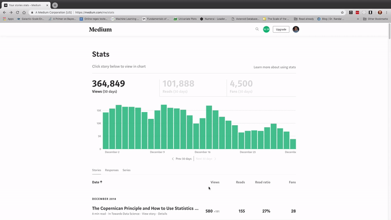

# Tools for analyzing Medium article statistics

The Medium stats Python toolkit is a suite of tools for retrieving, analyzing, predicting, and visualizing
your Medium article stats. You can also run on my Medium statistics
which are located in `data/`

* Note: running on Mac may first require setting
    `export OBJC_DISABLE_INITIALIZE_FORK_SAFETY=YES`
    from the command line [to enable parallel processing](https://stackoverflow.com/questions/50168647/multiprocessing-causes-python-to-crash-and-gives-an-error-may-have-been-in-progr)

* For complete usage refer to `Medium Stats Analysis`
* Data retrieval code lives in `retrieval.py`
* Visualization and analysis code is in `visuals.py`
* See also the Medium article ["Medium Analysis in Python"](https://medium.com/@williamkoehrsen/analyzing-medium-story-stats-with-python-24c6491a8ff0)
* Contributions are welcome and appreciated
* For help contact wjk68@case.edu or twitter.com/@koehrsen_will

## Basic usage

### Use your own Medium statistics
1. Go to the stats page https://medium.com/me/stats
2. Scroll all the way down to the bottom so all the articles are loaded
3. Right click, and hit 'save as'
4. Save the file as `stats.html` in the `data/` directory. You can also save the responses to do a similar analysis.



If you don't do this, you can still go to the next step and use the provided data!

## Retrieving Statistics

* Open up a Jupyter Notebook or Python terminal in the `medium/` directory
and run

```
from retrieval import get_data
df = get_data(fname='stats.html')
```

## Analysis and Visualization

* Interactive plots are not rendered on GitHub. To view the plots with their full
capability, use NBviewer ([`Medium Stats Analysis` on NBviewer](https://nbviewer.jupyter.org/github/WillKoehrsen/Data-Analysis/blob/master/medium/Medium%20Stats%20Analysis.ipynb))
* All plots can be opened in the plotly online editor to finish up for publication


* __Histogram__: `make_hist(df, x, category=None)`
* __Cumulative plot__: `make_cum_plot(df, y, category=None, ranges=False)`
* __Scatter plots__: `make_scatter_plot(df, x, y, fits=None, xlog=False, ylog=False, category=None, scale=None, sizeref=2, annotations=None, ranges=False, title_override=None)`
* __Scatter plot with three variables__: pass in `category` or `scale` to `make_scatter_plot`
* __Univariate Linear Regression__: `make_linear_regression(df, x, y, intercept_0)`
* __Univariate polynomial fitting__: `make_poly_fits(df, x, y, degree=6)`
* __Multivariate Linear Regression__: pass in list of `x` to `make_linear_regression`
* __Future extrapolation__: `make_extrapolation(df, y, years, degree=4)`


* More methods will be coming soon!
* Submit pull requests with your own code, or open issues for suggestions!


